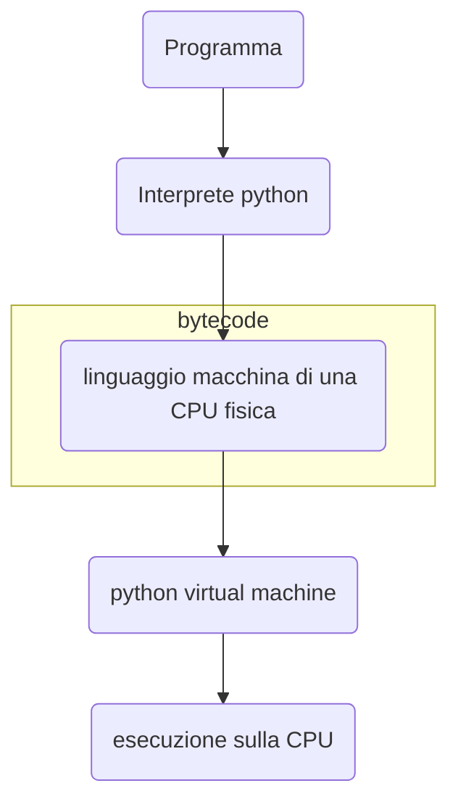
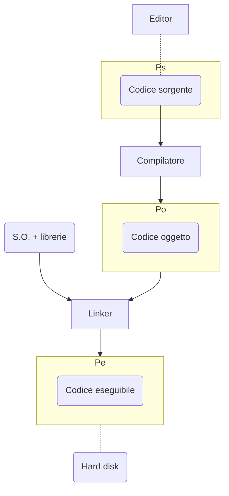
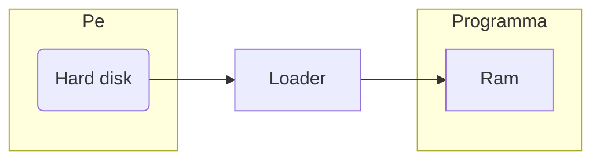
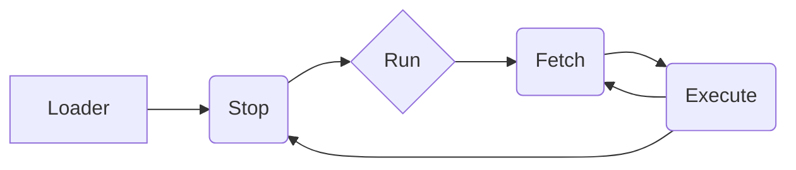
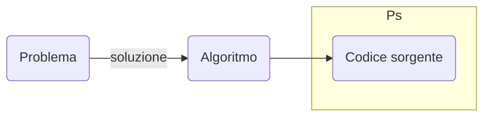

#appunti 
#fondamenti1
## Funzionamento hardware

componente logica di una macchina realistica

## Programmazione

#Algoritmo - coding programma

### #Hardware

Tutto ciò che in un sistema informatico ha una consistenza

### #Firmware

software congelato indefinitivamente nell’hardware (nella rom)

→ non può essere concettualmente modificato

### #Software

> [!important]
> 
> - **Lessico,** singole parole
> - **Grammatica/sintassi,** regole di composizione
> - **Semantica,** significato
> - **Pragmatica, finalità** della frase

#### ALGORITMO

espressione che descrive la risoluzione automatica di un problema

- numero finito di istruzioni
- formato da istruzioni
    - ognuna eseguibile in un tempo finito
    - non ambigua (semantica precisamente definita)

#PROGRAMMA

rende possibile l’eseguibilità di un algoritmo traducendolo dal linguaggio naturale ad un linguaggio di programmazione (codificare). Questo perché i linguaggi naturali sono **intrinsecamente ambigui.** I linguaggi di programmazione sono infatti costruiti in modo da non essere ambigui (lessico, sintassi e semantica senza ambiguità)

Esistono linguaggi di programmazione di **alto o di basso livello**

Stati di comportamento dell’hardware

- #Basso_livello, sintassi e lessico strettamente legati alla macchina fisica
    - Linguaggio macchina, codice binario comprensibile quasi esclusivamente dalla macchina
    - Assembly, traduzione in parole comprensibili del linguaggio macchina
- #Alto_livello, linguaggi comprensibili più facilmente dall’uomo in quanto costruiti basandosi su linguaggi naturali.

$$\text{P} \rightarrow \text{A}_\text{p} \rightarrow \text{P}_{\text{p}}$$

[[Algoritmi vari]]

# I linguaggi di programmazione

Esistono varie **famiglie** di #linguaggi_di_programmazione, caratterizzate dal loro principale meccanismo di comunicazione uomo/macchina, che prende il nome di **metafora comunicativa**.

1. #imperativo (es. c, [[Python]], pascal, basic,… + tutti i linguaggi macchina /[[3. Linguaggio assembly|assembly]])
    - comando del programmatore
2. #orientato_agli_oggetti(es. java, c++, Eiffel,…), composto da un unità di calcolo e uno strato orientato agli oggetti
    - costruisce unità di calcolo che scambiano tra di loro messaggi, a loro volta ogni singolo oggetto in locale è imperativo
3. #logico (es. ,[[4. Programmazione logica|Prolog]]…), utilizzato per esempio nella creazione di modelli di IA simbolica==
    - implicazione logica
4. #funzionale (es. lisp,…), utilizzato in programma basati su funzioni come per esempio AutoCAD
    - definizione di funzione e della loro chiamata

## Il traduttore

Dopo aver codificato il programma utilizzando un linguaggio di programmazione ad alto livello, prima di poter essere eseguito su un calcolatore, sarà tradotto in un #linguaggio_macchina, che lo renderà eseguibile sull’hardware.

$$P(\text{l.a.l.}) \rightarrow \text{traduzione} \rightarrow P(\text{l.m.)} \rightarrow \text{esecuzione sull'hardware}$$

La traduzione viene svolta da un programma (scritto in l.m.) detto #traduttore, che ne manterrà identica la semantica. Esistono due tipi di traduttori:

### Compilatori

Con il #compilatore invece, ne risulta un codice equivalente interamente tradotto, utilizzabile in qualsiasi momento

(es. c++, c,…)

- più lento durante la compilazione, ma più veloce durante l’esecuzione del programma

### Interpreti

Utilizzando gli #interprete viene tradotta solo la parte necessaria sul momento dell’esecuzione (rigo per rigo) ad un livello intermedio. Il codice quindi sarà più orientato alla portabilità del software su hardware diverso.

(es. lisp, prolog, python,…)

- Il programma sarà più lento durante l’esecuzione

Inoltre esiste l' #assemblatore, un particolare tipo di traduttore che ha il compito di traduttore esclusivamente il linguaggio assembly in linguaggio macchina.

## Processo di codifica

Per memorizzare dati utilizzando la notazione binaria i caratteri vengono tradotti utilizzando l’ #unicode, che fornisce una rappresentazione omogenea su intervalli contigui. Ad oggi ogni carattere occupa 16 bit, fornendo 65.536 combinazioni possibili (====$2^{16}$====).==

Per quanto riguarda i numeri invece dipende dall’insieme numerico preso in considerazione. Da qui in avanti $k$ è il numero di bit utilizzati per la rappresentazione
[[Notazione binaria#Insiemi numerici in notazione binaria|Insiemi di numeri in notazione binaria]]
## Nella pratica

Per discutere di algoritmi esistono varie forme

- scrivere direttamente in C
- utilizzare uno #pseudolinguaggio
- utilizzare una rappresentazione grafica del flusso di controllo di un programma, che prende il nome di ==**diagramma a blocchi**== #flowchart

# Ciclo istruzione

Le macchine odierne, dette ==**macchine a programma memorizzato**== (o di Von Neumann) utilizzano dei cicli di istruzione essenziali memorizzati all’interno della memoria della macchina. In questo caso prenderemo in esame una macchina a ciclo istruzione essenziale sequenziale, seppur nei più moderni calcolatori le istruzioni eseguite non siano sequenziali, ma simultanee.
[[1. Reti logiche#Memoria ad accesso casuale (RAM)|RAM]] e CPU ([[1. Reti logiche#Unità logico aritmetica (ALU)|ALU]] - CU) sono collegati tramite [[1. Reti logiche#BUS|BUS]]

**RAM**

|   |   |
|---|---|
|||
|7|istr. 1|
|8|istr. 2|
|9|istr. 3|
|10|halt|
|||

  
  

$$\text{bus}\\  
\leftarrow ----\\  
---- \rightarrow$$

  
  
**CPU**  

|   |   |   |
|---|---|---|
|P.C.|7||
||||
|I.R.|istr. 1||

  

  

  

## Esempio di microlinguaggio

Il #Microlinguaggio non è altro che un linguaggio di descrizione dell’hardware.

In questo esempio definiremo un semplice microlinguaggio da $n$ istruzioni e un numero $k$ di bit. Questi due numeri sono definibili come $\log_2n = k$ o anche come $n=2^k$

**RAM**

|   |   |   |   |
|---|---|---|---|
|||MAR|k bit|
|7|istr. 1|MBR|n bit|
|8|istr. 2|||
|9|istr. 3|||
|10|halt|||
|||||

  
  
**CPU**  

|              |       |     |
| ------------ | ----- | --- |
| P.C.         | k bit |     |
| Accumulatore | n bit |     |
| I.R.         | n bit |     |

**DESCRIZIONE DEI COMANDI DEL MICROLINGUAGGIO**

||**Assembly**|**Linguaggio macchina**|**Realizzazione**|
|---|---|---|---|
|1|Halt|000 ——|Ø;|
|2|LD x|001 (x)nbn|x→MAR;   M[MAR]→MBR;   MBR→ ACC|
|3|ST x|010 (x)nbn|x→MAR, ACC→MBR;   MBR → M[MAR]|
|4|Fetch|000 ——|PC → MAR;   M[MAR] → MBR;   MBR → IR;|
|5||||
|6||||

A questo punto il programma va completato con delle chiamate al sistema operativo

# Algoritmi

Definiamo un qualsiasi **algoritmo** come una corrispondenza tra un input e un output. Input e output che non sono altro che stringhe di bit. Questa definizione quindi risulta non troppo dissimile da una normale $f:\mathbb{N}\rightarrow\mathbb{N}$.

Nonostante questo però ci sono dei problemi che non possono essere risolti tramite l’uso di un algoritmo.

$$|\{algoritmo\}|\leq |\mathbb{N}| \\  
\Rightarrow |\mathbb{N}| < |[0,1]\subseteq\mathbb{R}| = |\{f|f:\mathbb{N}\rightarrow \mathbb{N}\}|$$

Ne consegue che esistono problemi cui non corrisponde nessun algoritmo. Più nello specifico alcuni di questi problemi non appartengono solo alla sfera teorica, ma alla risoluzione pratica di problemi reali.

> [!important] es.
> 
> - Problema della fermata
> - Problema della correttezza