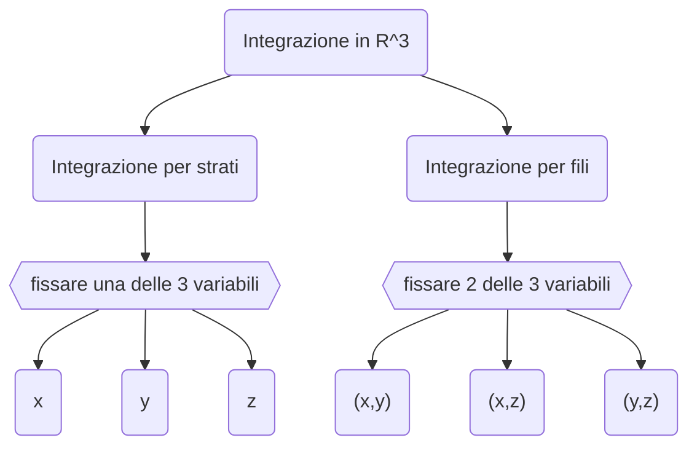

#matematica2 
#appunti 
[[5. Integrali]]
# Estensione di integrali in $\mathbb{R}^2$
## Definizione di funzione Reimann integrabile
Sia $f:[a,b]*[c,d]\to \mathbb{R}$, limitata
![[Pasted image 20251114180125.png|center|400]]
$$
\displaylines{
a = x_{0} <x_{1}<\dots<x_n=b \\
c = y_{0} <y_1 < \dots<x_n=b
}
$$
$$
I_h * I_k = [x_{h-1},x_h]*[y_{k-1},y_k] \to n^2\begin{array}{l}\to \frac{b-a}{n} \\ \to \frac{d-c}{n}\end{array}
$$
con
$$
\left.\begin{array}{c}
h = 1,\dots,n \\
k = 1,\dots,n
\end{array}\right\} \text{partizione }[a,b]*[c,d]
$$
Definito un generico punto $c_{hk} \in I_h*I_k$
definiamo il volume come
$$
V_{nk} = area(I_h, I_k)* f(c_{hk}) = \left( \frac{b-a}{n} \right)\left( \frac{c-d}{n} \right) f(c_{hk})
$$
Definiamo quindi la **somma di Reimann in $\mathbb{R}^2$** come segue
$$
\sum_{h=1}^n \sum_{k=1}^n V_{hk} = \sum_{h=1}^n \sum_{k=1}^n \frac{(b-a)(c-d)}{n^2} f(c_{hk}) = \frac{(b-a)(c-d)}{n^2} \sum_{h=1}^n \sum_{k=1}^n f(c_{hk})
$$
Notiamo come
- dipende da $n$
- dipende da $c_{hk}$

>[!important] Definizione
>Diremo che $f:[a,b]*[c,d] \subseteq \mathbb{R}^2 \to \mathbb{R}$ è **Reimann integrabile** se
>1. $$\exists \text{ finito } \lim_{ n \to \infty } \frac{(b-a)(c-d)}{n^2} \sum_{h=1}^n \sum_{k=1}^n = l \in \mathbb{R}$$
>2. $l$ non dipende dalla scelta di $c_{hk}$
>
>Chiameremo integrale doppio di $f$ su $[a,b]*[c,d]$
>$$\implies l = \iint_{[a,b]*[c,d]} f(x,y) dxdy$$

Considerando per esempio una funzione costante
$$
f(x,y) = z = \text{const}
$$

$$
\displaylines{
\iint_{[a,b]*[c,d]}f(x,y)dxdy = \lim_{ n \to \infty }  \frac{(b-a)(c-d)}{n^2} \sum_{h=1}^n \sum_{k=1}^n f(c_{hk})= \\
=\lim_{ n \to \infty } \frac{(b-a)(c-d)}{n^2} * \text{const} * n^2= \\
=(a-b)(c-d)*\text{const}
}
$$
Otteniamo così il volume del parallelepipedo
## Insiemi di misura nullo in $\mathbb{R}^2$
>[!important] Definizione
>Sia $A \subseteq \mathbb{R}^2$ diremo che $A$ ha misura nulla se
>$$\forall \epsilon>0 \exists R_{1},\dots,R_k \text{rettangoli in }\mathbb{R}^2:$$
>1. $A \subseteq \bigcup_{i=1}^k R_i$
>2. $\sum_{i=1}^k area(R_i)\leq \epsilon$

![[Pasted image 20251114180427.png|center|300]]
Partizioni sempre più piccole

>[!info] Teorema
>Se $f$ è una funzione scalare continua $[a,b] \to \mathbb{R}$, allora il grafico di $f$
>$$\{(x,f(x))\in \mathbb{R}^2|x \in [a,b]\} \subseteq \mathbb{R}^2$$
>ma di **misura nulla**.
>Inoltre i segmenti in $\mathbb{R}^2$ hanno misura nulla

>[!important] Insieme misurabile
>Un insieme $A \subseteq \mathbb{R}^2$ si dice **misurabile** se la frontiera di $A$ è un insieme di misura nulla
>$$m(F(A)) = 0$$
>*es.* il cerchio è un insieme misurabile
# Definizione di integrale
Supponiamo che:
1. $A \subseteq \mathbb{R}^2$ misurabile e limitato
2. $f:A \to \mathbb{R}$ continua
Indichiamo con $I$ un rettangolo contenente $A$  e definiamo la seguente funzione
$$
\tilde{f}(x,y) = \left\{\begin{array}{l} f(x,y) \text{ se }(x,y) \in A \\ 0 \text{ se }(x,y) \in I\setminus A\end{array}\right.
$$
$$
\iint_I \tilde{f}(x,y) dxdy \triangleq \iint_A f(x,y) dxdy
$$
>[!warning] Potrebbe non essere continua
>Nonostante questo essendo la frontiera un insieme di misura nulla la funzione è comunque integrabile

## Classe di funzioni integrabili
>[!info] Teorema
>Se $f:A \subseteq \mathbb{R}^2 \to \mathbb{R}$  funzione limitata continua escluso al più un insieme di misura nulla, cioè:
>$$\{(x,y) \in A:f(x,y) \text{ non è continua}\} \subseteq \mathbb{R}^2$$
>$$\implies \tilde{f} \text{ è integrabile su }I \text{, allora }f \text{ è integrabile su }A$$

## Proprietà
Siano $f$ e $g$ continue su $A$ misurabile
1. $$\iint_A (f+g) dxdy = \iint_A f dxdy + \iint_A gdxdy$$
2. $$\iint_A k f(x,y)dxdy = k\iint_A f(x,y) dxdy, k \in \mathbb{R}$$
Queste prime due proprietà ci fanno capire che $\iint_A$ è un operatore **lineare**
3. Se $f(x,y) \leq g(x,y)$ $\forall (x,y) \in A$
   $$\implies \iint_A f dxdy \leq \iint_A g dxdy$$
4. Se
   $$\left\{\begin{array}{l}A = A_{1} \cup A_{2} \\ A_{1} \cap A_{2} = \emptyset \\ A_{1} \text{ e } A_{2} \text{ misurabili}\end{array}\right.$$
   $$\implies \iint_A fdxdy = \iint_{A_{1}} fdxdy + \iint_{A_{2}}fdxdy$$
5. Se $A$ ha misura nulla
   $$\implies \iint_A fdxdy=0$$
## Simmetra
[...]

# Calcolo integrale
Definiamo per prima cosa
>[!important] Insieme normale rispetto a $x$/$y$
>Supponiamo
>1. $g_{1}(x), g_{2}(x):[a,b]\to \mathbb{R}$, continue
>2. $g_{1}(x) \leq g_{2}(x)$ $\forall x \in [a,b]$
>
>![[Pasted image 20251114183158.png|center|300]]
>$$A = \{(x,y) \in \mathbb{R}^2|x \in [a,b], g_{1}(x) \leq y \leq g_{2}(x)\}$$
>$$m(F(A)) = 0 \implies A\text{ misurabile}$$
>Dividendola in segmenti perpendicolari all'asse $x$ anch'essi sono normali
>
>**Possiamo definire un insieme normale rispetto a $y$ analogamente**

- Il [[5. Integrali#Teorema fondamentale del calcolo integrale|teorema del calcolo integrale]] definito in $\mathbb{R}$ viene ripreso per definire il **teorema di riduzione**
- il [[5. Integrali#Integrazioni per sostituzione|metodo della sostituzione]] è applicabile anche in $\mathbb{R}^2$
- Invece l'[[5. Integrali#Integrazione per parti|integrazione per parti]] non può essere applicata in $\mathbb{R}^2$

>[!info] Teorema di riduzione rispetto all'asse $x$
>Sia $A\subseteq \mathbb{R}^2$ normale rispetto all'asse $x$
>$$A = \{(x,y) \in \mathbb{R}^2 | x \in [a,b], g_{1}(x)\leq y \leq g_{2}(x)\}$$
>Sia $f:A \subseteq \mathbb{R}^2\to \mathbb{R}$ continua, allora
>$$\iint_A f(x,y) dxdy = \int_a^b \left( \int_{g_{1}(x)}^{g_{2}(x)} f(x,y) dy\right)dx$$

>[!info] Teorema di riduzione rispetto all'asse $y$
>Sia $A\subseteq \mathbb{R}^2$ normale rispetto all'asse $y$
>$$A = \{(x,y) \in \mathbb{R}^2 | y \in [a,b], g_{1}(y)\leq x \leq g_{2}(y)\}$$
>Sia $f:A \subseteq \mathbb{R}^2\to \mathbb{R}$ continua, allora
>$$\iint_A f(x,y) dxdy = \int_a^b \left( \int_{g_{1}(y)}^{g_{2}(y)} f(x,y) dx\right)dy$$

Si procede quindi per prima cosa a calcolare l'integrale interno
$$
\int_{g_{1}(x)}^{g_{2}(x)} f(x,y) dy = k(x)
$$
e poi l'integrale esterno
$$
\int_a^b k(x)dx
$$

>[!question] Caso particolare A = rettangolo = $[a,b]\times [c,d]$
>$$\iint_A f(x,y) dxdy = \iint_{[a,b]\times[c,d]} f(x,y)dxdy = \int_a^b \left(  \int_c^d f(x,y) dy \right)dx$$
>che consiste quindi nel calcolare la misura si $A$
>$$m(A) = \iint_A 1 dxdy$$

## Sostituzione di Eulero
$$
\displaylines{
x = r \sin t \to dx = r \cos t dt \\
r^2-x^2 = r^2-r^2 \sin^2t = r^2(1-\sin^2 t) = r^2*\cos^2t \\
x = -r \to r \sin t = -r \to \sin t = -1 \to t=-\frac{\pi}{2} \\
x = r \to r \sin t = r \to \sin t = 1 \to t = \frac{\pi}{2}
}
$$
### Area del cerchio
[...]
## Cambiamento di variabile
Dal [[5. Integrali#Integrazioni per sostituzione|cambiamento di variabili in]] $\mathbb{R}$ $\int_a^b f(x) dx = \int_{\varphi^{-1}(a)}^{\varphi?{-1}(b)}f(\varphi(t))\varphi'(t) dt$ e $x = \varphi(t)$
ricaviamo le seguenti considerazioni
- $\varphi \in C^1(I)$
- $\varphi'(t)\neq 0 \forall t \in I$:
	- $\varphi'(t)<0\implies$ $\varphi$ e strettamente decrescente in $I$
	- $\varphi'(t)>0\implies$ $\varphi$ e strettamente crescente in $I$
$\implies$ $\varphi$ è strettamente monotona $\implies \varphi$ è invertibile ($\exists \varphi^{-1}$)
$$
\left\{\begin{array}{l}
x = \varphi(t) \to dx = \varphi'(t)dt \\
x = a \to a = \varphi(t_{1}) \to t_{1} = \varphi^{-1}(a) \\
x = b \to b = \varphi(t_{2}) \to t_{2} = \varphi^{-1}(b)
\end{array}\right.
$$
>[!important] Definizione
>Sia $F:\Omega \subseteq \mathbb{R}^n \to \mathbb{R}^n$, $\Omega$ aperto.
>Diremo che $F$ è un cambiamento di variabile se
>1. $F \in C^1(\Omega)$
>   $$\implies J_F = \left(\begin{array}{cccc}\frac{\partial F_{1}}{\partial u_1} & \frac{\partial F_{1}}{\partial u_2} & \dots & \frac{\partial F_{1}}{\partial u_n} \\ \frac{\partial F_{2}}{\partial u_1} & \frac{\partial F_{2}}{\partial u_2} & \dots \frac{\partial F_{2}}{\partial u_n} \\ \vdots & \ddots & \vdots \\ \frac{\partial F_{n}}{\partial u_1} & \frac{\partial F_{n}}{\partial u_2} & \dots & \frac{\partial F_{n}}{\partial u_n}\end{array}\right) (u_{1},u_{2},\dots,u_n) \hspace{4ex} [n\times n]$$
>2. $F$ invertibile
>3. $\det(J_F(u_{1},u_{2},\dots,u_n)) \neq 0 \forall \vec{u} \in \Omega$

>[!info] Cambiamento di variabile per integrali multipli
>Sia $f:A \subseteq \mathbb{R}^n \to \mathbb{R}$, continua, e sia $F:\Omega \subseteq \mathbb{R}^n \to \mathbb{R}^n$ cambiamento di variabile. Supponiamo che $A \subseteq F(\Omega)$ e sia $A$ misurabile.
>$$\displaylines{\int_A f(x_{1},x_{2},\dots,x_n)dx_{1}dx_{2}\dots dx_n =\\ \int_{F^{-1}(A)} f(F(u_{1},u_{2},\dots,u_n))|\det(J_F(u_{1},u_{2},\dots,u_n))|du_{1}du_{2}\dots du_n}$$

Per $n=2$
$$
\iint_Af(x,y) dxdy = \iint_{F^{-1}(A)} f(F(u,v))|\det(J_F(u,v))|dudv
$$
>[!question] Osservazione
>$$\left\{\begin{array}{l}x = F_{1}(u,v)\\ y = F_{2}(u,v)\end{array}\right. \implies f(F(u,v)) = f(x(u,v), u(u,v)) = f(F_{1}(u,v), F_{2}(u,v))$$

>[!important] Dilatazioni
>Sia $\lambda \in \mathbb{R}^n:\lambda=(\lambda_{1},\dots,\lambda_n), \lambda_i>0 \forall i =1,\dots,n$. Sia $F:\mathbb{R}^n\to \mathbb{R}^n \implies(u_{1},u_{2},\dots,u_n)\to(\lambda_{1}u_{2},\lambda_{2}u_{2},\dots,\lambda_n u_n):$
>$$J_F(u_{1},\dots,u_n) = \left(\begin{array}{ccccc}\lambda_{1} & 0 & 0 & \dots & 0 \\ 0 & \lambda_{2} & \dots & 0 \\ \vdots & \ddots & & \vdots \\ 0 & 0 & \dots & \lambda_n\end{array}\right) \implies \left\{\begin{array}{l}F \in C^1(\mathbb{R}^n)\\ \det(J_F) = \lambda_{1}\lambda_{2}\dots \lambda_n \neq 0\end{array}\right.$$
>La **dilatazione** è un cambio di variabile
### Coordinate polari
$$
F:\left\{\begin{array}{l}x= \rho \cos \theta \hspace{4ex}\\ y = \rho \sin \theta \hspace{4ex} \theta \in [0,2\pi]\end{array}\right.
$$
$$
J_F = \left(\begin{array}{cc}\cos \theta & -\rho \sin \theta \\ \sin \theta & \rho \cos \theta\end{array}\right)
$$
Per passare quindi da coordinate cartesiane a coordinate polari sostituiamo le variabili e moltiplichiamo per il determinante dello Jacobiano, che in questo caso è semplicemente $\rho$.
Ovviamente dobbiamo cambiare anche gli elementi del dominio
$$
\iint_\Omega f(x,y) dx dy = \iint_{\Omega'} f(\rho \cos \theta, \rho \sin \theta) \rho d\rho d\theta
$$
# Integrali tripli
$$
\displaylines{
f:\Omega \subseteq \mathbb{R}^3 \to \mathbb{R} \\
(x,y,z) \in \Omega\to f(x,y,z) \in \mathbb{R}
}
$$
$$
\iiint_\Omega f(x,y,z) dxdydz = \int_\Omega f(x,y,z) dxdydz
$$
**Definizione**
$P=[a,b]\times[c,d]\times[e,f]$ sia un parallelepipedo.
Lo partizioniamo in $n^3$ parallelepipedi più piccoli
$$
\displaylines{
[a,b] \to n \text{ sottointervalli } \frac{b-a}{n} \hspace{4ex} a = x_{0} < x_{1} <\dots <x_n = b \\
[c,d] \to n \text{ sottointervalli } \frac{d-c}{n} \hspace{4ex} c = x_{0} < x_{1} <\dots <x_n = d \\
[e,f] \to n \text{ sottointervalli } \frac{f-e}{n} \hspace{4ex} e = x_{0} < x_{1} <\dots <x_n = f
}
$$
$$
P_{hki} = [x_{h-1},x_h]\times[y_{k-1},y_k] \times [z_{i-1},z_i] \hspace{4ex} \left.\begin{array}{r}h = 1,\dots,n \\ k = 1,\dots,n \\ i = 1,\dots,n\end{array}\right\}n^3
$$
Scegliamo a caso $c_{hki}\in P_{hki} \subseteq \mathbb{R}^3$
e valutiamo la $f(c_{hki}) \in \mathbb{R}$
$$
\sum_h \sum_k \sum_i \frac{b-a}{n}* \frac{d-c}{n} * \frac{f-e}{n} * f(c_{hki}) = \frac{(b-a)(d-c)(f-e)}{n^3} \sum_{h,k,i = 1}^n f(c_{hki})
$$
Se
$$
\lim_{ n \to \infty } \frac{(b-a)(d-c)(f-e)}{n^3} \sum_{h,k,i = 1}^n f(c_{hki}) = l \in \mathbb{R}
$$
$$
l \triangleq \iiint_P f(x,y,z)dxdydz
$$

Se vogliamo integrare rispetto a $\Omega \subseteq \mathbb{R}^3$ generico:
$$
\displaylines{
P(\Omega) \supseteq \Omega \text{ e }\\
\tilde{f}(x,y,z) = \left\{\begin{array}{lll}f(x,y,z) & \text{se}& (x,y,z) \in \Omega \\ 0 & \text{se} & (x,y,z) \in P(\Omega) \backslash \Omega\end{array}\right.
}
$$
$$
\int_\Omega f(x,y,z) dxdydz \triangleq \int_{P(\Omega)} \tilde{f}(x,y,z) dxdydz
$$
## Calcolo di integrale triplo
In $\mathbb{R}^3$ abbiamo 6 possibilità per integrare

### Integrazione per strati
![[Screenshot 2025-11-23 123302.png|center|400]]

>[!info] Teorema di integrazione per strati
>Sia $A$ un insieme $A = \{(x,y,z) \in \mathbb{R}^3 | z \in [a,b], (x,y) \in A_z\}$ con
>- $A_z = A \cap \{z = z_0\}$ una sezione di $A$ proiettata sul piano $xy$
>- $[a,b]$ è la proiezione di $A$ sull'asse $z$
>Supponiamo che $A \subseteq \mathbb{R}^3$ di questo tipo
>- $A = \{(x,y,z) \in \mathbb{R}^3 | z \in [a,b], (x,y) \in A_z\}$
>- $A_z \subseteq \mathbb{R}^2$ misurabile $\forall z \in [a,b]$
>Allora
>$$\iiint_A f(x,y,z) dxdydz = \int_a^b \left( \iint_{A_z} f(x,y,z)dxdy \right)dz$$
### Integrazione per fili
![[Pasted image 20251123123437.png|center|400]]
>[!info] Teorema di integrazione per fili
>Supponiamo che $A$ sia del tipo
>$A = \{(x,y,z) \in \mathbb{R}^3|(x,y) \in B, g_{1}(x,y) \leq z \leq g_{2}(x,y)\}$ con
>- $B$ misurabile (proiezione di $A$ sul piano)
>- $g_{1},g_{2}:B \subseteq \mathbb{R}^2 \to \mathbb{R}$ continue con $g_{1}(x,y) \leq g_{2}(x,y)$
>Sia $f:A \subseteq \mathbb{R}^3 \to \mathbb{R}$ continua
>allora
>$$\iiint_A f(x,y,z) dxdydz = \iint_B \left( \int_{g_{1}(x,y)}^{g_{2}(x,y)} f(x,y,z)dz \right)dxdy$$
### Teorema di Gauss-Green
Sia $D$ un dominio regolare, limitato e connesso per archi di $\mathbb{R}^2$ con la frontiera $Fr(D)$ data da una curva semplice, chiusa, regolare a tratti, orientata positivamente (verso antiorario).
Sia $F(x,y)=(F_{1}(x,y), F_{2}(x,y))$ campo vettoriale definito su un insieme $\Omega \supseteq \vec{D}$ (chiusura di $D$), con $F_{1}, F_{2} \in C^1(\Omega)$
Allora
$$
\oint_{Fr(D)} FdP = \oint_{Fr(D)} \vec{F} * \vec{ds} = \iint_D \left(  \frac{\partial F_{2}}{\partial x} - \frac{\partial F_{1}}{\partial y}\right) dxdy
$$
>[!question] Osservazione
>$D=D_{1} \cup D_{2} \cup \dots \cup D_k$ vale anche l'unione di un numero finito di domini normali
>$\implies Fr(D) =$ unione finita di curve regolari

 >[!question] Osservazione
 >Se $D$ ha dei buchi sul verso di percorrenza la frontiera lascia i punti del dominio alla sinistra della percorrenza
 >![[Pasted image 20251123125041.png|center|300]]
 

$$
\displaylines{
\int_0^1 x^2 \sqrt{ 2-x^2 } dx\\
\int_0^{\frac{\pi}{4}} (\sqrt{ 2 } \sin \theta)^2 \sqrt{ 2- (\sqrt{ 2 }\sin \theta)^2 } (\sqrt{ 2 } \cos \theta) d\theta \\
\int_0^{\frac{\pi}{4}} 2 \sin^2 \theta \sqrt{ 2(1-\sin^2\theta) } (\sqrt{ 2 } \cos \theta) d\theta \\
\int_0^{\frac{\pi}{4}} 2 \sin^2 \theta \sqrt{ 2 \cos^2 \theta } (\sqrt{ 2 } \cos \theta) d\theta \\
\int_0^{\frac{\pi}{4}} 2 \sin^2 \theta \sqrt{ 2 } \cos \theta \sqrt{ 2 } \cos \theta d\theta \\
\int_0^{\frac{\pi}{4}} 4 \sin^2 \theta \cos^2 \theta d\theta \\
\int_0^{\frac{\pi}{4}}(2 \sin \theta \cos \theta)^2 d\theta \\
\int_0^{\frac{\pi}{4}}\sin^2 (2 \theta) d\theta \\
\int_0^{\frac{\pi}{4}} \frac{1- \cos 4 \theta}{2} d\theta \\
\int_0^{\frac{\pi}{4}} \frac{1}{2}- \frac{\cos 4 \theta}{2} d\theta \\
\frac{1}{2} [\theta]_{0}^{\pi/4} - \left[ \frac{\sin 4 \theta}{8} \right]_0^{\pi/4}
}
$$