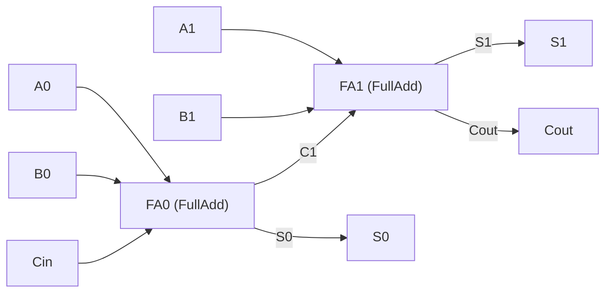

#elettronica_digitale 
#appunti 
# VHDL
## Introduzione
- **VHDL** = _Very High Speed Integrated Circuits Hardware Description Language_
- linguaggio per **descrivere sistemi hardware**, usabile per **sintesi** e/o **simulazione** (sviluppato dal DoD USA)
- vantaggi:
    - indipendente dal tool CAD (cosa impossibile con gli schematici)
    - indipendente dall'architettura di implementazione → codice riutilizzabile su piattaforme diverse (attenzione se si usano risorse specifiche del dispositivo)
    - stesso linguaggio per simulazione e sintesi
    - modellabile a qualunque livello gerarchico (chip, scheda, sistema)

### Sintesi
- processo di conversione del codice VHDL in **elementi fisici** specifici dell'hardware scelto
- il tool deve conoscere l'architettura del dispositivo per generare una **netlist** (EDIF) → richiede una libreria di primitive (`unisim`)
- oltre a tradurre fa riduzione logica, ottimizzazione e usa risorse specifiche della tecnologia target (clock globali, set/reset globali, registri nelle celle di I/O)

|Termine|Significato|
|---|---|
|**Netlist**|descrizione testuale della connettività del circuito: lista di connettori, di istanze e, per ogni istanza, dei segnali collegati ai suoi terminali (+ attributi)|
|**EDIF**|_Electronic Data Interchange Format_, formato standard per specificare una netlist|
|**EDN**|_Electronic Data Netlist_|
|**NGC**|netlist che contiene sia dati logici che _constraints_, sostituisce EDIF + NCF|

### Elementi strutturali

|Elemento|Cos'è|
|---|---|
|`entity`|interfaccia|
|`architecture`|implementazione / funzione / comportamento|
|`process`|blocco di istruzioni sequenziali controllato da eventi|
|`package`|insieme di dichiarazioni (tipi, costanti, funzioni)|
|`library`|collezione di oggetti VHDL compilati|

## Entity

Descrive **solo l'interfaccia** (nessun comportamento): nome, porte, per ogni porta direzione, tipo e dimensione.

```vhdl
entity FullAdd is
	port(
		A, B, C : in bit;
		S, Co   : out bit
	);
end FullAdd;
```

> [!warning] Sintassi l'ultima porta **non** ha `;` prima di `)`, il `;` va dopo la parentesi chiusa

- `bit` è un tipo standard: viene riconosciuto senza includere librerie, e ne sono sottintesi range e operatori

### Modi delle porte

|Modo|Significato|
|---|---|
|`in`|sola lettura|
|`out`|sola scrittura (**non** si può leggere dentro l'architecture), drivers multipli|
|`inout`|bidirezionale|
|`buffer`|come `out` ma leggibile, 1 solo driver → **sconsigliato** (barrato nelle slide)|

- capita di dover usare un segnale di output **all'interno** del circuito stesso (leggerlo) → uso `inout`
- alternativa più pulita: segnale interno letto internamente e poi assegnato all'`out`

## Architecture
- è obbligatorio descrivere **prima la Entity** e poi l'architecture
- è **sempre legata a una specifica entity**
- le porte della entity sono visibili come segnali dentro l'architecture
- contiene istruzioni **concorrenti**

```vhdl
architecture MyFA of FullAdd is
	-- parte DICHIARATIVA
begin
	-- parte DEFINITORIA
end MyFA;
```

|Parte|Contenuto|
|---|---|
|tra `is` e `begin` (**dichiarazioni**)|tipi, subtype, costanti, segnali, componenti|
|tra `begin` e `end` (**definizioni**)|assegnazioni di segnali, processi, istanze di componenti, istruzioni concorrenti|

- tra `begin` ed `end` si può usare una descrizione:
    - **strutturale**: richiamo di entity/componenti descritti altrove
    - **comportamentale**: approccio più ad alto livello, slegato dallo schematic del circuito

```vhdl
architecture EXAMPLE of STRUCTURE is
	subtype DIGIT is integer range 0 to 9;
	constant BASE : integer := 10;
	signal DIGIT_A, DIGIT_B : DIGIT;
begin
	...
end EXAMPLE;
```

## Segnali

Per definire il funzionamento interno bisogna dare un nome ai collegamenti, che avranno un corrispettivo **fisico** (fili).

```vhdl
signal identificatore : tipo [:= espressione];
```

- dichiarati nell'architecture (tra `is` e `begin`), **visibili solo al suo interno**
- negli esempi: `signal datain : std_logic;` `signal addr : bit_vector(3 downto 0);`

![[Porte logiche-1790763513846.webp|center|401]]

```vhdl
architecture MyFA of FullAdd is
	signal p    : bit;
	signal x, y : bit;
begin
	p  <= A xor B;
	x  <= p nand C;
	y  <= A nand B;
	S  <= C xor p;
	Co <= x nand y;
end MyFA;
```

`<=` = statement di assegnazione:

- **congruenza** tra i membri (stesso tipo)
- a sinistra **non** possono esserci porte `in`
- i segnali possono sia ricevere che cedere il valore

### Segnale = driver

Un'assegnazione equivale a costruire un **driver** (uscita di una porta logica) per il segnale: `A <= B;` ≈ buffer da B ad A.

**Conflitti di assegnazione**: se più assegnazioni pilotano lo stesso segnale (`A <= B; A <= C;`) servono una **funzione di risoluzione**. I tipi **standard (`bit`, ...) non ce l'hanno** → serve `std_logic` (vedi sotto).

## Le istruzioni sono concorrenti

Non importa l'ordine in cui scrivo gli statement dell'architecture: sono eseguiti **in parallelo**, perché sto descrivendo uno schema circuitale.

```vhdl
x <= a and b;      -- equivale a scriverle invertite
y <= c and x;
```

### Assegnazione condizionale (`when ... else`)

```vhdl
target <= val1 when cond1 else
          val2 when cond2 else
          valN;                 -- else finale OBBLIGATORIO

y <= '1' when (a = '1' and b = '0') else '0';   -- y = a·b'
```

- la condizione è un'espressione logica (boolean)

### `with ... select`

```vhdl
with x select
	y <= a when 0,
	     b when 7 | 9,
	     c when 1 to 5,
	     0 when others;
```

- **tutti i casi devono essere coperti** → `when others`

## Tipi

- ogni segnale ha un **tipo** = insieme di valori che può assumere (in un'assegnazione può assumere **solo** valori del suo tipo)
- il tipo **deve sempre essere dichiarato**: nelle porte dell'entity o nell'architecture
- in un'assegnazione i tipi a sinistra e a destra **devono corrispondere**

### Tipi standard

|Descrizione|Keyword|Valori|
|---|---|---|
|Logico|`boolean`|`false`, `true`|
|Bit|`bit`|`'0'`, `'1'`|
|Caratteri|`character`|set ASCII|
|Interi|`integer`|da -(2^31-1) a 2^31-1|
|Reali|`real`|±1.7e+38 circa|

```vhdl
entity FULLADD is
	port(A, B, CIN : in bit;
	     SUM       : out bit;
	     CARRY     : out boolean);
end FULLADD;
```
## Costanti e variabili

### Costanti

Utili per rendere un design **parametrico**.

```vhdl
constant identificatore : tipo := espressione;

constant rombase  : std_logic_vector(3 downto 0) := "0000";
constant rambase  : std_logic_vector(3 downto 0) := "0100";
constant io_space : std_logic_vector(3 downto 0) := "1000";

rom_cs <= '0' when (addr >= rombase and addr < rambase) else '1';
```

### Variabili

```vhdl
variable identificatore : tipo [:= espressione];
```

- dichiarate e disponibili **solo dentro un `process`**
- assegnazione con `:=` (i segnali con `<=`)
- assegnazioni possibili segnale→variabile e variabile→segnale, **dello stesso tipo**

```vhdl
process (A, B, C)
	variable M, N : integer range 0 to 7;
begin
	M := A;
	...
end process;
```
## Library e package

- **library**: contenitore logico di unità di progetto già compilate (può contenere ogni tipo di design unit)
- la dichiarazione di library deve **precedere** le design unit del codice
- librerie definite implicitamente: `std` e `work`
- la più usata: `IEEE` (standardizzata a livello internazionale, tipi e funzioni di uso comune)
- **package**: insieme di dichiarazioni (tipi, costanti, funzioni). Per usarlo servono la libreria e la clausola `use`

```vhdl
library nome_logico_libreria;
use nome_logico_libreria.nome_package.nome_item;

library IEEE;
use IEEE.STD_LOGIC_1164.ALL;
```

## Modelli gerarchici e component

VHDL permette la modellazione **gerarchica**: un modulo si assembla a partire da sottomoduli.



Possiamo riutilizzare entity già definite:

```vhdl
entity RCA2 is
	port(
		A1, A0 : in bit;
		B1, B0 : in bit;
		Cin    : in bit;
		Cout   : out bit;
		S1, S0 : out bit
	);
end RCA2;

architecture MyRCA2 of RCA2 is

	signal C1 : bit;

	component FullAdd    -- ricercato nella directory di lavoro
		port(
			A, B, C : in bit;
			S, Co   : out bit
		);
	end component;

begin
	FA0: FullAdd port map (A0, B0, Cin, S0, C1);
	FA1: FullAdd port map (A1, B1, C1, S1, Cout);
end MyRCA2;
```

- **dichiarazione** (`component`): nella parte dichiarativa (tra `is` e `begin`), deve rispecchiare le porte della entity
- **istanziazione**: dopo `begin`, con una **label** per ogni utilizzo del componente (se lo uso 2 volte, 2 istanze con label diverse)
- i segnali di connessione tra istanze (come `C1`) sono dei _wires_ da dichiarare
- i nomi delle porte del component hanno **visibilità locale**

### Associazione delle porte

|Tipo|Sintassi|Note|
|---|---|---|
|**posizionale** (default)|`port map (A0, B0, Cin, S0, C1)`|conta l'**ordine** in cui passo i segnali|
|**per nome**|`port map (A => A0, B => B0, ...)`|a sinistra i **formali** (porte del component), a destra gli **attuali** (segnali dell'architecture); indipendente dall'ordine|

```vhdl
MODULE1: HALFADDER
	port map (A => A, SUM => W_SUM, B => B, CARRY => W_CARRY1);
```
## Array

Insieme di oggetti **dello stesso tipo**. Standard: `bit_vector` (array di `bit`), `string` (array di `character`). Si possono definire array anche di altri tipi.

### Dichiarazione e assegnazione

```vhdl
signal ADD_BUS      : bit_vector(31 downto 0);
signal DATA_BUS     : bit_vector(0 to 7);
signal INTERNAL_BUS : bit_vector(1 to 8);
signal EXT_BUS      : bit_vector(31 downto 24);
```

- `downto` → MSB a sinistra (indice alto → basso), `to` → indice crescente
- ❌ `bit_vector(0 downto 31)` / `bit_vector(7 to 0)` (range al contrario = vuoto)
- l'assegnazione tra array avviene **per posizione**, non per indice: `DATA_BUS <= INTERNAL_BUS;` → `DATA_BUS(0) <= INTERNAL_BUS(1)` ... `DATA_BUS(7) <= INTERNAL_BUS(8)`
- ❌ `EXT_BUS <= ADD_BUS;` → dimensioni diverse

### Inizializzazione con costanti

- vettore di bit → **virgolette doppie** `"01011010"`
- singolo bit → apici `'1'`

### Slices

Porzione di un array. L'ordine deve essere lo **stesso** della dichiarazione.

```vhdl
ADD_BUS(27 downto 24) <= DATA_BUS(1 to 4);   -- ok
ADD_BUS(24 to 27)     <= DATA_BUS(1 to 4);   -- ❌ direzione opposta
```

### Concatenazione `&`

Raggruppa bit singoli e vettori per formare array.

```vhdl
-- A='1', B='0', C='0', D='1'; A_BUS="010", B_BUS="11101"
Z_BUS <= A & B & C & D;      -- "1001"
BYTE  <= A_BUS & B_BUS;      -- "01011101"
```

### Aggregati

Modo efficiente di assegnare gli elementi di un vettore.

```vhdl
Z_BUS <= (A, B, C, D);                         -- per posizione
Z_BUS <= (3 => '1', 1 downto 0 => '1', 2 => B); -- per indice
BUS   <= (3 => '1', 1 => '0', others => B);     -- others: indipendente dalla dimensione
```

> [!warning] `(A,B,C,D) <= "0101";` → ambiguità tra i tipi, da evitare
## Operatori

|Categoria|Operatori|
|---|---|
|Logici|`not`, `and`, `or`, `nand`, `nor`, `xor`, `xnor`|
|Relazionali|`=`, `/=`, `<`, `<=`, `>`, `>=`|
|Shift|`sll`, `srl`|
|Aritmetici|`+`, `-`, `*`, `/`, `mod`, `abs`|

### Logici

- priorità: `not` (alta), poi `and/or/nand/nor/xor/xnor` (**stessa** priorità → usare le parentesi)
- predefiniti per `bit`, `bit_vector`, `boolean`
- i tipi a destra e sinistra dell'assegnazione devono essere gli stessi

```vhdl
Z1    <= A and (B or (not C xor D));
EQUAL <= A xor B;   -- ❌ SBAGLIATO: EQUAL è boolean, A xor B è bit
```

- su **array**: operandi di stessa lunghezza e tipo, operazione **posizione per posizione** (indipendente dagli indici)

```vhdl
signal A_BUS, B_BUS : bit_vector(3 downto 0);
signal Z_BUS        : bit_vector(4 to 7);
Z_BUS <= A_BUS and B_BUS;   -- Z_BUS(4) = A_BUS(3) and B_BUS(3), ...
```

### Relazionali

- predefiniti per tutti i tipi standard, risultato **boolean**

```vhdl
A_LT_B  <= (A < B);                -- ok (boolean)
A_EQ_B2 <= (A = B);                -- ❌ se A_EQ_B2 è bit
-- con bit: usare if (A = B) then A_EQ_B1 <= '1'; else ... dentro un process
```

## Statement sequenziali

- eseguiti **in sequenza**, uno dopo l'altro
- producono (solitamente) logica **sincrona** (macchine a stati, contatori...), ma possono creare anche logica combinatoria

### Process

- un `process` è uno statement **concorrente** che racchiude statement **sequenziali**
- gli statement interni sono eseguiti in ordine; **non** si possono inserire statement concorrenti
- esiste **solo** nell'architecture

```vhdl
etichetta : process (sensitivity list)
begin
	-- sequential statements
end process etichetta;
```

- **sensitivity list**: lista di segnali; ogni **evento** su un segnale della lista attiva il process

```vhdl
process (clock, reset)
begin
	if (reset = '0') then
		q <= '0';
	elsif (clock'event and clock = '1') then   -- fronte di salita
		q <= d;
	end if;
end process;
-- = flip-flop D con clear asincrono (FDC)
```

> [!tip] `clock'event and clock='1'` si può scrivere anche `rising_edge(clock)` (richiede `std_logic`)

### `if ... then ... else`

```vhdl
if (cond1) then
	...        -- eseguito se cond1 è TRUE
elsif (cond2) then
	...        -- eseguito se cond2 TRUE e cond1 FALSE
else
	...
end if;
```

- valutazione **in ordine** dall'alto verso il basso

### Latch involontari

```vhdl
process (address)
begin
	if (address = "01") then
		chipselect <= '1';
	end if;               -- manca l'else!
end process;
```

Se `address` ≠ `"01"`, `chipselect` **mantiene il valore** → il tool sintetizza un **latch** (equivale a `else chipselect <= chipselect;`). → in logica combinatoria **assegnare sempre il segnale in tutti i rami** (`else` completo).

### `case`

```vhdl
case instruction is
	when add  => result <= sum;
	when sub  => result <= diff;
	when mult => result <= prod;
	when others => null;       -- tutti i casi devono essere coperti
end case;
```

### Loop

```vhdl
for i in 0 to 7 loop
	-- sequential statements    -- eseguito n volte
end loop;

while condition loop            -- condition = boolean, testata PRIMA di ogni iterazione
	-- sequential statements    -- se subito false, il loop non viene eseguito
end loop;
```

- nel `while` il parametro va definito esplicitamente (es. `variable i : integer := 0;` e incrementato con `i := i + 1;`)

```vhdl
process (oe, data_in)
	variable i : integer := 0;
begin
	if (oe = '1') then
		while i < 8 loop
			data_out(i) <= data_in(i);
			i := i + 1;
		end loop;
	else
		data_out <= (others => 'Z');   -- alta impedenza → buffer tri-state
	end if;
end process;
```
## IEEE Standard Logic (`std_logic`)

I segnali possono avere più stati oltre a `'0'` e `'1'`. Lo standard **IEEE 1164** definisce `std_logic` con 9 valori:

|Valore|Significato|
|---|---|
|`U`|Uninitialized|
|`X`|Unknown (forzato)|
|`0`|Force 0|
|`1`|Force 1|
|`Z`|High Impedance|
|`W`|Weak Unknown|
|`L`|Weak Low|
|`H`|Weak High|
|`-`|Don't Care|

```vhdl
library IEEE;
use IEEE.Std_Logic_1164.all;     -- rende visibile il package

signal A, B, Z : std_logic;
signal BUSA    : std_logic_vector(7 downto 0);   -- come bit_vector ma con 9 stati per digit
signal BUSB    : std_ulogic_vector(7 downto 0);  -- versione senza risoluzione
BUSA <= "ZZZZZZZZ";
```

- `std_logic` **ha la funzione di risoluzione** → permette più driver sullo stesso segnale (`std_ulogic` no)
- definita in `std_logic_1164.vhd`

### Tabella di risoluzione

Riga = segnale C, colonna = segnale B (due driver sullo stesso segnale).

|C \ B|U|X|0|1|Z|W|L|H|-|
|---|---|---|---|---|---|---|---|---|---|
|**U**|U|U|U|U|U|U|U|U|U|
|**X**|U|X|X|X|X|X|X|X|X|
|**0**|U|X|0|X|0|0|0|0|X|
|**1**|U|X|X|1|1|1|1|1|X|
|**Z**|U|X|0|1|Z|W|L|H|X|
|**W**|U|X|0|1|W|W|W|W|X|
|**L**|U|X|0|1|L|W|L|W|X|
|**H**|U|X|0|1|H|W|W|H|X|
|**-**|U|X|X|X|X|X|X|X|X|

- es. `0` e `1` in conflitto → `X`; `Z` cede sempre all'altro valore (utile per i bus tri-state)
