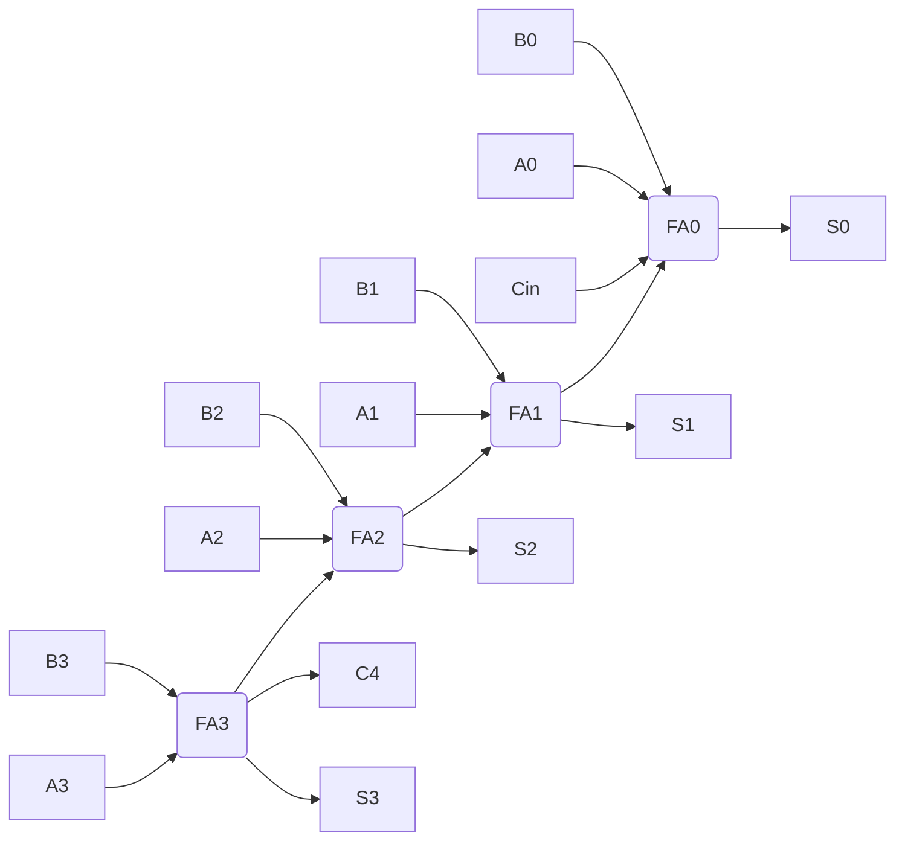

#elettronica_digitale 
#appunti 
# VHDL
## Introduzione
- **VHDL** = _Very High Speed Integrated Circuits Hardware Description Language_
- linguaggio per **descrivere sistemi hardware**, usabile per **sintesi** e/o **simulazione** (sviluppato dal DoD USA)
- vantaggi:
    - indipendente dal tool CAD (cosa impossibile con gli schematici)
    - indipendente dall'architettura di implementazione → codice riutilizzabile su piattaforme diverse (attenzione se si usano risorse specifiche del dispositivo)
    - stesso linguaggio per simulazione e sintesi
    - modellabile a qualunque livello gerarchico (chip, scheda, sistema)

### Sintesi
- processo di conversione del codice VHDL in **elementi fisici** specifici dell'hardware scelto
- il tool deve conoscere l'architettura del dispositivo per generare una **netlist** (EDIF) → richiede una libreria di primitive (`unisim`)
- oltre a tradurre fa riduzione logica, ottimizzazione e usa risorse specifiche della tecnologia target (clock globali, set/reset globali, registri nelle celle di I/O)

|Termine|Significato|
|---|---|
|**Netlist**|descrizione testuale della connettività del circuito: lista di connettori, di istanze e, per ogni istanza, dei segnali collegati ai suoi terminali (+ attributi)|
|**EDIF**|_Electronic Data Interchange Format_, formato standard per specificare una netlist|
|**EDN**|_Electronic Data Netlist_|
|**NGC**|netlist che contiene sia dati logici che _constraints_, sostituisce EDIF + NCF|

### Elementi strutturali

| Elemento       | Cos'è                                                  |
| -------------- | ------------------------------------------------------ |
| `entity`       | interfaccia                                            |
| `architecture` | implementazione / funzione / comportamento             |
| `package`      | insieme di dichiarazioni (tipi, costanti, funzioni)    |
| `library`      | collezione di oggetti VHDL compilati                   |

## Entity

Descrive **solo l'interfaccia** (nessun comportamento): nome, porte, per ogni porta direzione, tipo e dimensione.

```vhdl
entity FullAdd is
	port(
		A, B, C : in bit;
		S, Co   : out bit
	);
end FullAdd;
```

- `bit` è un tipo standard: viene riconosciuto senza includere librerie, e ne sono sottintesi range e operatori

### Modi delle porte

| Modo     | Significato                                                                     |
| -------- | ------------------------------------------------------------------------------- |
| `in`     | sola lettura                                                                    |
| `out`    | sola scrittura (**non** si può leggere dentro l'architecture), drivers multipli |
| `inout`  | bidirezionale                                                                   |

- capita di dover usare un segnale di output **all'interno** del circuito stesso (leggerlo) → uso `inout`
- alternativa più pulita: segnale interno letto internamente e poi assegnato all'`out`

## Architecture
- è obbligatorio descrivere **prima la Entity** e poi l'architecture
- è **sempre legata a una specifica entity**
- le porte della entity sono visibili come segnali dentro l'architecture
- contiene istruzioni **concorrenti**

```vhdl
architecture MyFA of FullAdd is
	-- parte DICHIARATIVA
begin
	-- parte DESCRITTIVA
end MyFA;
```

| Parte                                  | Contenuto                                                                        |
| -------------------------------------- | -------------------------------------------------------------------------------- |
| tra `is` e `begin` (**dichiarazioni**) | tipi, subtype, costanti, segnali, componenti                                     |
| tra `begin` e `end` (**definizioni**)  | assegnazioni di segnali, processi, istanze di componenti, istruzioni concorrenti |

- tra `begin` ed `end` si può usare una descrizione:
    - **strutturale**: richiamo di entity/componenti descritti altrove
    - **comportamentale**: approccio più ad alto livello, slegato dallo schematic del circuito

```vhdl
architecture EXAMPLE of STRUCTURE is
	subtype DIGIT is integer range 0 to 9;
	constant BASE : integer := 10;
	signal DIGIT_A, DIGIT_B : DIGIT;
begin
	...
end EXAMPLE;
```

## Segnali

Per definire il funzionamento interno bisogna dare un nome ai collegamenti, che avranno un corrispettivo **fisico** (fili).

```vhdl
signal identificatore : tipo;
```

- dichiarati nell'architecture (tra `is` e `begin`), **visibili solo al suo interno**
- negli esempi: `signal datain : std_logic;` `signal addr : bit_vector(3 downto 0);`

![[VHDL-1791367673158.webp|center|458]]

```vhdl
architecture MyFA of FullAdd is
	signal p    : bit;
	signal x, y : bit;
begin
	p  <= A xor B;
	x  <= p nand C;
	y  <= A nand B;
	S  <= C xor p;
	Co <= x nand y;
end MyFA;
```

`<=` = statement di assegnazione:

- **congruenza** tra i membri (stesso tipo)
- a sinistra **non** possono esserci porte `in`
- i segnali possono sia ricevere che cedere il valore

## Le istruzioni sono concorrenti

Non importa l'ordine in cui scrivo gli statement dell'architecture: sono eseguiti **in parallelo**, perché sto descrivendo uno schema circuitale.

```vhdl
x <= a and b;      -- equivale a scriverle invertite
y <= c and x;
```

## Tipi

- ogni segnale ha un **tipo** = insieme di valori che può assumere (in un'assegnazione può assumere **solo** valori del suo tipo)
- il tipo **deve sempre essere dichiarato**: nelle porte dell'entity o nell'architecture
- in un'assegnazione i tipi a sinistra e a destra **devono corrispondere**

### Tipi standard

|Descrizione|Keyword|Valori|
|---|---|---|
|Logico|`boolean`|`false`, `true`|
|Bit|`bit`|`'0'`, `'1'`|
|Caratteri|`character`|set ASCII|
|Interi|`integer`|da -(2^31-1) a 2^31-1|
|Reali|`real`|±1.7e+38 circa|

```vhdl
entity FULLADD is
	port(A, B, CIN : in bit;
	     SUM       : out bit;
	     CARRY     : out boolean);
end FULLADD;
```
## Modelli gerarchici e component
VHDL permette la modellazione **gerarchica**: un modulo si assembla a partire da sottomoduli.

![[VHDL-1791038126249.webp|center|405]]
Possiamo riutilizzare entity già definite:

```vhdl
entity RCA2 is
	port(
		A1, A0 : in bit;
		B1, B0 : in bit;
		Cin    : in bit;
		Cout   : out bit;
		S1, S0 : out bit
	);
end RCA2;

architecture MyRCA2 of RCA2 is

	signal C1 : bit;

	component FullAdd    -- ricercato nella directory di lavoro
		port(
			A, B, C : in bit;
			S, Co   : out bit
		);
	end component;

begin
	FA0: FullAdd port map (A0, B0, Cin, S0, C1);
	FA1: FullAdd port map (A1, B1, C1, S1, Cout);
end MyRCA2;
```

- **dichiarazione** (`component`): nella parte dichiarativa (tra `is` e `begin`), deve rispecchiare le porte della entity
- **istanziazione**: dopo `begin`, con una **label** per ogni utilizzo del componente (se lo uso 2 volte, 2 istanze con label diverse)
- i segnali di connessione tra istanze (come `C1`) sono dei _wires_ da dichiarare
- i nomi delle porte del component hanno **visibilità locale**

### Associazione delle porte

| Tipo                      | Sintassi                           | Note                                                                                                                           |
| ------------------------- | ---------------------------------- | ------------------------------------------------------------------------------------------------------------------------------ |
| **posizionale** (default) | `port map (A0, B0, Cin, S0, C1)`   | conta l'**ordine** in cui passo i segnali                                                                                      |
| **per nome**              | `port map (A => A0, B => B0, ...)` | a sinistra i **formali** (porte del component), a destra gli **attuali** (segnali dell'architecture); indipendente dall'ordine |

```vhdl
MODULE1: HALFADDER
	port map (A => A, SUM => W_SUM, B => B, CARRY => W_CARRY1);
```
## Operatori

| Categoria   | Operatori                                        |
| ----------- | ------------------------------------------------ |
| Logici      | `not`, `and`, `or`, `nand`, `nor`, `xor`, `xnor` |
| Relazionali | `=`, `/=`, `<`, `<=`, `>`, `>=`                  |
| Shift       | `sll`, `srl`                                     |
| Aritmetici  | `+`, `-`, `*`, `/`, `mod`, `abs`                 |
## Array

Insieme di oggetti **dello stesso tipo**. Standard: `bit_vector` (array di `bit`), `string` (array di `character`). Si possono definire array anche di altri tipi.
### Dichiarazione e assegnazione

```vhdl
signal ADD_BUS      : bit_vector(31 downto 0);
signal DATA_BUS     : bit_vector(0 to 7);
signal INTERNAL_BUS : bit_vector(1 to 8);
signal EXT_BUS      : bit_vector(31 downto 24);
```

- `downto` → MSB a sinistra (indice alto → basso), `to` → indice crescente
- ❌ `bit_vector(0 downto 31)` / `bit_vector(7 to 0)` (range al contrario = vuoto)
- l'assegnazione tra array avviene **per posizione**, non per indice: `DATA_BUS <= INTERNAL_BUS;` → `DATA_BUS(0) <= INTERNAL_BUS(1)` ... `DATA_BUS(7) <= INTERNAL_BUS(8)`
- ❌ `EXT_BUS <= ADD_BUS;` → dimensioni diverse

### Inizializzazione con costanti

- vettore di bit → **virgolette doppie** `"01011010"`
- singolo bit → apici `'1'`

### Slices

Porzione di un array. L'ordine deve essere lo **stesso** della dichiarazione.

```vhdl
ADD_BUS(27 downto 24) <= DATA_BUS(1 to 4);   -- ok
ADD_BUS(24 to 27)     <= DATA_BUS(1 to 4);   -- ❌ direzione opposta
```

### Concatenazione

Raggruppa bit singoli e vettori per formare array.

```vhdl
-- A='1', B='0', C='0', D='1'; A_BUS="010", B_BUS="11101"
Z_BUS <= A & B & C & D;      -- "1001"
BYTE  <= A_BUS & B_BUS;      -- "01011101"
```

### Aggregati

Modo efficiente di assegnare gli elementi di un vettore.

```vhdl
Z_BUS <= (A, B, C, D);                         -- per posizione
Z_BUS <= (3 => '1', 1 downto 0 => '1', 2 => B); -- per indice
BUS   <= (3 => '1', 1 => '0', others => B);     -- others: indipendente dalla dimensione
```

> [!warning] `(A,B,C,D) <= "0101";` → ambiguità tra i tipi, da evitare


## Test bench
>[!important] Test bench
>Permette di simulare il componente del circuito a partire dalla forma d'onda --> in uscita ha forma d'onda.
>Codice `VHDL` per rappresenta il circuito --> descrizione temporale delle forme d'onda

--> **Regole**
1. Non ha corrispondenza circuitale --> non ha una entity
2. a livello gerarchico frammento di codice prescinde costituzione component da testare
3. `architecture` definisce:
	1. component da simulare
	2. segnali: associare forme d'onda fisiche ad elementi di codice

*es.*
```
A = 0 0
B = 0 1
Cin = 0

A = 1 1
B = 0 1
Cin = 0
```

![[VHDL-1791209382970.webp|center|601]]
``` vhdl
Entity SimRCA2 is
end SimRCA2;

Architecture mySimRCA2 of SimRCA2 is
component RCA2
port(
	A1, A0: in bit;
	B1, B0: in bit:
	Cin: in bit;
	Cout, S1, S0: out bit
);
end component;
signal A1, A0, B1, B0, Cin, Cout, S1, S0: bit;

-- statement non concorrenti definiti da process: tutto ciò che contiene non è sequenziale
begin
	process begin
		-- t=0
		A1 <= '0'; A0 <= '0';
		B1 <= '0'; B0 <= '1'; Cin <= '0';
		wait for 10ns;
		-- t=10
		A1 <= '1'; A0 <= '1':
		wait for 10ns;
		-- t=20
		A1 <= '0'; A0 <= '1';
		B1 <= '1'; B0 <= '0';
		Cin <= '1';
		wait for 10ns;
	end process
	-- dichiarazione: circuit under test
	CUT: RCA2
		port map(A1,A0,B1,B0,Cin,Cout,S1,S0);
end mySimRCA2;
```

## When - else
*es.* Full adder con multiplexer
![[1. Reti logiche-1790174274976.webp|center|453]]
``` vhdl
Entity FullAdd2 is
port(
	A, B, Cin: in bit;
	Cout, S: out bit);
end FullAdd2;
Architecture myFA2 of FullAdd2 is
signal y:bit;
begin
	Cout <= Cin when y = '1' else A; -- operazioni di multiplexaggio
	y <= A xor B;
	S <= y xor Cin;
end myFA2
```

*es.* Ripple carry a 4 bit


``` vhdl
entity RCA4 is
port(
	A,B: in bit_vector(3 downto 0);
	Cin: in bit;
	C4: out bit;
	S: out bit_vector(3 downto 0));
end RCA4;
architecture myRCA4 of RCA4 is
component FullAdd2
port(
	A,B,Cin: in bit;
	Cout,S: out bit);
end component;
signal C: bit_vector(3 downto 1);
begin
	FA0: FullAdd2 port map(A(0),B(0),Cin,C(1),S(0));
	FA1: FullAdd2 port map(A(1),B(1),Cin,C(2),S(1));
	FA2: FullAdd2 port map(A(2),B(2),Cin,C(3),S(2));
	FA3: FullAdd2 port map(A(3),B(3),Cin,C4,S(3))
end myRCA4;
```

## Loop
Il codice può essere compattato, utilizzando lo statement **for**:
- **concorrente** (for generate)
  può essere utilizzata in componente concorrenti
- **sequenziale** (for loop)
  può essere utilizzata solamente all'interno di un process

``` vhdl
entity RCA8 is
	port(
		A,B: in bit_vector(7 downto 0);
		Cin: in bit;
		S: out bit_vector(8 downto 0)); -- l'uscita può essere direttamente un vettore
end RCA8;

architecture myRCA8 of RCA8 is

component FullAdd2
	port(
		A,B,Cin: in bit;
		Cout,S: out bit);
end component;

signal C: bit_vector(8 downto 0); -- assocerò dopo C(8) ad S(8) e C(0) a Cin

begin
	C(0) <= Cin;
	FAi: for i in 1 to 8 generate -- la dichiarazione è implicita e la visibilità è locale al ciclo for
		FullAddi: FullAdd2 port map(A(i-1),B(i-1),C(i-1),C(i),S(i-1)); -- elenchiamo ingressi/uscite in funzione di i
	end generate; -- chiude il for
	S(8) <= C(8);
end myRCA8;
```

questa è una descrizione strutturale, invece con il full adder abbiamo fatto una descrizione comportamentale.
>[!important] Un circuito può fare uso di entrambe le descrizioni

Possiamo anche non utilizzare il component e quindi avere un circuito completamente strutturale/comportamentale (da capire [...]).
Supponendo di avere un [[Porte logiche#Ripple carry adder|ripple carry adder]] che utilizza dei full adder con multiplexer
>[!multi-column]
>
>>[!blank]
>>``` vhdl
>>entity RCA8_v2 is
>>	port(A,B: in bit_vector(7 downto 0);
>>	Cin: in bit;
>>	S: out bit_vector(8 downto 0));
>>end RCA8_v2;
>>
>>architecture myRCA8_v2 of RCA8_v2 is
>>signal c: bit_vector(8 downto 0);
>>signal p: bit_vector(7 downto 0);
>>
>>begin
>>	p <= A xor B; -- possiamo utilizzare dei costrutti aggregati -> stiamo facendo lo xor bit a bit
>>	c(0) <= Cin;
>>	Circ: for i  in 0 to 7 generate
>>		c(i+1) <= B(i) when p(i) = '0' else c(i); -- il costrutto when else è concorrenziale quindi può essere utilizzato
>>		s(i) <= p(i) xor c(i)
>>	end generate;
>>	S(8) <= c(8)
>>end myRCA2_v2;
>>```
>
>>[!blank]
>>![[VHDL-1791367949012.webp|center]]


[...] <-- riordina con queste cose
- assegnazione
- istanziazione
- when/else
- for generate

``` vhdl
entity RCA8_v3 is
	port(A,B: in bit_vector(7 downto 0);
	Cin: in bit;
	S: out bit_vector(8 downto 0));
end RCA8_v3;

architecture myRCA8_v3 of RCA8_v3 is
signal c: bit_vector(8 downto 0);
signal p: bit_vector(7 downto 0);

begin
	p <= A xor B;
	S(7 downto 0) <= p xor c(7 downto 0); -- posso fare riferimento a dei sottovettori specificando gli indici
	-- non possiamo usare il when else nell'aggregazione anche su c: nel confronto dovrei elencare tutte le possibili combinazioni di p
	c(8 downto 1) <= p and c(7 downto 0) or A and B;
	S(8) <= c(8);
	c(0) <= Cin;
end myRCA8_v3;
```

test bench
``` vhdl
entity SimRCA8 is
end SimRCA8;
architecture mySim of SimRCA8 is
component RCA8_v3
	port(
		A,B: in bit_vector(7 downto 0);
		Cin: in bit;
		S: out bit_vector(8 downto 0));
end component;

signal A,B: bit_vector(7 downto 0);
signal Cin: bit;
signal S: bit_vector(8 downto 0);

begin
	cut: RCA8_v3 port map(IA,IB,ICin,OS);
	process begin
		-- per sequenze binarie usiamo i " "
		-- t = 0 --
		IA <= "00000000";
		IB <= "11111111";
		ICin <= '1';
		wait for 10 ns;
		-- t = 10 --
		ICin <= '0';
		wait for 10 ns;
		-- t = 20 --
		IA <= (others => '1'); -- tutti i bit di A assumono il valore 1
		wait; -- buona prassi - la simulazione riparte da 0 dopo aver concluso, fino a quando non si esaurisce il tempo totale di simulazione
	end process
end mySim
```


carry look ahead
``` vhdl
entity CLA is
	port(
		A,B: in bit_vector(2 downto 0);
		Cin: in bit;
		c: out bit_vector(3 downto 1));
end CLA;
architecture myCLA of CLA is
signal p,g: bit_vector(2 downto 0);
begin
	p <= A xor B;
	g <= A and B;
	c(1) <= g(0) or p(0) and Cin;
	c(2) <= g(1) or p(1) and g(0) or p(1) and p(0) and Cin;
	c(3) <= g(2) or p(2) and g(1) or p(2) and p(1) and g(0) or p(2) and p(1) and p(0) and Cin;
end myCLA
```
