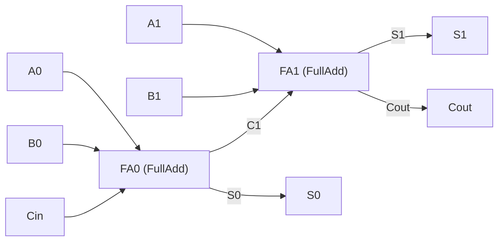

#elettronica_digitale 
#appunti 
# VHDL
## Introduzione
- **VHDL** = _Very High Speed Integrated Circuits Hardware Description Language_
- linguaggio per **descrivere sistemi hardware**, usabile per **sintesi** e/o **simulazione** (sviluppato dal DoD USA)
- vantaggi:
    - indipendente dal tool CAD (cosa impossibile con gli schematici)
    - indipendente dall'architettura di implementazione → codice riutilizzabile su piattaforme diverse (attenzione se si usano risorse specifiche del dispositivo)
    - stesso linguaggio per simulazione e sintesi
    - modellabile a qualunque livello gerarchico (chip, scheda, sistema)

### Sintesi
- processo di conversione del codice VHDL in **elementi fisici** specifici dell'hardware scelto
- il tool deve conoscere l'architettura del dispositivo per generare una **netlist** (EDIF) → richiede una libreria di primitive (`unisim`)
- oltre a tradurre fa riduzione logica, ottimizzazione e usa risorse specifiche della tecnologia target (clock globali, set/reset globali, registri nelle celle di I/O)

|Termine|Significato|
|---|---|
|**Netlist**|descrizione testuale della connettività del circuito: lista di connettori, di istanze e, per ogni istanza, dei segnali collegati ai suoi terminali (+ attributi)|
|**EDIF**|_Electronic Data Interchange Format_, formato standard per specificare una netlist|
|**EDN**|_Electronic Data Netlist_|
|**NGC**|netlist che contiene sia dati logici che _constraints_, sostituisce EDIF + NCF|

### Elementi strutturali

|Elemento|Cos'è|
|---|---|
|`entity`|interfaccia|
|`architecture`|implementazione / funzione / comportamento|
|`process`|blocco di istruzioni sequenziali controllato da eventi|
|`package`|insieme di dichiarazioni (tipi, costanti, funzioni)|
|`library`|collezione di oggetti VHDL compilati|

## Entity

Descrive **solo l'interfaccia** (nessun comportamento): nome, porte, per ogni porta direzione, tipo e dimensione.

```vhdl
entity FullAdd is
	port(
		A, B, C : in bit;
		S, Co   : out bit
	);
end FullAdd;
```

> [!warning] Sintassi l'ultima porta **non** ha `;` prima di `)`, il `;` va dopo la parentesi chiusa

- `bit` è un tipo standard: viene riconosciuto senza includere librerie, e ne sono sottintesi range e operatori

### Modi delle porte

|Modo|Significato|
|---|---|
|`in`|sola lettura|
|`out`|sola scrittura (**non** si può leggere dentro l'architecture), drivers multipli|
|`inout`|bidirezionale|
|`buffer`|come `out` ma leggibile, 1 solo driver → **sconsigliato** (barrato nelle slide)|

- capita di dover usare un segnale di output **all'interno** del circuito stesso (leggerlo) → uso `inout`
- alternativa più pulita: segnale interno letto internamente e poi assegnato all'`out`

## Architecture
- è obbligatorio descrivere **prima la Entity** e poi l'architecture
- è **sempre legata a una specifica entity**
- le porte della entity sono visibili come segnali dentro l'architecture
- contiene istruzioni **concorrenti**

```vhdl
architecture MyFA of FullAdd is
	-- parte DICHIARATIVA
begin
	-- parte DEFINITORIA
end MyFA;
```

|Parte|Contenuto|
|---|---|
|tra `is` e `begin` (**dichiarazioni**)|tipi, subtype, costanti, segnali, componenti|
|tra `begin` e `end` (**definizioni**)|assegnazioni di segnali, processi, istanze di componenti, istruzioni concorrenti|

- tra `begin` ed `end` si può usare una descrizione:
    - **strutturale**: richiamo di entity/componenti descritti altrove
    - **comportamentale**: approccio più ad alto livello, slegato dallo schematic del circuito

```vhdl
architecture EXAMPLE of STRUCTURE is
	subtype DIGIT is integer range 0 to 9;
	constant BASE : integer := 10;
	signal DIGIT_A, DIGIT_B : DIGIT;
begin
	...
end EXAMPLE;
```

## Segnali

Per definire il funzionamento interno bisogna dare un nome ai collegamenti, che avranno un corrispettivo **fisico** (fili).

```vhdl
signal identificatore : tipo [:= espressione];
```

- dichiarati nell'architecture (tra `is` e `begin`), **visibili solo al suo interno**
- negli esempi: `signal datain : std_logic;` `signal addr : bit_vector(3 downto 0);`

![[Porte logiche-1790763513846.webp|center|401]]

```vhdl
architecture MyFA of FullAdd is
	signal p    : bit;
	signal x, y : bit;
begin
	p  <= A xor B;
	x  <= p nand C;
	y  <= A nand B;
	S  <= C xor p;
	Co <= x nand y;
end MyFA;
```

`<=` = statement di assegnazione:

- **congruenza** tra i membri (stesso tipo)
- a sinistra **non** possono esserci porte `in`
- i segnali possono sia ricevere che cedere il valore

## Le istruzioni sono concorrenti

Non importa l'ordine in cui scrivo gli statement dell'architecture: sono eseguiti **in parallelo**, perché sto descrivendo uno schema circuitale.

```vhdl
x <= a and b;      -- equivale a scriverle invertite
y <= c and x;
```

## Tipi

- ogni segnale ha un **tipo** = insieme di valori che può assumere (in un'assegnazione può assumere **solo** valori del suo tipo)
- il tipo **deve sempre essere dichiarato**: nelle porte dell'entity o nell'architecture
- in un'assegnazione i tipi a sinistra e a destra **devono corrispondere**

### Tipi standard

|Descrizione|Keyword|Valori|
|---|---|---|
|Logico|`boolean`|`false`, `true`|
|Bit|`bit`|`'0'`, `'1'`|
|Caratteri|`character`|set ASCII|
|Interi|`integer`|da -(2^31-1) a 2^31-1|
|Reali|`real`|±1.7e+38 circa|

```vhdl
entity FULLADD is
	port(A, B, CIN : in bit;
	     SUM       : out bit;
	     CARRY     : out boolean);
end FULLADD;
```
## Modelli gerarchici e component
VHDL permette la modellazione **gerarchica**: un modulo si assembla a partire da sottomoduli.



Possiamo riutilizzare entity già definite:

```vhdl
entity RCA2 is
	port(
		A1, A0 : in bit;
		B1, B0 : in bit;
		Cin    : in bit;
		Cout   : out bit;
		S1, S0 : out bit
	);
end RCA2;

architecture MyRCA2 of RCA2 is

	signal C1 : bit;

	component FullAdd    -- ricercato nella directory di lavoro
		port(
			A, B, C : in bit;
			S, Co   : out bit
		);
	end component;

begin
	FA0: FullAdd port map (A0, B0, Cin, S0, C1);
	FA1: FullAdd port map (A1, B1, C1, S1, Cout);
end MyRCA2;
```

- **dichiarazione** (`component`): nella parte dichiarativa (tra `is` e `begin`), deve rispecchiare le porte della entity
- **istanziazione**: dopo `begin`, con una **label** per ogni utilizzo del componente (se lo uso 2 volte, 2 istanze con label diverse)
- i segnali di connessione tra istanze (come `C1`) sono dei _wires_ da dichiarare
- i nomi delle porte del component hanno **visibilità locale**

### Associazione delle porte

|Tipo|Sintassi|Note|
|---|---|---|
|**posizionale** (default)|`port map (A0, B0, Cin, S0, C1)`|conta l'**ordine** in cui passo i segnali|
|**per nome**|`port map (A => A0, B => B0, ...)`|a sinistra i **formali** (porte del component), a destra gli **attuali** (segnali dell'architecture); indipendente dall'ordine|

```vhdl
MODULE1: HALFADDER
	port map (A => A, SUM => W_SUM, B => B, CARRY => W_CARRY1);
```
## Operatori

|Categoria|Operatori|
|---|---|
|Logici|`not`, `and`, `or`, `nand`, `nor`, `xor`, `xnor`|
|Relazionali|`=`, `/=`, `<`, `<=`, `>`, `>=`|
|Shift|`sll`, `srl`|
|Aritmetici|`+`, `-`, `*`, `/`, `mod`, `abs`|
