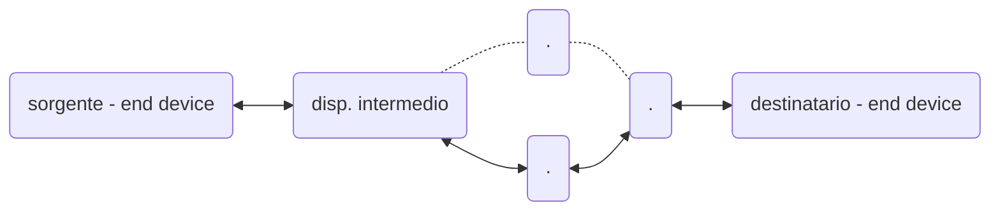
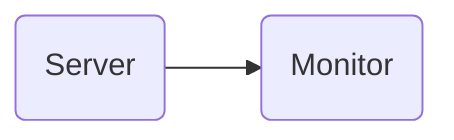
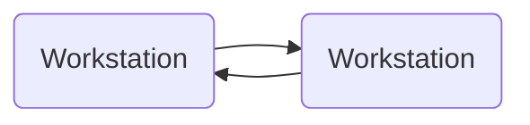
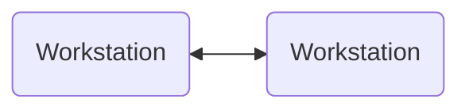

1. funzionamento di internet
2. protocolli per la comunicazione
3. architetture di rete (TCP/IP)
4. tecnologie di comunicazione e di rete
5. modi di interpretare e gestire l'informazione

esame
prova scritta e orale
la scritta è cambiata l'anno scorso e sarà come l'anno scorso

Le prime reti eterogenee sono state collegate tramite protocolli che permettono di astrarre il concetto di interconnessione tra reti.
Anche le tecnologie nate dopo si sono adattate ai protocolli già definiti.

# Introduzione
## Modalità di trasferimento
### commutazione di circuito
Prima di mandare l'informazioni la richiesta raggiunge il destinatario e ripercorrendo la stessa strada le risorse vengono riservate (rete telefonica).
in questo modo le prestazioni sono garantite, ma è necessario un setup di chiamata, che se non va a buon fine non può essere stabilita la connessione

### commutazione di pacchetto
L'informazione viene suddivisa in pacchetti, che prendono dei percorsi indipendenti (internet).
L'ordine di arrivo non è necessariamente quello di invio, viene ricostruito all'arrivo.
Il principale vantaggio è che se un nodo della rete non funziona correttamente, contrariamente alla commutazione di circuito, non è necessario ristabilire la connessione da 0 (fault tolerance - paradigma dinamico per motivi bellici).
Ogni pacchetto contiene informazioni aggiuntive per garantire la dinamicità della rete.
[...] <-- *fai schema con pacchetti che prendono direzioni diverse*

I canali che i pacchetti attraversano non sono dedicati in modo univoco ad un determinato flusso di informazione, ma possono essere messi in condivisione con chiunque altro abbia bisogno di una connessione. Questo è un grande vantaggio da un punto di vista economico: molti utenti utilizzano la stessa infrastruttura di rete.

>[!important] multiplexing
>Più flussi (anche da diverse sorgerti) sullo stesso canale.
>Il canale di comunicazione (di vario tipo) permette di trasmettere una certa quantità di bit al secondo. La risorsa che passa dal canale può essere spezzettata, in modo da poter inviare informazioni da vari flussi:
>- Frequency division
>- Time division
>- Wavelength division
>- Code division

![[Reti di telecomunicazioni-1790519782217.webp|center|377]]

I pacchetti possono avere velocità di trasmissioni diverse e possono sfruttare tutta la risorsa del canale o solo una parte e passare da canali eterogenei. In base al mezzo non tutte le forme d'onda vengono trasmesse --> cambia quindi anche il **data rate** (quantità di bit al secondo che il canale può trasportare).
Non dedicando le risorse a specifici flussi ci sono dei problemi:
- **contesa per le risorse**
  immettendo sulla rete una quantità di dati eccessivi, potrebbe superare la quantità di dati che può mantenere il canale di trasmissione
- **congestione**
  I pacchetti non accodati vengono persi

--> **store and forward** - meccanismo di accodamento e instradamento
Ogni nodo intermedio (insieme di nodi intermedi) è un sistema dotato di più code in grado di mantenere i pacchetti prima di inviarli al nodo successivo.

Con $L$ grandezza in bit dei pacchetti ed $R$ velocità di trasmissione

>[!multi-column]
>
>>[!important] Transmission delay
>>Tempo impiegato ad immettere un pacchetto sul canale ($\neq$ tempo impiegato a raggiungere un altro nodo). Può essere trovato come $\frac{L}{R}$
>
>>[!important] Store and forward
>>L'intero pacchetto deve arrivare prima di essere ritrasmesso al canale successivo.
>
>>[!important] End-end-delay
>>Tempo necessario dalla sorgente alla destinazione, può essere calcolato come $\frac{2L}{R}$

## Reti di accesso
>[!multi-column]
>
>>[!blank]
>>![[Reti di telecomunicazioni-1790519859068.webp|400]]
>
>>[!blank]
>>L'accesso alla rete è organizzata in una **gerarchia** e sui vari livelli avremo nodi di tipo diverso.
>>La suddivisione gerarchica è di livello logico, ma anche fisico: i nodi di accesso hanno hardware diverso dai core, che devono gestire il traffico di moltissime reti di accesso.
>>Si ha quindi una differenza di costi e compiti, portando anche a rapporti gerarchici tra le aziende che offrono i servizi di connessione alla rete.

## Canali di comunicazione
### Collegamento punto-punto
>[!multi-column]
>
>>[!blank]
>>Il collegamento può essere diretto e su livelli diversi
>>- 2 end device paritari
>>- end device e server
>>- comunicazione con alta direttività (la direzione delle onde elettromagnetiche non viaggiano in tutte le direzioni, ma solo verso il destinatario)
>
>>[!blank]
>>![[Reti di telecomunicazioni-1790520068059.webp|center|400]]
### Connessione punto a multipunto
Il segnale generato da un punto viene ricevuto da più punti, ma non in tutte le direzioni
### Canale broadcast
I satelliti hanno delle antenne che garantiscono un determinato cono di apertura che dipende anche dalla distanza dalla terra.
## Modalità di trasmissione
La scelta del canale potrebbe influire sulla scelta dei protocolli utilizzati
### Simplex
La comunicazione è supportata solo in una direzione

### Half-duplex
In entrambe le direzioni, ma in momenti diversi

### Full-duplex
Consente sia di trasmettere che di ricevere nello stesso momento

## Topologia di rete

>[!important] Rete di telecomunicazione
>Un insieme di **nodi** e **canali** che fornisce un collegamento tra due o più punti per permettere la telecomunicazione (comunicazione a distanza) tra essi.

>[!multi-column]
>
>>[!important] Nodo
>>Punto della rete in cui può avvenire la **commutazione** (processo per cui una sottoparte di informazione viene inviato in un mezzo di comunicazione piuttosto che un altro)
>
>>[!important] Canale
>>Mezzo trasmissivo
>

>[!multi-column]
>
>>[!blank]
>>I modi in cui sono disposti nodi e canali definisce la **topologia**:
>>-**topologia fisica**, tiene conto del percorso dei mezzi trasmissivi;
>>-**topologia logica**,  interconnessione tra nodi mediante canali.
>
>>[!blank]
>>![[Reti di telecomunicazioni-1790520279316.webp|center|400]]

Non necessariamente coincidono (tramite un insieme di protocolli e regole).
Tramite software posso gestire la comunicazione tra i nodi e instradare i flussi solo in determinate direzioni.

>[!question] Osservazione
> La topologia a maglia completamente connessa per esempio a livello fisico è incredibilmente complessa, ma può essere "simulata" a livello logico con molti meno collegamenti.
>Il processo inverso (limitare una topologia fisica molto connessa) può essere applicato per motivi di sicurezza.

![[Reti di telecomunicazioni-1790520313788.webp|center|718]]

- **completamente connessa**$$C = \frac{N(N-1)}{2}$$
  aumenta l'affidabilità, ma il numero di collegamenti è quadratica rispetto al numero di nodi.

- **Topologia ad albero**$$C = N-1$$
  Esiste un solo percorso tra i nodi, il che è uno svantaggio per la fault tolerance, ma è un vantaggio per la ricerca del percorso migliore
- **Topologia a maglia non completamente connessa**$$N-1 < C < \frac{N(N-1)}{2}$$
  tolleranza ai guasti e cammini alternativi, ma la commutazione diventa più complessa
- **Topologia a stella**$$C = N$$
  La commutazione è molto semplice, ma se il nodo centrale è guasto non è più garantita la comunicazione
- **Topologia ad anello**
  Può essere unidirezionale o bidirezionale$$C = N$$
  Vulnerabilità ai guasti (soprattutto nel monodirezionale), ma la commutazione è molto semplice
- **Topologia a bus**
  Può essere attivo se i nodi hanno un ruolo nella trasmissione.$$C = N-1$$
  È invece passivo se ho un canale broadcast a cui tutti i nodi si possono interfacciare.$$C = 1$$
  Sono necessari dei terminali che evitano la riflessione dell'onda elettromagnetica all'interno del collegamento.
- **Topologia Ibrida di rete**
  Internet collega reti con varie topologia eterogenee combinando i vantaggi delle singole reti
## Tecniche di commutazione
>[!important] Commutazione
>Allocare risorse

Il traffico su internet è intrinsecamente intermittente, quindi la [[#commutazione di pacchetto]] risulta molto conveniente.

**Vantaggi**
- Statistical multiplexing (nel circuit switching ogni slot è assegnato ad un canale, nella commutazione di pacchetto invece ogni pacchetto acquisisce il primo slot disponibile e lo libera dopo il passaggio)
- Possibilità di controllo di correttezza lungo il percorso: se c'è un percorso non più funzionante è possibile cambiare percorso anche durante la comunicazione
- Possibilità di conversione di velocità, formati e protocolli
- Si può implementare una tariffazione basata sul traffico trasmesso

**Svantaggi**
- Ogni pacchetto deve essere elaborato singolarmente
- ritardo di trasmissione variabile.

### Ritardi nelle reti
![[Reti di telecomunicazioni-1790523411038.webp|546]]
#### ritardo di elaborazione
Bisogna controllare alterazioni di bit che può portare il canale e determinare il link di uscita.
#### ritardo di accodamento
I pacchetti si mettono in attesa nella coda e attendono di essere prelevati e spostati sul link di uscita.
L'intensità del traffico che arriva sull'interfaccia potrebbe essere maggiore della velocità di instradamento.
Conoscendo il tasso di arrivo medio $a$ moltiplicato per la lunghezza del pacchetto $L$ e poi diviso per la banda $R$ otteniamo l'intensità del traffico $$\frac{L \cdot a}{R}$$
- $\frac{La}{R} \sim 0$ ritardo medio in coda piccolo
- $\frac{La}{R} \to 1$ i ritardi crescono
- $\frac{La}{R} > 1$ arrivano più pacchetti di quelli che si riescono a gestire
#### Ritardo di trasmissione
Rapporto tra la dimensione del pacchetto e il rate nominale
$$
\frac{L}{R}
$$
#### Ritardo di propagazione
Tempo impiegato a raggiungere il nodo successivo $\frac{d}{s}$
Dipende anche dalla distanza fisica tra i due nodi $d$, non solo dalla velocità di propagazione $s$
### Modi di servizio di una rete a pacchetto
#### Datagramma
Non esiste una suddivisione della comunicazione in tre fasi.
Posso inviare pacchetti indipendenti con percorsi e dimensioni diverse.
La tabella di instradamento associa dinamicamente l'**indirizzo di destinazione** alla **porta di uscita**.
Posso accettare un maggior numero di utenti, ma non posso garantire una determinata qualità per tutti.
In questo caso è necessario identificare la sorgente e la destinazione univocamente determinati.

Ogni pacchetto è considerato una entità autonoma e viene trasferita in rete solo sulla base dell'indirizzo di destinazione.
Ogni nodo ha una tabella di instradamento che associa ad ogni indirizzo di destinazione una porta di uscita, che viene aggiornata dinamicamente in base alle informazioni ricevute dai nodi adiacenti.

![[Reti di telecomunicazioni-1790524354193.webp|608]]
#### Circuito virtuale
La comunicazione avviene tramite una connessione sul piano logico.
Viene divisa in 3 fasi:
- apertura connessione
- trasferimento dati
- chiusura connessione
Viene stabilito un **accordo preliminare** tra la sorgente e la destinazione, che contengono il percorso (in condivisione con altri utenti) che verrà utilizzato per la comunicazione.
Nel circuito virtuale i pacchetti viaggiano in ordine.

![[Reti di telecomunicazioni-1790523756060.webp|475]]

Viene gestito tramite il **VCI** (identificativo di circuito virtuale): ogni nodo ha una **tabella di instradamento** che associa ad ogni VCI la linea di uscita stabilita e la nuova etichetta per il nodo successivo.

- **Tempo di trasmissione** $T_t =\frac{L}{C}$
  lunghezza di pacchetto $L \ [\text{bit}]$
  capacità del canale $C \ [\text{bit/s}]$
- **Tempo di propagazione** $T_p = \frac{l}{V}$
  lunghezza del collegamento $l \ [m]$
  velocità di propagazione del segnale $V \ [m\text{/s}]$
- **Tempo di elaborazione**
  è minore, le tabelle di instradamento semplificano questo processo

Non è necessario mantenere informazioni relative a sorgente e destinazione, ma è sufficiente identificare il circuito virtuale.

>[!question] Differenza con la [[#commutazione di circuito]]
>A differenza della commutazione di circuito le risorse non sono assegnate in modo esclusivo

#### Datagramma / Circuito virtuale
**Datagramma**
- Destination address determina il next hop
- i percorsi possono cambiare durante una sessione
- come chiedere indicazioni mentre si guida
**Circuito virtuale**
- Ogni pacchetto trasporta un identificativo che determina il next hop
- un percorso fisso viene determinato durante il *call setup* e resta lo stesso per tutta la durata della comunicazione
- i router mantengono informazioni di stato per-chiamata
# Modelli funzionali
Le reti sono molto complesse e composte da numerosi elementi: risulta quindi necessario organizzare tutti questi elementi.

>[!important] Comunicazione
>trasferire contenuto informativo attraverso regole e convenzioni stabilite a priori tra dispositivi, da cui dipendono anche le performance della rete.

La comunicazione presuppone la cooperazione tra i nodi della rete, per questo nascono agenzie (CCITT) e organizzazioni (ISO) con il compito di imporre degli standard che tutti i sistemi nella rete devono rispettare per garantire la comunicazione.
## Protocolli
Bisogna fare attenzione a convenzione, sintassi e semantica, altrimenti potremmo creare una incoerenza tra i dispositivi.
>[!important] Protocollo
>I protocolli definiscono il **formato**, l'**ordine** di invio e ricezione dei messaggi tra le entità di rete, e le **azioni** intraprese alla trasmissione/ricezione del messaggio.
>Un **protocollo** è un insieme di regole che governano il trasferimento dei dati tra entità che risiedono in diversi sistemi.
>Descrizione formale delle procedure adottate per assicurare la comunicazione tra due o più funzioni dello **stesso livello gerarchico**.

In una comunicazione i protocolli definiscono:
- **sintassi**
  struttura e formato di comandi e risposte e come vengono presentate
- **semantica**
  come deve essere interpretato un determinato messaggio
- **temporizzazione**
  sequenze temporali di comandi e risposte - tecniche di sincronizzazione dei nodi della rete
## Architetture a strati
Una architettura di comunicazione è composta da:
- **sistemi**
  effettuano il trattamento e/o trasferimento di informazione in vista di specifiche applicazioni
- **processi applicativi**
  coinvolti da esigenze di interazione con altri dispositivi
- **mezzi trasmissivi**
  la struttura fisica di interconnessione tra i sistemi

![[Reti di telecomunicazioni-1790846637179.webp|center|367]]

### Sistema e strato (logico vs fisico)
>[!multi-column]
>
>>[!important] Sistema
>>Successione ordinata di sottosistemi ad ognuno del quale è associato un sottoinsieme funzionale. Ogni sottosistema potrà essere poi mappato a ciascun livello, per questo vengono sviluppati in modo ordinato, così da creare una sequenza in cui ogni sottosistema comunica con il sottosistema con livello adiacente.
>
>>[!important] Strato
>>L'unione di tutti i sottosistemi omologhi (di uguale rango) appartenenti a sistemi interconnessi.
>>Due sistemi sono in grado di comunicare su un determinato livello se i sottosistemi del medesimo rango possono ricostruire il dato risalendo lo stack (usano le stesse convenzioni e svolgono le stesse funzioni)

La comunicazione tra i livelli è a livello logico, una astrazione, invece a livello fisico devo riattraversare tutti gli strati, dall'alto verso il basso.

Abbiamo quindi la possibilità di creare una infrastruttura logica in cui un dato che viene trasmesso può essere interpretato dallo strato dell'end-device sullo stesso livello

>[!multi-column]
>
>>[!blank]
>>**Livello logico**
>>![[Reti di telecomunicazioni-1790847479783.webp]]
>
>>[!blank]
>>**Livello fisico**
>>![[Reti di telecomunicazioni-1790847598113.webp]]

I livelli di progettazione diranno che tipo di informazioni (di controllo) devono essere garantite per ogni livello affinché i livelli si intendano.
### Informazioni utente e di controllo, PDU, SAP
>[!multi-column]
>
>>[!important] Informazioni utente
>>sono l'oggetto dello scambio
>
>>[!important] Informazioni di controllo
>>sono informazioni necessarie al trasferimento dell'informazione utente $\to$ effetto collaterale affinché le informazioni arrivino

Ad ogni livello viene aggiunta una informazione di controllo, interpretabile dal medesimo livello del sistema ricevente.

>[!important] Unità di dati
>le informazioni di utente o di controllo scambiate in un processo di comunicazione sono strutturate in unità informative specifiche di ogni strato, dette **unità di dati**

>[!important] PDU (Protocol data unit)
>Una unità di dati è composta da dati e unità di controllo (Header)
>PDU di livello [...]

>[!important] SAP (Service access point)
>Punto di accesso al livello

### Incapsulamento/decapsulamento
Per l'invio di un dato è necessario l'**incapsulamento**: ogni livello riceve informazioni dal livello superiore e viene eseguito un processo di aggiunta di informazioni di controllo, necessarie al **decapsulamento** per verificare l'integrità delle informazioni e passare il dato al livello successivo.
![[Reti di telecomunicazioni-1790848221981.webp|center|570]]

I sistemi intermedi non necessitano di tutti i livelli di progettazione, ma per il reindirizzamento sono sufficienti meno livelli:
- **Router** primi 3
- **Switch** primi 2
- **Hub** solo il primo 
![[Reti di telecomunicazioni-1790848674334.webp|center|464]]

---

# Modello ISO/OSI
Il comitato di standardizzazione ISO (International standard organization) ha definito un modello di riferimento OSI (Open system Interconnection), che viene oggi universalmente accettato.

È definito su 7 livelli
![[Reti di telecomunicazioni-1790846255642.webp|center|440]]

Un sistema che genera l'informazione o un host destinazione devono avere funzionalità collocate su ciascun livello.
È come se i due sistemi sono in grado di interpretare lo stesso livello gerarchico dello stack, senza interessarsi del funzionamento degli altri livelli.
## Livello fisico
[...]
È necessaria una interfaccia fisica in grado di interpretare le forme d'onda.
[...]
## Livello collegamento (livello 2)
### Servizi del livello (nodi, link, frame, tipi di collegamento, adattatori)
Ogni nodo sulla rete ha un processo di bufferizzazione, su vari livelli, necessari per l'implementazione store and forward e rendere i livelli indipendenti.
La quantità di bit prelevate dopo il buffer è legata ai protocolli di tipo collegamento.
Dobbiamo fornire i seguenti servizi:
- servizi forniti a **livello rete** per prelevare o fornire dati al livello adiacente
- **framing** - capire quando inizia e quando si conclude una porzione di dati, su questi frame è possibile effettuare:
	- **controllo sugli errori**
	  che stanno avvenendo sul singolo frame, se qualcuno di questi è errato può essere ritrasmesso
	- **controllo del flusso**
	  controllo sulla velocità di invio dei dati - il ricevitore potrebbe non riuscire abbastanza velocemente i dati inviati

Vari tipi di buffer che possono essere organizzati a bit (livello 1) o frame (livello 2). Servono a creare una asincronicità e parallelizzazione del funzionamento dei livelli. Inoltre tramite il buffer possiamo capire se il dato è stato corrotto, segnalandolo alla corrente in modo che la sorgente possa ritrasmetterlo: il frame verrà eliminato dal buffer solo quando abbiamo la certezza che ha raggiunto la destinazione.

>[!multi-column]
>
>>[!important] Nodi
>>[...]
>
>>[!important] Link
>>[...]

>[!important] Frame
>PDU di livello 2 [...]

Il livello **data-link** ha la responsabilità di trasferire datagrammi (frame) da un nodo al nodo adiacente su un link (collegamento punto-punto)

I collegamenti sono di tipo:
- point-to-point
- broadcast (LAN)
- switched (LAN commutata tramite l'uso di uno switch, che è capace di separare i **domini di collisione**)

La tecnologia utilizzata per i collegamenti (link) potrebbe essere eterogenea, questo potrebbe portare a un cambio di protocolli di data-link e di accesso al mezzo; Di conseguenza il formato del frame può cambiare in funzione del mezzo di trasmissione.

Definisce il collegamento su un link seriale:
- Classificazione
	- orientata al carattere (deprecated)
	- orientata al bit
- Colloquio
	- half-duplex
	- full-duplex
- Relazione tra le stazioni
	- master-slave
	- peer-to-peer

![[Reti di telecomunicazioni-1790865714210.webp|330]]

[...] <-- definisci il tipo di call out Protocollo

In genere si utilizzano protocolli che lavorano su firmware (stretta correlazione con la macchina per cui sono programmati) --> **adattatori**.
Il trasmittente incapsulano i datagrammi nel frame che li compete (ricevuti dal livello superiore)
![[Reti di telecomunicazioni-1790865886667.webp|409]]

**Funzioni del livello data-link**
[...]

### Framing (header/payload, delimitatori, BSC, HDLC + bit stuffing)
La quantità di bit è rappresentata dal datagramma + parte di controllo
- **parte di controllo** - Header
- **datagramma livello superiore** - Payload

![[Reti di telecomunicazioni-1790786586690.webp|center|555]] 

I gruppi logici di bit prendono il nome di **trame**.
Le trame permettono il reindirizzamento dei flussi.
È possibile numerare le trame, utili a ricostruire il flusso finale.
In questo modo in caso di errori possiamo ritrasmettere solo determinate trame.
Per delimitare le trame il ricevitore deve riconoscere l'inizio e la fine della trama, tramite **delimitatori di trama**, che identificano in modo univoco inizio e fine:
- **flag**
  sequenze di bit o caratteri speciali
- **codice di linea**
  [...]
- **temporizzazione**
  se abbiamo una elevata sincronizzazione posso stabilire in base al tempo l'inizio e la fine della trama
- **conteggio**
  una trama è composta da un determinato numero di bit che sarà sufficiente contare per determinare la fine

#### BSC
>[!protocollo] BSC
>Utilizza una serie di pattern di sincronizzazione, in modo da capire la frequenza con cui vengono inviati i bit. Poi utilizza una sequenza speciale start of header
>![[Reti di telecomunicazioni-1790866272935.webp]]

#### HDLC
>[!protocollo] HDLC
>Utilizza come delimitatore di inizio e fine la sequenza di bit `01111110`. Per evitare che si ripresenti all'interno del payload utilizziamo la tecnica del **bit stuffing**: se devo utilizzare la sequenza riservata inserisco un bit in più che interrompe la sequenza, che verrà inserito nella trasmissione e verrà eliminato nella ricezione.

### Controllo degli errori (cause, ripetizione, FEC/ARQ, parità, CRC)

>[!bug] Possibili cause di alterazione
>- **rumore termico**, probabilità di errore avendo un certo tipo di temperatura assoluta (dipende dai mezzi trasmissivi e apparati di ricezione e trasmissione) - PDF (probability density function)
>- **interferenza da altre trasmissioni** sullo stesso mezzo
>- **disturbi elettromagnetici**
>- **perdite di sincronismo**
>- etc.

>[!important] CRC (codice a ridondanza ciclica)
>[...]

Codice ripetizione - ogni volta che inviamo un segnale ne mandiamo anche una copia
*es.* `110 --> R3 --> 111 111 000`
Potrebbe capitare che il canale agisce sul segnale e la destinazione interpreta in modo errato il segnale
*es.* `111 101 000`
In questo modo posso **rilevare** l'errore se c'è discordanza tra le terne e **correggerlo** utilizzando la maggioranza dei rimanenti.
Se lo usassi per correggere rimarrebbe il problema se abbiamo due alterazioni nello stesso pattern, commettendo un errore.
Se avessi una quantità di bit alterati che è la metà del pattern (estremo inferiore) posso correggerlo, invece per la **rilevazione** può avvenire anche se due bit su 3 vengono alterati.

Applicando invece `R5`
*es.* `110 --> R5 --> 11111 11111 00000`
e c'è un errore
*es.* `11111 10110 00000`
posso ugualmente correggerlo $\to$ rispecchia la generalizzazione

Applicando una codifica con lo scopo di correggere potrebbe andare comunque male.
Utilizzando invece una capacità rilevativa, nel rilevare un errore, potrebbe farlo capire alla sorgente, mandandolo alla sorgente (riscontro positivo/negativo) (feedback di canale). In questo modo la sorgente può innescare una ritrasmissione e dato che il dato è bufferizzato può essere ritrasmesso.

Tipicamente nella rilevazione tipicamente si utilizzano i protocolli di ritrasmissione ARQ.
Avviando invece la modalità correttiva non abbiamo modo di rilevare e potrebbe andare bene o male.
In base al mezzo e a degli studi su di essi possiamo decidere se implementare un rilevamento o una correzione (può dipendere per esempio dalla lentezza del canale, se il canale è particolarmente lento si tende ad utilizzare la correzione).

- **FEC** correzione di errori
- **ARQ** rilevamento e ritrasmissione

>[!Important] Controllo di parità
>Posso utilizzare dei [[4. Gestione della memoria secondaria#Dischi RAID|bit di parità]] per controllare se in un pattern c'è stato un errore.
>Per essere più sicuri è possibili utilizzare i bit di parità in più dimensioni:
>![[Reti di telecomunicazioni-1790867284139.webp|center|300]]
>In questo modo aumentiamo il coding rate.
>Per Shannon possiamo determinare il limite superiore del coding rate oltre il quale non si può andare.
### Controllo del flusso e ritrasmissione (stop and wait, go back N)
#### Stop and wait

>[!protocollo] Stop and wait
>(Caso degenere del go back N con finestra unitaria, necessita di enumerazione a un bit)
>In ogni frame c'è un [[#Controllo degli errori (cause, ripetizione, FEC/ARQ, parità, CRC)|CRC]], codice generato applicando una funzione su header e payload che caratterizza il pattern di bit cercando di verificarne l'integrità
>Mantengo un frame nel buffer finché non ricevo un riscontro. Appena ricevo il riscontro posso eliminare il frame dal buffer e posso passare al successivo.
>Posso gestire un pacchetto alla volta.
>Ho quindi una bassa utilizzazione del canale.

#### Go back N

>[!protocollo] Go back N
>Approccio a finestra a slittamento (da capire).
>Invio una determinata quantità di frame che posso inviare prima di ricevere un riscontro - il bro ha un semaforo inizializzato a N, ogni volta che ne invia uno fa l'acquire, quando riceve riscontro fa la release.
>Ogni frame quindi va numerato (**numeri di sequenza**), in base alla dimensione della finestra posso avere la necessità di utilizzare più bit per l'enumerazione.
>Per il riscontro il ricevitore utilizza un ack cumulativo: se non arriva un determinato pacchetto $n$ non accetterà il pacchetto $n+1$. Ogni frame ha un timer di attesa che attende riscontro, in caso di pacchetti fuori sequenza si causa un effetto a catena.

### Medium access control (MAC)
Se ci sono più [...] che concorrono evitare che collidano
[...]
## Livelli successivi
[...]

# Modello TCP/IP
![[Reti di telecomunicazioni-1790783354935.webp|233]]
In realtà collegamento-fisico sono un unico livello di accesso alla rete.
Prende il nome da due protocolli (anche se ne contiene in realtà di più):
- **TCP**
- **IP**

## Livello di accesso alla rete (= OSI 1 + 2, rimanda ai capitoli sopra)
Il livello di accesso alla rete comprende sia il livello di:
- **collegamento**
  punto-punto (ppp, ethernet)
- **fisico**
  forme d'onda
[...]
## Livello di rete
Protocolli che permettono di andare da un certo sistema (sorgente) della rete ad un altro (destinazione)
- ip, protocolli di routing
Avendo una gestione gerarchica dei centri di smistamento non è necessario conoscere tutto l'indirizzo, ma solo a quale centro di smistamento è necessario inviare il dato
[...]
## Livello di trasporto (qui l'Internet checksum)
Trasferimento dati host-host
- tcp (orientato alla connessione), udp (non orientato alla connessione)
[...]

[[#Controllo degli errori (cause, ripetizione, FEC/ARQ, parità, CRC)]]
>[!important] Internet checksum
>Il trasmittente somma il contenuto dei segmenti e fa il complemento ad 1 della somma. Il trasmittente mette il valore della checksum nel campo checksum dell’UDP.
>Il ricevitore calcola la checksum del segmento ricevuto. Considera se la checksum calcolata è uguale al valore del campo checksum.
## Livello applicazione
Supporto delle applicazioni di rete
- ftp, smtp, http, dns
Ogni specifica applicazione avrà i suoi protocolli

# Differenze TCP/IP e ISO/OSI
mentre il modello ISO/OSI venne standardizzato dall'ente ISO e ha impiegato nel tempo per essere descritto nella sua interezza e per specificare le funzionalità di ogni livello, il modello TCP/IP nasce dall'utilizzo di protocolli progettati prescindendo da una logica di standardizzazione in modo da fornire servizi.
Sono quindi stati uniti più protocolli già presenti, si è dimostrato che funzionavano e solo dopo si è cominciato a preoccuparsi di standardizzare questi protocolli.
La differenza con il modello ISO/OSI è che il modello TCP/IP è molto più pratico, per ogni livello vengono associati determinati protocolli e di conseguenza un modo di gestire una informazione più pratico. Il modello ISO/OSI è quindi più astratto.
[...]
