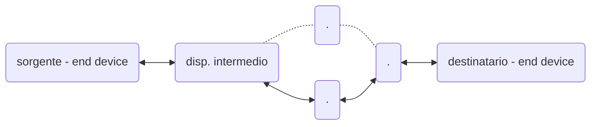
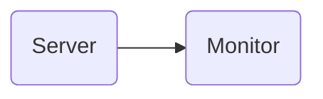
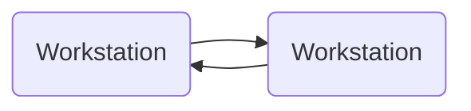
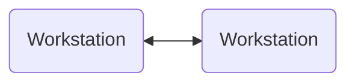

1. funzionamento di internet
2. protocolli per la comunicazione
3. architetture di rete (TCP/IP)
4. tecnologie di comunicazione e di rete
5. modi di interpretare e gestire l'informazione

esame
prova scritta e orale
la scritta è cambiata l'anno scorso e sarà come l'anno scorso

Le prime reti eterogenee sono state collegate tramite protocolli che permettono di astrarre il concetto di interconnessione tra reti.
Anche le tecnologie nate dopo si sono adattate ai protocolli già definiti.

# Introduzione
## Modalità di trasferimento
### commutazione di circuito
Prima di mandare l'informazioni la richiesta raggiunge il destinatario e ripercorrendo la stessa strada le risorse vengono riservate (rete telefonica).
in questo modo le prestazioni sono garantite, ma è necessario un setup di chiamata, che se non va a buon fine non può essere stabilita la connessione

### commutazione di pacchetto
L'informazione viene suddivisa in pacchetti, che prendono dei percorsi indipendenti (internet).
L'ordine di arrivo non è necessariamente quello di invio, viene ricostruito all'arrivo.
Il principale vantaggio è che se un nodo della rete non funziona correttamente, contrariamente alla commutazione di circuito, non è necessario ristabilire la connessione da 0 (fault tolerance - paradigma dinamico per motivi bellici).
Ogni pacchetto contiene informazioni aggiuntive per garantire la dinamicità della rete.
[...] <-- *fai schema con pacchetti che prendono direzioni diverse*

I canali che i pacchetti attraversano non sono dedicati in modo univoco ad un determinato flusso di informazione, ma possono essere messi in condivisione con chiunque altro abbia bisogno di una connessione. Questo è un grande vantaggio da un punto di vista economico: molti utenti utilizzano la stessa infrastruttura di rete.

>[!important] multiplexing
>Più flussi (anche da diverse sorgerti) sullo stesso canale.
>Il canale di comunicazione (di vario tipo) permette di trasmettere una certa quantità di bit al secondo. La risorsa che passa dal canale può essere spezzettata, in modo da poter inviare informazioni da vari flussi:
>- Frequency division
>- Time division
>- Wavelength division
>- Code division

![[Reti di telecomunicazioni-1790519782217.webp|center|377]]

I pacchetti possono avere velocità di trasmissioni diverse e possono sfruttare tutta la risorsa del canale o solo una parte e passare da canali eterogenei. In base al mezzo non tutte le forme d'onda vengono trasmesse --> cambia quindi anche il **data rate** (quantità di bit al secondo che il canale può trasportare).
Non dedicando le risorse a specifici flussi ci sono dei problemi:
- **contesa per le risorse**
  immettendo sulla rete una quantità di dati eccessivi, potrebbe superare la quantità di dati che può mantenere il canale di trasmissione
- **congestione**
  I pacchetti non accodati vengono persi

--> **store and forward** - meccanismo di accodamento e instradamento
Ogni nodo intermedio (insieme di nodi intermedi) è un sistema dotato di più code in grado di mantenere i pacchetti prima di inviarli al nodo successivo.

Con $L$ grandezza in bit dei pacchetti ed $R$ velocità di trasmissione

>[!multi-column]
>
>>[!important] Transmission delay
>>Tempo impiegato ad immettere un pacchetto sul canale ($\neq$ tempo impiegato a raggiungere un altro nodo). Può essere trovato come $\frac{L}{R}$
>
>>[!important] Store and forward
>>L'intero pacchetto deve arrivare prima di essere ritrasmesso al canale successivo.
>
>>[!important] End-end-delay
>>Tempo necessario dalla sorgente alla destinazione, può essere calcolato come $\frac{2L}{R}$

## Reti di accesso
>[!multi-column]
>
>>[!blank]
>>![[Reti di telecomunicazioni-1790519859068.webp|400]]
>
>>[!blank]
>>L'accesso alla rete è organizzata in una **gerarchia** e sui vari livelli avremo nodi di tipo diverso.
>>La suddivisione gerarchica è di livello logico, ma anche fisico: i nodi di accesso hanno hardware diverso dai core, che devono gestire il traffico di moltissime reti di accesso.
>>Si ha quindi una differenza di costi e compiti, portando anche a rapporti gerarchici tra le aziende che offrono i servizi di connessione alla rete.

## Canali di comunicazione
### Collegamento punto-punto
>[!multi-column]
>
>>[!blank]
>>Il collegamento può essere diretto e su livelli diversi
>>- 2 end device paritari
>>- end device e server
>>- comunicazione con alta direttività (la direzione delle onde elettromagnetiche non viaggiano in tutte le direzioni, ma solo verso il destinatario)
>
>>[!blank]
>>![[Reti di telecomunicazioni-1790520068059.webp|center|400]]
### Connessione punto a multipunto
Il segnale generato da un punto viene ricevuto da più punti, ma non in tutte le direzioni
### Canale broadcast
I satelliti hanno delle antenne che garantiscono un determinato cono di apertura che dipende anche dalla distanza dalla terra.
## Modalità di trasmissione
La scelta del canale potrebbe influire sulla scelta dei protocolli utilizzati
### Simplex
La comunicazione è supportata solo in una direzione

### Half-duplex
In entrambe le direzioni, ma in momenti diversi

### Full-duplex
Consente sia di trasmettere che di ricevere nello stesso momento

## Topologia di rete

>[!important] Rete di telecomunicazione
>Un insieme di **nodi** e **canali** che fornisce un collegamento tra due o più punti per permettere la telecomunicazione (comunicazione a distanza) tra essi.

>[!multi-column]
>
>>[!important] Nodo
>>Punto della rete in cui può avvenire la **commutazione** (processo per cui una sottoparte di informazione viene inviato in un mezzo di comunicazione piuttosto che un altro)
>
>>[!important] Canale
>>Mezzo trasmissivo
>

>[!multi-column]
>
>>[!blank]
>>I modi in cui sono disposti nodi e canali definisce la **topologia**:
>>-**topologia fisica**, tiene conto del percorso dei mezzi trasmissivi;
>>-**topologia logica**,  interconnessione tra nodi mediante canali.
>
>>[!blank]
>>![[Reti di telecomunicazioni-1791231168755.webp|center|400]]

Non necessariamente coincidono (tramite un insieme di protocolli e regole).
Tramite software posso gestire la comunicazione tra i nodi e instradare i flussi solo in determinate direzioni.

>[!question] Osservazione
> La topologia a maglia completamente connessa per esempio a livello fisico è incredibilmente complessa, ma può essere "simulata" a livello logico con molti meno collegamenti.
>Il processo inverso (limitare una topologia fisica molto connessa) può essere applicato per motivi di sicurezza.

![[Reti di telecomunicazioni-1791231141323.webp|center|532]]

- **completamente connessa**$$C = \frac{N(N-1)}{2}$$
  aumenta l'affidabilità, ma il numero di collegamenti è quadratica rispetto al numero di nodi.

- **Topologia ad albero**$$C = N-1$$
  Esiste un solo percorso tra i nodi, il che è uno svantaggio per la fault tolerance, ma è un vantaggio per la ricerca del percorso migliore
- **Topologia a maglia non completamente connessa**$$N-1 < C < \frac{N(N-1)}{2}$$
  tolleranza ai guasti e cammini alternativi, ma la commutazione diventa più complessa
- **Topologia a stella**$$C = N$$
  La commutazione è molto semplice, ma se il nodo centrale è guasto non è più garantita la comunicazione
- **Topologia ad anello**
  Può essere unidirezionale o bidirezionale$$C = N$$
  Vulnerabilità ai guasti (soprattutto nel monodirezionale), ma la commutazione è molto semplice
- **Topologia a bus**
  Può essere attivo se i nodi hanno un ruolo nella trasmissione.$$C = N-1$$
  È invece passivo se ho un canale broadcast a cui tutti i nodi si possono interfacciare.$$C = 1$$
  Sono necessari dei terminali che evitano la riflessione dell'onda elettromagnetica all'interno del collegamento.
- **Topologia Ibrida di rete**
  Internet collega reti con varie topologia eterogenee combinando i vantaggi delle singole reti
## Tecniche di commutazione
>[!important] Commutazione
>Allocare risorse

Il traffico su internet è intrinsecamente intermittente, quindi la [[#commutazione di pacchetto]] risulta molto conveniente.

**Vantaggi**
- Statistical multiplexing (nel circuit switching ogni slot è assegnato ad un canale, nella commutazione di pacchetto invece ogni pacchetto acquisisce il primo slot disponibile e lo libera dopo il passaggio)
- Possibilità di controllo di correttezza lungo il percorso: se c'è un percorso non più funzionante è possibile cambiare percorso anche durante la comunicazione
- Possibilità di conversione di velocità, formati e protocolli
- Si può implementare una tariffazione basata sul traffico trasmesso

**Svantaggi**
- Ogni pacchetto deve essere elaborato singolarmente
- ritardo di trasmissione variabile.

### Ritardi nelle reti
![[Reti di telecomunicazioni-1790523411038.webp|546]]
#### ritardo di elaborazione
Bisogna controllare alterazioni di bit che può portare il canale e determinare il link di uscita.
#### ritardo di accodamento
I pacchetti si mettono in attesa nella coda e attendono di essere prelevati e spostati sul link di uscita.
L'intensità del traffico che arriva sull'interfaccia potrebbe essere maggiore della velocità di instradamento.
Conoscendo il tasso di arrivo medio $a$ moltiplicato per la lunghezza del pacchetto $L$ e poi diviso per la banda $R$ otteniamo l'intensità del traffico $$\frac{L \cdot a}{R}$$
- $\frac{La}{R} \sim 0$ ritardo medio in coda piccolo
- $\frac{La}{R} \to 1$ i ritardi crescono
- $\frac{La}{R} > 1$ arrivano più pacchetti di quelli che si riescono a gestire
#### Ritardo di trasmissione
Rapporto tra la dimensione del pacchetto e il rate nominale
$$
\frac{L}{R}
$$
#### Ritardo di propagazione
Tempo impiegato a raggiungere il nodo successivo $\frac{d}{s}$
Dipende anche dalla distanza fisica tra i due nodi $d$, non solo dalla velocità di propagazione $s$
### Modi di servizio di una rete a pacchetto
#### Datagramma
Non esiste una suddivisione della comunicazione in tre fasi.
Posso inviare pacchetti indipendenti con percorsi e dimensioni diverse.
La tabella di instradamento associa dinamicamente l'**indirizzo di destinazione** alla **porta di uscita**.
Posso accettare un maggior numero di utenti, ma non posso garantire una determinata qualità per tutti.
In questo caso è necessario identificare la sorgente e la destinazione univocamente determinati.

Ogni pacchetto è considerato una entità autonoma e viene trasferita in rete solo sulla base dell'indirizzo di destinazione.
Ogni nodo ha una tabella di instradamento che associa ad ogni indirizzo di destinazione una porta di uscita, che viene aggiornata dinamicamente in base alle informazioni ricevute dai nodi adiacenti.

![[Reti di telecomunicazioni-1790524354193.webp|608]]
#### Circuito virtuale
La comunicazione avviene tramite una connessione sul piano logico.
Viene divisa in 3 fasi:
- apertura connessione
- trasferimento dati
- chiusura connessione
Viene stabilito un **accordo preliminare** tra la sorgente e la destinazione, che contengono il percorso (in condivisione con altri utenti) che verrà utilizzato per la comunicazione.
Nel circuito virtuale i pacchetti viaggiano in ordine.

![[Reti di telecomunicazioni-1790523756060.webp|475]]

Viene gestito tramite il **VCI** (identificativo di circuito virtuale): ogni nodo ha una **tabella di instradamento** che associa ad ogni VCI la linea di uscita stabilita e la nuova etichetta per il nodo successivo.

- **Tempo di trasmissione** $T_t =\frac{L}{C}$
  lunghezza di pacchetto $L \ [\text{bit}]$
  capacità del canale $C \ [\text{bit/s}]$
- **Tempo di propagazione** $T_p = \frac{l}{V}$
  lunghezza del collegamento $l \ [m]$
  velocità di propagazione del segnale $V \ [m\text{/s}]$
- **Tempo di elaborazione**
  è minore, le tabelle di instradamento semplificano questo processo

Non è necessario mantenere informazioni relative a sorgente e destinazione, ma è sufficiente identificare il circuito virtuale.

>[!question] Differenza con la [[#commutazione di circuito]]
>A differenza della commutazione di circuito le risorse non sono assegnate in modo esclusivo

#### Datagramma / Circuito virtuale
**Datagramma**
- Destination address determina il next hop
- i percorsi possono cambiare durante una sessione
- come chiedere indicazioni mentre si guida
**Circuito virtuale**
- Ogni pacchetto trasporta un identificativo che determina il next hop
- un percorso fisso viene determinato durante il *call setup* e resta lo stesso per tutta la durata della comunicazione
- i router mantengono informazioni di stato per-chiamata
# Modelli funzionali
Le reti sono molto complesse e composte da numerosi elementi: risulta quindi necessario organizzare tutti questi elementi.

>[!important] Comunicazione
>trasferire contenuto informativo attraverso regole e convenzioni stabilite a priori tra dispositivi, da cui dipendono anche le performance della rete.

La comunicazione presuppone la cooperazione tra i nodi della rete, per questo nascono agenzie (CCITT) e organizzazioni (ISO) con il compito di imporre degli standard che tutti i sistemi nella rete devono rispettare per garantire la comunicazione.
## Protocolli
Bisogna fare attenzione a convenzione, sintassi e semantica, altrimenti potremmo creare una incoerenza tra i dispositivi.
>[!important] Protocollo
>I protocolli definiscono il **formato**, l'**ordine** di invio e ricezione dei messaggi tra le entità di rete, e le **azioni** intraprese alla trasmissione/ricezione del messaggio.
>Un **protocollo** è un insieme di regole che governano il trasferimento dei dati tra entità che risiedono in diversi sistemi.
>Descrizione formale delle procedure adottate per assicurare la comunicazione tra due o più funzioni dello **stesso livello gerarchico**.

In una comunicazione i protocolli definiscono:
- **sintassi**
  struttura e formato di comandi e risposte e come vengono presentate
- **semantica**
  come deve essere interpretato un determinato messaggio
- **temporizzazione**
  sequenze temporali di comandi e risposte - tecniche di sincronizzazione dei nodi della rete
## Architetture a strati
Una architettura di comunicazione è composta da:
- **sistemi**
  effettuano il trattamento e/o trasferimento di informazione in vista di specifiche applicazioni
- **processi applicativi**
  coinvolti da esigenze di interazione con altri dispositivi
- **mezzi trasmissivi**
  la struttura fisica di interconnessione tra i sistemi

![[Reti di telecomunicazioni-1790846637179.webp|center|367]]

### Sistema e strato (logico vs fisico)
>[!multi-column]
>
>>[!important] Sistema
>>Successione ordinata di sottosistemi ad ognuno del quale è associato un sottoinsieme funzionale. Ogni sottosistema potrà essere poi mappato a ciascun livello, per questo vengono sviluppati in modo ordinato, così da creare una sequenza in cui ogni sottosistema comunica con il sottosistema con livello adiacente.
>
>>[!important] Strato
>>L'unione di tutti i sottosistemi omologhi (di uguale rango) appartenenti a sistemi interconnessi.
>>Due sistemi sono in grado di comunicare su un determinato livello se i sottosistemi del medesimo rango possono ricostruire il dato risalendo lo stack (usano le stesse convenzioni e svolgono le stesse funzioni)

La comunicazione tra i livelli è a livello logico, una astrazione, invece a livello fisico devo riattraversare tutti gli strati, dall'alto verso il basso.

Abbiamo quindi la possibilità di creare una infrastruttura logica in cui un dato che viene trasmesso può essere interpretato dallo strato dell'end-device sullo stesso livello

>[!multi-column]
>
>>[!blank]
>>**Livello logico**
>>![[Reti di telecomunicazioni-1790847479783.webp]]
>
>>[!blank]
>>**Livello fisico**
>>![[Reti di telecomunicazioni-1790847598113.webp]]

I livelli di progettazione diranno che tipo di informazioni (di controllo) devono essere garantite per ogni livello affinché i livelli si intendano.
### Informazioni utente e di controllo, PDU, SAP
>[!multi-column]
>
>>[!important] Informazioni utente
>>sono l'oggetto dello scambio
>
>>[!important] Informazioni di controllo
>>sono informazioni necessarie al trasferimento dell'informazione utente $\to$ effetto collaterale affinché le informazioni arrivino

Ad ogni livello viene aggiunta una informazione di controllo, interpretabile dal medesimo livello del sistema ricevente.

>[!important] Unità di dati
>le informazioni di utente o di controllo scambiate in un processo di comunicazione sono strutturate in unità informative specifiche di ogni strato, dette **unità di dati**

>[!important] PDU (Protocol data unit)
>Una unità di dati è composta da dati (Payload - SDU) e unità di controllo (Header)

>[!important] SAP (Service access point)
>Punto di accesso al livello

### Incapsulamento/decapsulamento
Per l'invio di un dato è necessario l'**incapsulamento**: ogni livello riceve informazioni dal livello superiore e viene eseguito un processo di aggiunta di informazioni di controllo, necessarie al **decapsulamento** per verificare l'integrità delle informazioni e passare il dato al livello successivo.
![[Reti di telecomunicazioni-1790848221981.webp|center|570]]

I sistemi intermedi non necessitano di tutti i livelli di progettazione, ma per il reindirizzamento sono sufficienti meno livelli:
- **Router** primi 3
- **Switch** primi 2
- **Hub** solo il primo 
![[Reti di telecomunicazioni-1790848674334.webp|center|464]]
# Modello ISO/OSI
Il comitato di standardizzazione ISO (International standard organization) ha definito un modello di riferimento OSI (Open system Interconnection), che viene oggi universalmente accettato.

È definito su 7 livelli
![[Reti di telecomunicazioni-1790846255642.webp|center|440]]

Un sistema che genera l'informazione o un host destinazione devono avere funzionalità collocate su ciascun livello.
È come se i due sistemi sono in grado di interpretare lo stesso livello gerarchico dello stack, senza interessarsi del funzionamento degli altri livelli.
## Livello fisico (livello 1)
Fornisce i mezzi meccanici, fisici, funzionali e procedurali per attivare, mantenere e disattivare le connessioni fisiche.
Ha il compito di effettuare la conversione da cifre binarie scambiate dalle entità di livello di collegamento.
Le unità dati sono bit o simboli.
È necessaria una interfaccia fisica in grado di interpretare le forme d'onda e una serie di procedure utili alla trasformazione del flusso informativo di bit in segnali da inviare al mezzo:
- modulazione/demodulazione
- codifica/decodifica
- multiplazione fisica e accesso multiplo fisico

![[Reti di telecomunicazioni-1791126990874.webp|center|542]]

![[Reti di telecomunicazioni-1791127089354.webp|center|514]]

## Livello collegamento (livello 2)
Fornisce i mezzi funzionali e procedurali per il trasferimento delle unità dati tra entità di livello rete e per fronteggiare malfunzionamenti del livello fisico.

Funzioni fondamentali:
- rilevazione e recupero degli errori di trasmissioni
- controllo di flusso
### Servizi del livello
Ogni nodo sulla rete ha un processo di bufferizzazione, su vari livelli, necessari per l'implementazione store and forward e rendere i livelli indipendenti.
La quantità di bit prelevate dopo il buffer è legata ai protocolli di tipo collegamento.
Dobbiamo fornire i seguenti servizi:
- servizi forniti a **livello rete** per prelevare o fornire dati al livello adiacente
- **Livello data link**
	- [[#Framing]]
	  capire quando inizia e quando si conclude una porzione di dati, su questi frame è possibile effettuare:
	- [[#Controllo degli errori]]
	  che stanno avvenendo sul singolo frame, se qualcuno di questi è errato può essere ritrasmesso
	- [[#Controllo del flusso e ritrasmissione (stop and wait, go back N)]]
	  controllo sulla velocità di invio dei dati - il ricevitore potrebbe non riuscire abbastanza velocemente i dati inviati
- [[#Medium access control (MAC)]]
	- Nel caso di mezzo condiviso fornisce i mezzi per condividere in maniera ottimale le risorse

Vari tipi di buffer che possono essere organizzati a bit (livello 1) o frame (livello 2). Servono a creare una asincronicità e parallelizzazione del funzionamento dei livelli. Inoltre tramite il buffer possiamo capire se il dato è stato corrotto, segnalandolo alla corrente in modo che la sorgente possa ritrasmetterlo: il frame verrà eliminato dal buffer solo quando abbiamo la certezza che ha raggiunto la destinazione.

>[!multi-column]
>
>>[!important] Nodi
>>Host e routers
>
>>[!important] Link
>>Canali di comunicazione che connettono nodi adiacenti lungo un percorso

>[!important] Frame
>PDU di livello 2, incapsula datagrammi.

Il livello **data-link** ha la responsabilità di trasferire datagrammi (frame) da un nodo al nodo adiacente su un link (collegamento punto-punto)

I collegamenti sono di tipo:
- point-to-point
- broadcast (LAN)
- switched (LAN commutata tramite l'uso di uno switch, che è capace di separare i **domini di collisione**)

La tecnologia utilizzata per i collegamenti (link) potrebbe essere eterogenea, questo potrebbe portare a un cambio di protocolli di data-link e di accesso al mezzo; Di conseguenza il formato del frame può cambiare in funzione del mezzo di trasmissione.

Definisce il collegamento su un link seriale:
- Classificazione
	- orientata al carattere (deprecated)
	- orientata al bit
- Colloquio
	- half-duplex
	- full-duplex
- Relazione tra le stazioni
	- master-slave
	- peer-to-peer

In genere si utilizzano protocolli che lavorano su firmware (stretta correlazione con la macchina per cui sono programmati) --> **adattatori**.
Il trasmittente incapsulano i datagrammi nel frame che li compete (ricevuti dal livello superiore)

![[Reti di telecomunicazioni-1791130796643.webp|center|639]]

>[!multi-column]
>
>>[!blank]
>>**Lato trasmittente**
>>Incapsula datagrammi in un frame e aggiunge bits di controllo di errore e di flusso
>
>>[!blank]
>**Lato ricevente**
>Controlla errori e il flusso, estrae i datagrammi e li passa al nodo ricevente
### Framing
La quantità di bit è rappresentata dal datagramma + parte di controllo
- **parte di controllo** - Header
- **datagramma livello superiore** - Payload

![[Reti di telecomunicazioni-1791127331408.webp|center|604]]

I gruppi logici di bit prendono il nome di **trame** e permettono il reindirizzamento dei flussi.
È possibile numerare le trame in modo da ricostruire il flusso finale, in questo modo in caso di errori possiamo ritrasmettere solo determinate trame.
Per delimitare le trame il ricevitore deve riconoscere l'inizio e la fine della trama, tramite **delimitatori di trama**, che identificano in modo univoco inizio e fine:
- **flag** (delimiter)
  sequenze di bit o caratteri speciali
- **codice di linea**
  violazione del codice di linea usato a livello fisico
- **temporizzazione**
  se abbiamo una elevata sincronizzazione posso stabilire in base al tempo l'inizio e la fine della trama
- **conteggio**
  una trama è composta da un determinato numero di bit che sarà sufficiente contare per determinare la fine

#### BSC
>[!protocollo] BSC
>Utilizza una serie di pattern di sincronizzazione SYN, in modo da capire la frequenza con cui vengono inviati i bit. Poi utilizza una sequenza speciale start of header SOH e un'altra sequenza speciale per segnalare l'inizio dei dati STX. Un'altra sequenza speciale indica la fine dei dati ETX.
>![[Reti di telecomunicazioni-1790866272935.webp|center|400]]

>[!important] DLE
>Se nei dati compare per caso un byte uguale a un carattere di controllo, il ricevitore crederebbe che la trama sia finita. Per evitarlo si usa il carattere DLE (Data Link Escape), con la tecnica del character stuffing:
>- i delimitatori diventano coppie `DLE STX` apre i dati, `DLE ETX` li chiude;
>- se nei dati compare un DLE, il trasmettitore lo raddoppia (`DLE DLE`); il ricevitore, quando vede due DLE consecutivi, ne elimina uno e tratta l'altro come dato.
>
>Così un carattere di controllo è valido solo se preceduto da un DLE singolo.

#### HDLC
>[!protocollo] HDLC
>Utilizza come delimitatore di inizio e fine la sequenza di bit `01111110`. Per evitare che si ripresenti all'interno del payload utilizziamo la tecnica del **bit stuffing**.

>[!important] bit stuffing
>Per garantire che il flag non compaia mai all'interno del frame, trasmettitore e ricevitore si accordano sulla seguente regola:
>- **in trasmissione**: dopo ogni sequenza di cinque 1 consecutivi nei dati si inserisce uno 0;
>- **in ricezione**: dopo cinque 1 consecutivi si guarda il bit successivo: se è 0 è di riempimento e viene eliminato; se è 1, si tratta del flag.
>
>Poiché nei dati non possono mai comparire sei 1 consecutivi, il flag `01111110` è univoco.
### Controllo degli errori

>[!bug] Possibili cause di alterazione
>- **rumore termico**, probabilità di errore avendo un certo tipo di temperatura assoluta (dipende dai mezzi trasmissivi e apparati di ricezione e trasmissione) - PDF (probability density function)
>- **interferenza da altre trasmissioni** sullo stesso mezzo
>- **disturbi elettromagnetici**
>- **perdite di sincronismo**
>- etc.

>[!multi-column]
>
>>[!protocollo] FEC (forward error correction)
>>Prevede l'aggiunta di ridondanza in trasmissione, in modo che il sistema ricevente riceva delle informazioni extra insieme al messaggio utile. Lo scopo principale è proprio l'uso della ridondanza in ricezione per **correggere** ai bit errati. Questo processo di recupero dell'informazione originale ha però un limite logico: è possibile solo se le alterazioni avvengono in numero contenuto.
>
>>[!protocollo] ARQ (automatic retransmission request) 
>>Questo metodo prevede un'aggiunta di ridondanza in trasmissione per ogni unità informativa, tipicamente implementata tramite un campo denominato FCS (Frame Check Sequence). Il suo scopo è ben delineato e limitato: l'uso della ridondanza in ricezione serve esclusivamente per **rivelare** la presenza di errori e non per correggerli.
>>L'effettiva correzione avverrà tramite la richiesta di ritrasmissione dell'unità informativa alla sorgente.

Codice ripetizione - ogni volta che inviamo un segnale ne mandiamo anche una copia
*es.* `110 --> R3 --> 111 111 000`
Potrebbe capitare che il canale agisce sul segnale e la destinazione interpreta in modo errato il segnale
*es.* `111 101 000`
In questo modo posso **rilevare** l'errore se c'è discordanza tra le terne e **correggerlo** utilizzando la maggioranza dei rimanenti.
Se avessi una quantità di bit alterati che è la metà del pattern (estremo inferiore) posso correggerlo, invece per la **rilevazione** può avvenire anche se due bit su 3 vengono alterati.
Il numero massimo di bit correggibili è dato da:
$$
t = \left\lfloor  \frac{N-1}{2}  \right\rfloor 
$$
Applicando invece `R5`
*es.* `110 --> R5 --> 11111 11111 00000`
e c'è un errore
*es.* `11111 10110 00000`
posso ugualmente correggerlo $\to$ rispecchia la generalizzazione

Utilizzando una capacità rilevativa, si potrebbe mandare alla sorgente (riscontro positivo/negativo) un **feedback di canale**. In questo modo la sorgente può innescare una ritrasmissione e dato che il dato è bufferizzato può essere ritrasmesso.

In base al mezzo e a degli studi su di essi possiamo decidere se implementare un rilevamento o una correzione (può dipendere per esempio dalla lentezza del canale, se il canale è particolarmente lento si tende ad utilizzare la correzione).

>[!important] Coding rate
>Il **coding rate** è il rapporto tra bit utili e bit trasmessi
>$$R_c = \frac{k}{n} \hspace{4ex} (k =\text{ bit di informazione, }n=\text{ bit totali})$$
>Più ridondanza significa più protezione, ma $R_c$ più basso (si sprecano più bit).

>[!Important] Controllo di parità
>Posso utilizzare dei [[4. Gestione della memoria secondaria#Dischi RAID|bit di parità]] per controllare se in un pattern c'è stato un errore.
>Per essere più sicuri è possibili utilizzare i bit di parità in più dimensioni:
>![[Reti di telecomunicazioni-1790867284139.webp|center|300]]
>In questo modo aumentiamo il coding rate.
>Per Shannon possiamo determinare il limite superiore del coding rate oltre il quale non si può andare.

>[!important] CRC (codice a ridondanza ciclica)
>Il CRC è un codice di rilevazione che fa uso di aritmetica in modulo 2.

### Controllo del flusso e ritrasmissione
È necessario regolamentare il flusso dei frame che deve essere inviato, evitando di sovraccaricare la scheda del ricevente.
Per la valutazione dei protocolli è necessario definire i ritardi:
- **ritardo di trasmissione**$$T (\text{sec}) = \frac{L(\text{bit})}{V_T (\text{bit/sec})}$$ funzione della lunghezza del frame $L$
- **ritardo di propagazione**$$\tau (\text{sec})= \frac{d(\text{m})}{V_p (\text{m/sec})}$$funzione della lunghezza del canale $d$

Inoltre faremo uso del **diagramma di timing** che rappresenta su due linee del tempo i due sistemi:
![[Reti di telecomunicazioni-1791451492256.webp|center|662]]

Valutiamo l'**efficienza** di un protocollo come:
$$
E = \frac{T}{T_{tot}} \in [0,1]
$$
dove $T$ è il ritardo di trasmissione e il tempo totale $T_{tot}$ contiene sia i tempi necessario che i tempi morti
#### Stop and wait
>[!multi-column]
>
>>[!protocollo] Trasmettitore
>>Prepara il frame in un tempo pari al ritardo di trasmissione, invia il frame, ne mantiene una copia in un buffer e avvia un timer. Solo nel momento in cui riceve il riscontro (`ACK`) invia il frame successivo. Se il riscontro non arriva entro lo scadere del timer oppure arriva un riscontro negativo, può rinviare la copia del frame precedente. 
>
>>[!protocollo] Ricevitore
>>Mantiene un bit utile a tracciare il **numero di sequenza** (i frame arrivati hanno un numero di sequenza che si alterna tra 0 e 1). Alla ricezione del frame invia un `ACK` al trasmettitore e aggiorna il numero di sequenza.

![[Reti di telecomunicazioni-1791456564669.webp|741]]

Inizialmente il riscontro potevano essere:
- positivo
  se arriva posso andare avanti e rimuovere il frame precedente
- negativo
  quel pacchetto è arrivato corrotto e va rimandato
>[!bug] Il problema principale è se viene perso il riscontro
>Questo problema viene risolto tramite l'implementazione di un timer associato ad ogni frame inviato, che può essere avviato nel momento in cui la sorgente inizia l'elaborazione del frame o dal momento in cui viene immesso nella rete.

![[Reti di telecomunicazioni-1791456808592.webp|659]]

È fondamentale scegliere bene il tempo necessario al timer prima di rinviare il frame, in quanto, se è un tempo troppo breve, rischiamo di effettuare troppo ritrasmissioni innecessarie; se invece è troppo lungo, la comunicazione è più lenta.
Possiamo definire il tempo di attesa in modo corretto tramite la seguente disuguaglianza
$$t_{out} \geq 2 \tau + 2 T_{e} + T_r$$
[...] ricontrolla formula da cla

>[!important] Numero di sequenza
>Anche nello Stop-and-Wait, dove si trasmette e si riceve un solo frame alla volta, è necessario un numero di sequenza, anche di un solo bit. Se l'ACK va perso o arriva in ritardo, allo scadere del timer il mittente ritrasmette il frame, ma il ricevitore non è in grado di stabilire se si tratti di un duplicato del frame precedente o di un nuovo frame. Associando un bit a ogni frame, il ricevitore si aspetta un'alternanza dei valori (0, 1, 0, 1, …): se riceve due volte lo stesso bit, capisce che si tratta di una ritrasmissione e scarta il duplicato, reinviando l'ACK.

![[Reti di telecomunicazioni-1791457573851.webp|683]]

**Efficienza**
Riprendendo l'efficienza
$$
E = \frac{T}{T_{tot}} \in [0,1]
$$
in questo protocollo possiamo considerare $T_{tot}$ come:
$$
T_{tot} = \underbrace{T+\tau+T_r}_{\text{frame}} + \underbrace{T_E + \tau + T_r}_{ACK} = T+T_E + 2 \tau + 2 T_r
$$
dove $T$ ritardo di trasmissione, $T_{E}$ tempo di trasmissione dell'ACK, $\tau$ ritardo di propagazione e $T_r$ tempo di elaborazione.

Possiamo quindi riscrivere l'efficienza come
$$
E = \frac{T}{2 \tau + T + 2T_r + T_E} = \frac{1}{2 \frac{\tau}{T} + 1 + 2 \frac{T_r}{T} + \frac{T_E}{T}}
$$
Per valutare correttamente l'efficienza dobbiamo tenere in considerazione la possibilità che il frame debba essere ritrasmesso anche più di una volta, ma questa è una variabile aleatoria, di conseguenza estendiamo il concetto di efficienza aggiungendo il [[2. Variabili aleatorie#Valore atteso|valore atteso]] $E[n_t]$ per misurare il numero medio di trasmissioni necessarie ad avere il primo successo, che può essere approssimato ad una [[Modelli matematici#Prove di Bernoulli (binomiale - geometrico)|geometrica]]:
$$
E[n_t] = \frac{1}{1-p}
$$
dove $p$ è la probabilità di errore di frame (cioè che il frame arrivi alterato al ricevitore).
La formula dell'efficienza diventa quindi
$$
E = \frac{T}{E[n_t] \cdot T_{tot}} = \frac{T}{\frac{1}{1-p} \cdot T_{tot}} = \frac{1}{\frac{1}{1-p} \left(2 \frac{\tau}{T} + 1 + 2 \frac{T_r}{T} + \frac{T_E}{T}\right)}
$$
Ipotizziamo l'esistenza di un canale non rumoroso, se la probabilità di errore è nullo $p = 0$ e sapendo che in generale $2 \frac{T_r}{T} + \frac{T_E}{T}$ sono trascurabili rispetto al resto dei termini:
$$
E = \frac{1-p}{1+2a} \hspace{8ex} a = \frac{\tau}{T} > 0
$$
dove $a$ rapporto tra la propagazione e la trasmissione, caratteristica del canale.

Il denominatore è maggiore di 1, nella migliore delle ipotesi $p\to 0$, ne concludiamo che con questo tipo di protocolli non possiamo avere una alta efficienza.

[...]
In ogni frame c'è un [[#Controllo degli errori|CRC]], codice generato applicando una funzione su header e payload che caratterizza il pattern di bit cercando di verificarne l'integrità.
#### Go back N
Protocollo ARQ
Funzionamento simile allo [[#Stop and wait]] ma con $n$ frame.
>[!multi-column]
>
>>[!protocollo] Trasmettitore
>>Invia una finestra di $n$ frame in sequenza, avvia un timer per ciascun frame e poi attende gli ACK. Nel caso in cui non riceve il riscontro e il timer associato ad un frame $i$ termina ritrasmetterà il frame $i$ e tutti i successivi (effetto a cascata), anche se avesse ricevuto l'ACK del frame $i+1$ o successivi, che risulteranno quindi persi
>
>>[!protocollo] Ricevitore
>>Mantiene le informazioni dell'ultimo frame ricevuto

![[Reti di telecomunicazioni-1791462631656.webp]]

Il **numero di sequenza** diventa ora cruciale per capire quale frame è stato ricevuto: vengono usati $m$ bit per enumerare i frame (*es.* con una finestra di $n = 4$ sono necessari almeno $m=2$ bit per enumerare i frame).

>[!bug] Numero di bit necessari alla enumerazione dei frame
>Nel Go-Back-N, se tutti i frame della finestra (ad esempio 0, 1, 2, 3) arrivano correttamente al ricevitore ma tutti gli ACK vanno persi, i timer del mittente scadono e l'intera finestra viene ritrasmessa. Se la numerazione usasse solo i numeri da 0 a 3 (m = 2 bit), il ricevitore, che si aspetta il frame successivo, il quale ripartirebbe da 0, non potrebbe distinguere una ritrasmissione dal frame nuovo. Per evitare l'ambiguità, il numero di bit m usati per la numerazione deve soddisfare$$2^m > n$$
>dove $n$ è la dimensione della finestra di trasmissione. In questo modo il numero di sequenza atteso non coincide mai con quello del primo frame ritrasmesso. Nell'esempio, con $n = 4$ servono $m = 3$ bit (numeri da 0 a 7): dopo aver ricevuto i frame 0-3 il ricevitore si aspetta il 4, ma riceve di nuovo lo 0, quindi capisce che è una ritrasmissione e lo scarta, reinviando l'ACK.

La scelta della lunghezza $n$ della finestra di tolleranza deve essere tale che prima di finire l'invio del primo treno arrivi il primo riscontro.

[...] <-- come scegliere il time out

**Efficienza**
Nel caso migliore il tempo necessario a trasmettere tutti i frame nella finestra è esattamente
$$
n \cdot T
$$
Ma questa è un grossa approssimazione.
Indicando con $n_r$ il numeri di **ritrasmissioni** (non di trasmissioni come nello stop & wait) indichiamo il tempo totale con
$$
T_{tot} = T + n_r(T+t_{out})
$$
Partendo da questa considerazione e sfruttando la linearità dell'operatore valore atteso, possiamo calcolare l'efficienza come
$$
E = \frac{T}{E[T_{tot}]} = \frac{T}{E[T + n_r(T+t_{out})]} = \frac{T}{E[T] + E[n_r(T+t_{out})]}
$$
essendo $T$ non dipendente da nessuna variabile aleatoria $E[T] = T$. Solo $n_r$ è una variabile aleatoria
$$
E = \frac{T}{T+E[n_r](T+t_{out})}
$$
Il valore atteso del numero di ritrasmissioni è pari al valore atteso del numero di trasmissioni a cui sottraiamo la prima trasmissione
$$
E[n_t] = \frac{1}{1-p} \implies E[n_r] = E[n_t] -1 = \frac{1}{1-p} - 1 = \frac{p}{1-p}
$$
Ne concludiamo che
$$
E = \frac{T}{T+ \frac{p}{1-p}(T+t_{out})} = \frac{1-p}{1+ p \frac{t_{out}}{T}}
$$
#### Selective repeat
Protocollo ARQ
[...]

### Medium access control (MAC)
Nel caso di reti broadcast al livello di linea viene aggiunta la funzionalità di accesso multiplo detta MAC (Medium Access Control).
Se ci sono più dati che concorrono sullo stesso mezzo dobbiamo evitare che collidano.

## Livello rete (livello 3)
Fornisce i mezzi funzionali e procedurali per lo scambio di informazioni tra entità di livello di trasporto.
Fornisce i mezzi per instaurare, mantenere e abbattere le connessioni di rete tra entità di livello trasporto.
Funzioni fondamentali:
- instradamento
- indirizzamento
- controllo di connessione
![[Reti di telecomunicazioni-1791127810485.webp|center|545]]
L'obbiettivo fondamentale di questo livello è quello di individuare il partner nel colloquio (funzione di **instradamento**). Per far questo è necessaria una **tabella di instradamento**, che permette la scelta del SAP di uscita sulla base delle informazioni memorizzate, associando ad ogni destinazione il SAP di uscita

| Destinazione | SAP uscita |
| ------------ | ---------- |
|              |            |

## Livello trasporto (livello 4)
Fornisce alle entità di livello sessione le connessioni di livello trasporto.
Colma le deficienze della qualità di servizio delle connessioni di livello rete.
È il livello più basso con significato da estremo a estremo (la rete è una scatola nera, non ci interessa cosa avviene e come avviene la connessione tra gli host), per questo è implementato solo nei nodi terminali.
In questo livello i messaggi vengono frammentati in segmenti.
Le funzioni principali sono:
- connessione
- controllo di errore e di flusso

![[Reti di telecomunicazioni-1791128304964.webp|center|555]]

## Livello sessione (livello 5)
È responsabile dell'organizzazione del dialogo fra due programmi applicativi di sistemi diversi. Per permettere questa comunicazione, lo strato assicura alle entità di presentazione una connessione di sessione e si occupa di organizzare attivamente il colloquio tra le entità di presentazione stesse.

Le sue funzioni principali si concentrano sulla gestione del dialogo e sulla sincronizzazione tra eventi. A livello pratico, questo livello struttura e sincronizza lo scambio di dati in modo da poterlo sospendere, riprendere e terminare ordinatamente. Infine, per garantire stabilità al dialogo rispetto ai problemi di rete inferiori, il livello di sessione maschera le interruzioni del servizio trasporto.
## Livello presentazione (livello 6)
Lo scopo principale è la corretta interpretazione e formattazione delle informazioni scambiate.

Nello specifico, questo strato risolve i problemi di compatibilità per quanto riguarda la rappresentazione dei dati da trasferire. Per permettere una comunicazione trasparente tra architetture eterogenee, il livello di presentazione risolve i problemi relativi alla trasformazione della sintassi dei dati, una funzione essenziale, ad esempio, quando avviene un colloquio di sistemi basati su sistemi operativi diversi. Infine, oltre a gestire l'aspetto sintattico, questo livello può fornire servizi di cifratura delle informazioni.
## Livello applicazione (livello 7)
Il compito fondamentale di questo strato è fungere da interfaccia diretta per il software: fornisce ai processi applicativi i mezzi per accedere all'ambiente OSI.
Esempi di servizio:
- trasferimento di file
- terminale virtuale
- posta elettronica

# Modello TCP/IP
![[Reti di telecomunicazioni-1791128904735.webp|center|274]]

In realtà collegamento-fisico sono un unico livello di accesso alla rete.
Prende il nome da due protocolli (anche se ne contiene in realtà di più):
- **TCP**
- **IP**

## Livello di accesso alla rete (livello 1)
Il livello di accesso alla rete comprende sia il livello di:
- [[#Livello collegamento (livello 2)]]
  punto-punto (ppp, ethernet)
- [[#Livello fisico (livello 1)]]
  forme d'onda
## Livello di rete (livello 2)
[[#Livello rete (livello 3)]]
Protocolli che permettono di andare da un certo sistema (sorgente) della rete ad un altro (destinazione).
Avendo una gestione gerarchica dei centri di smistamento non è necessario conoscere tutto l'indirizzo, ma solo a quale centro di smistamento è necessario inviare il dato

Le sue principali funzioni sono:
- **interfunzionamento delle reti**
  questo livello consente a varie reti componenti di funzionare insieme. Sostanzialmente, maschera le differenze hardware sottostanti impacchettando i dati in un formato universale.
- **servizio senza connessione**
  il livello fornisce un servizio di strato senza connessione. I dati (datagrammi) vengono inviati nella rete senza stabilire preventivamente un canale dedicato.

>[!protocollo] IP
>Il protocollo utilizzato è l'Internet Protocol (IP), il quale provvede a instradare i dati attraverso reti multiple collegate in cascata. In pratica, si assicura di trovare il percorso giusto per trasferire informazioni tra sistemi terminali che appartengono a reti diverse.

## Livello di trasporto (livello 3)
[[#Livello trasporto (livello 4)]]
Trasferimento dati host-host.

[[#Controllo degli errori (cause, ripetizione, FEC/ARQ, parità, CRC)]]
>[!important] Internet checksum
>Il trasmittente somma il contenuto dei segmenti e fa il complemento ad 1 della somma. Il trasmittente mette il valore della checksum nel campo checksum dell’UDP.
>Il ricevitore calcola la checksum del segmento ricevuto. Considera se la checksum calcolata è uguale al valore del campo checksum.

>[!protocollo] TCP
>Protocollo di trasporto orientato alla connessione

>[!protocollo] UDP
>Protocollo di trasporto non orientato alla connessione

## Livello applicazione (livello 4)
[[#Livello sessione (livello 5)]] [[#Livello presentazione (livello 6)]] [[#Livello applicazione (livello 7)]]
Supporto delle applicazioni di rete.
Ogni specifica applicazione avrà i suoi protocolli (telnet, ftp, smtp, http, dns).

# Differenze TCP/IP e ISO/OSI
mentre il modello ISO/OSI venne standardizzato dall'ente ISO e ha impiegato nel tempo per essere descritto nella sua interezza e per specificare le funzionalità di ogni livello, il modello TCP/IP nasce dall'utilizzo di protocolli progettati prescindendo da una logica di standardizzazione in modo da fornire servizi.
Sono quindi stati uniti più protocolli già presenti, si è dimostrato che funzionavano e solo dopo si è cominciato a preoccuparsi di standardizzare questi protocolli.
La differenza con il modello ISO/OSI è che il modello TCP/IP è molto più pratico, per ogni livello vengono associati determinati protocolli e di conseguenza un modo di gestire una informazione più pratico. Il modello ISO/OSI è quindi più astratto.

---
