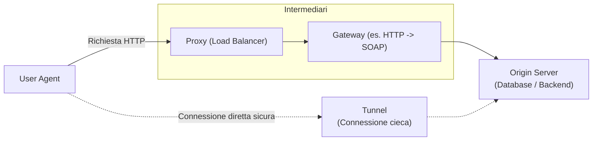
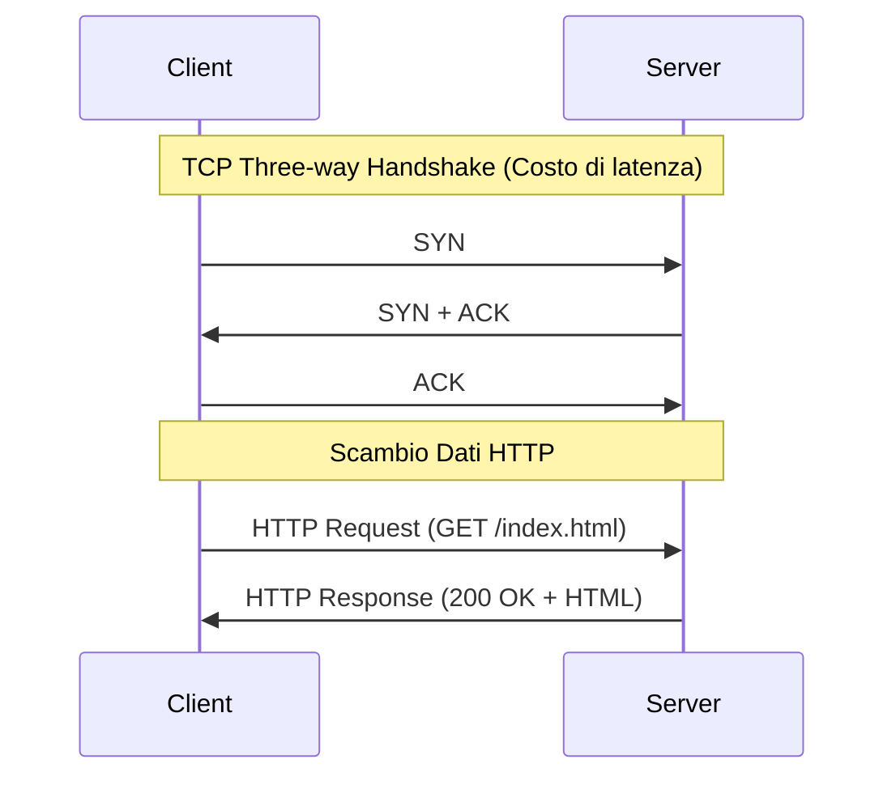
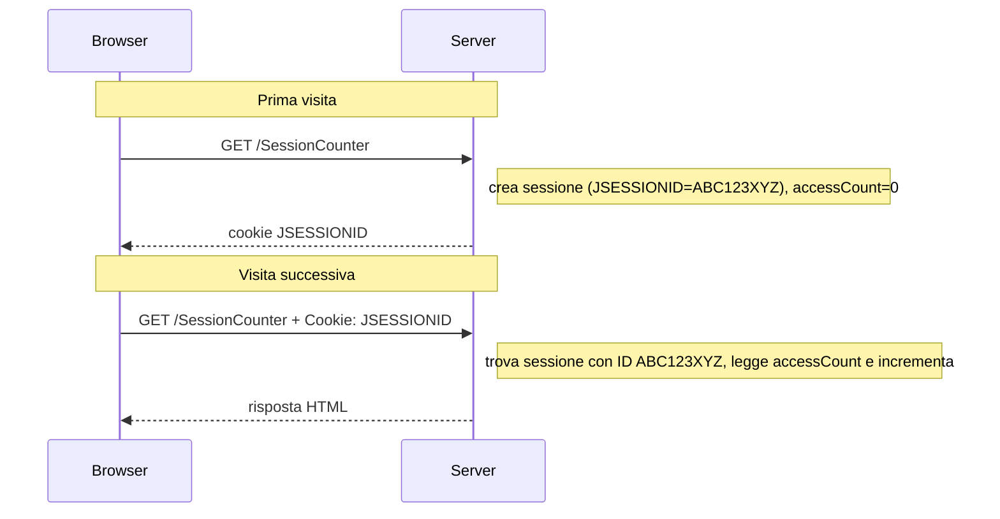

Con la nascita del web internet è diventato un luogo di compravendita di **servizi**.

I primi servizi erano **monoliti**, ma nel corso del tempo si è pensato di utilizzare delle astrazioni che potessero semplificare il tutto e implementare pagine dinamiche.
Nasce la necessità di rendere disponibili applicazioni distribuite sul web con una grossa scalabilità e capace di gestire una grande mole di richieste contemporaneamente, servizi pensati per le aziende: **enterprise computing** (sviluppo di applicazioni per le aziende).
# Enterprise computing
## Requisiti
>[!multi-column]
>
>>[!important] Requisiti funzionali
>>cosa un sistema deve offrire
>
>>[!important] Requisiti non funzionali
>>come il servizio deve fornire quella funzionalità

Requisiti fondamentali, ma non funzionali:
- **Portabilità**
  capacità del software di essere eseguito su macchine eterogenee
- **Interoperabilità**
  capacità di scambiare dati ed utilizzarli
- **Integrazione**
  vediamo il sistema come un'unica entità e non ci rendiamo conto dei componenti che interagiscono al suo interno
- **Interoperabilità con sistemi legacy**
  integrazioni con sistemi pre esistenti, anche se obsoleti (retrocompatibilità)
- **Supporto e gestione a runtime**
  sistema monitorabile anche se in esecuzione
- **Scalabilità**
  verticale (aggiungere risorse alla macchina) - orizzontale (acquisto di una nuova macchina)
- **Efficienza**
  buona efficacia spendendo di meno
- **Affidabilità**
  bassa probabilità di fallire
- **Tolleranza ai guasti**
  continuare ad operare anche se si presenta un guasto
- **Qualità**
  insieme di attributi non funzionali
- **Time to market**
  strumenti che ci permettano di sviluppare l'applicazione velocemente

## Paradigma a tre livelli
Il paradigma a tre livelli è diventato lo standard e si basa su:
- **Livello di presentazione**
  come appare
- **Business logic**
  come funziona
- **Dati**
  come gestire i dati
- **Servizi di sistema**
  su quali macchine

### Single tier
Inizialmente veniva installato tutto su una singola macchina [[0. Intro sistemi operativi#Sistema mainframe|mainframe]].
Essendo tutto centralizzato era molto più semplice recuperare le risorse, ma tutto è strettamente integrato, quindi un guasto o la necessità di un aggiornamento sul mainframe non permette l'utilizzo del programma.
### Two tier
I dati venivano mantenuti sui server, mentre tutto il resto veniva eseguito sui computer client. Le interfacce locali venivano riempite dai dati provenienti dai server.
Rimaneva il problema di non avere un sistema distribuito e il client è costretto ad installare software molto pesante.

L'idea di base è quella di avere il minimo software necessario sul client, un server che gestisce la business logic e c'è un ulteriore server che mantiene il database con i dati.
Il server centrale può inoltre utilizzare del caching per velocizzare le operazioni.
Questo sistema può essere implementato tramite remote procedure call.
Il server centrale può essere invocato tramite interfaccia (**chiamata a procedura remota**), ma risulta sovraccaricato.

Possiamo quindi passare a remote object: le chiamate al server centrale restituiscono oggetti e non soli dati, che vengono gestiti dal client, ma il middle tier rimane ugualmente sovraccaricato.

### Three tier
Oggi viene quindi utilizzato uno stile architetturale a tre livelli:
1. **web server**
   gestisce le richieste HTTP, si occupa del routing e smista il traffico
2. **application server**
   business logic
3. **database server**
   persistenza dei dati


>[!question] Stiamo tornando ad un approccio a monolite
>Negli ultimi anni sono cambiate le necessità del mercato e la potenza di calcolo

In questo modo la distribuzione del carico è ottimale. Inoltre un livello può essere aggiornato senza creare problemi agli altri livelli.

Ogni richiesta però deve attraversare obbligatoriamente tutti i livelli.
Se non ben sviluppato l'application server potrebbe soffrire di ridondanza.

Per evitare questo problema implementiamo all'interno dell'application server un **container**.
>[!important] Modello componente-container (non docker)
>Tutte le funzionalità comuni a basso livello vengono delegate a dei container, in modo da potersi concentrare sulla business logic (*es.* concorrenza, sicurezza, ...).
>Per l'implementazione dei container possono essere utilizzate applicazioni open source come **Jakarta** (Java enterprise)

[[Jakarta]]

[[Spring Boot]]

# Risorse
Con il termine risorsa intendiamo qualunque entità abbia una identità: un documento, un'immagine, un servizio, una collezione di altre risorse.
Gli **URI** (Uniform resource identifier) forniscono un meccanismo semplice ed estensibile per identificare una risorsa, per garantire interoperabilità
- concetto generale (non fa riferimento necessariamente a risorse accessibili tramite HTTP o a entità disponibili in rete)
- rappresenta solo l'involucro
- è un mapping concettuale ad una entità: non si riferisce necessariamente ad una particolare versione dell'entità esistente in un dato momento. Il mapping può rimanere inalterato anche se cambia il contenuto della risorsa
- rispettano una sintassi standard (insieme di termini e regole) e semantica (significato) semplice e regolare

>[!note] Vantaggi dell'uniformità
>- convenzioni sintattiche comuni e semantica comune → **interoperabilità**
>- possibilità di usare nello stesso contesto identificatori diversi, anche con protocolli di accesso diversi → **versatilità**
>- facilità nell'introdurre nuovi tipi di identificatori → **estensibilità**

## Sintassi degli URI
Forma più generale (dipende dallo schema):
```
<scheme>:<scheme-specific-part>
```
Per la `<scheme-specific-part>` non esiste una struttura o semantica comune a tutti gli URI. Esiste però un sottoinsieme che condivide una sintassi comune per rappresentare **relazioni gerarchiche** (risorse organizzate come nel file system) in uno spazio di nomi (forma tipica degli URL HTTP/HTTPS):
```
<scheme>://<authority><path>?<query>
```
Ogni URI è composto dalle seguenti sezioni:
- **schema**
  indica il tipo di URI sulla base del protocollo usato (es. `http`, `ftp`, `mailto`)
- **specifica**
	- **authority**
	  mappa l'host e l'eventuale porta tramite il quale raggiungere il server
	- **path**
	  percorso gerarchico della risorsa
	- **query**
	  ulteriori parametri

A parte lo `<scheme>`, le altre parti possono essere omesse (es. senza `<authority>` o senza `<query>`).

Esempio:
```
https://www.example.com:8080/api/students?id=10
└─┬─┘   └───────┬───────┘└┬─┘└─────┬─────┘ └─┬──┘
scheme      authority   port    path       query
                        (opz.)
```

## URN e URL
Esistono due specializzazioni dell'URI: URN e URL
- **URN** uniform resource name
  identifica la risorsa per mezzo di un nome (*es.* ISBN) in un particolare dominio di nomi (namespace). L'URN deve essere unico e duraturo (statico, pensato per la persistenza) e deve esistere una entità che conoscendo il nome può ricondurlo ad indirizzi fisici. Permette di "parlare" di una risorsa prescindendo dalla sua ubicazione e dalle modalità di accesso.
  Esempio: `urn:isbn:0-9553010-9` → identifica il libro ma non dice come/dove procurarselo
- **URL** uniform resource locator
  tiene conto anche della modalità per accedere alla risorsa (es. locazione nella rete) piuttosto che il suo nome o i suoi attributi. Specifica il protocollo necessario per il trasferimento (non solo HTTP). Tipicamente il nome dello schema corrisponde al protocollo utilizzato; la parte rimanente dipende dal protocollo.

>[!note] Analogia con una persona
>- URN = nome+cognome, o meglio codice fiscale
>- URL = indirizzo di casa o numero di telefono (se univoci)

Forma più comune dell'URL (schema HTTP-like):
```
<protocol>://[<username>:<password>@]<host>[:<port>][/<path>[?<query>][#<fragment>]]

https://example.com/articles.html?search=tecnologia&page=2#Capitolo1
```
Vale per HTTP, HTTPS, FTP, WAP, … ma non, ad esempio, per la posta elettronica (`mailto:info@example.com`: non c'è percorso né protocollo di trasferimento).

Situazione tipica: il browser invia una richiesta usando un URL per connettersi al server e richiedere una specifica risorsa. **HTTP lavora quindi principalmente con URL.**

le sezioni che compongono l'URL sono identiche a quelle dell'URI, tranne per la presenza (anche se deprecated) di username e password.

- `<protocol>`: come comunicare con il server (HTTP, HTTPS, FTP, MMS, …)
- `<username>:<password>@`: credenziali di autenticazione (deprecato)
- `<host>`: indirizzo del server su cui risiede la risorsa. Può essere un indirizzo IP logico o fisico
- `<port>`: porta da utilizzare (TCP come protocollo di trasporto, HTTP è a livello applicativo). Se non indicata si usa la porta standard del protocollo (per HTTP è 80)
- `<path>`: percorso (pathname) che identifica la risorsa nel file system del server. Se manca, tipicamente si accede alla risorsa predefinita (es. home page)
- `<query>`: stringa per passare al server uno o più parametri, di solito nel formato `parametro1=valore1&parametro2=valore2…`

### URN vs URL
| Caratteristica                  | URL (Locator)               | URN (Name)                       |
| ------------------------------- | --------------------------- | -------------------------------- |
| Tipo                            | Sottoinsieme di URI         | Sottoinsieme di URI              |
| Scopo                           | Localizzare una risorsa     | Identificare una risorsa per nome |
| Indica dove si trova?           | Sì                          | No                               |
| Indica come accedervi?          | Sì (es. HTTP, FTP)          | No                               |
| Dipende dalla posizione?        | Sì                          | No                               |
| Usato direttamente in HTTP?     | Sì                          | No                               |
| Esempio                         | `https://example.com/index.html` | `urn:isbn:9780134685991`    |
| Cambia se la risorsa cambia server? | Sì                      | No                               |
| In breve                        | *pratico ma fragile*        | *stabile ma astratto*            |


# HTTP

>[!important] Protocollo
>Insieme di regole che servono a normare un aspetto di un sistema

Protocollo generico e stateless, tramite cui client e server comunicano: richiedono e trasferiscono **rappresentazioni di risorse identificate da URL**.
È importante la rappresentazione: uno stesso contenuto informativo può avere più rappresentazioni (HTML, JSON, ecc.).

- **client/server**
  c'è una netta distinzione tra chi richiede le risorse e chi le fornisce. Il client attiva la connessione e richiede i servizi; il server accetta la connessione, se serve identifica il richiedente, risponde alla richiesta e alla fine chiude la connessione
- **generico**
  è indipendente dal formato con cui i dati vengono trasmessi: funziona per HTML come per binari, eseguibili, oggetti distribuiti o altre strutture dati
- **stateless**
  ogni operazione non tiene memoria delle precedenti, il server non è tenuto a mantenere informazioni tra una connessione e la successiva su natura, identità e richieste precedenti di un client. È il client che deve ricreare il contesto per effettuare ogni richiesta
- **progettato per sistemi distribuiti complessi**
  tra client e server possono esserci vari intermediari e componenti con ruoli diversi

Non serve solo per scambiare documenti ipertestuali, ma per una moltitudine di applicazioni (name server, sistemi object-oriented distribuiti).

È possibile negoziare il formato dei dati (il client dice che formato preferisce, il server sceglie il più adatto), questo favorisce l'indipendenza del sistema dal formato di rappresentazione dei dati.
Nonostante sia stateless sono comunque presenti dei sistemi di "caching sofisticato" (a seconda del tipo di connessione) per migliorare prestazioni, scalabilità e ridurre il traffico.
Sono disponibili sistemi di autenticazione sofisticata su vari livelli (supporto a vari livelli di sicurezza).

## Applicazioni HTTP

Ruoli delle applicazioni HTTP:
- **User agent**
  è il client che invia richieste HTTP. Può essere un browser (Chrome, Firefox, Safari), ma anche un'app mobile, un bot o qualsiasi altro software
- **Proxy**
  usato per vari scopi: sicurezza, caching, modifica di richieste/risposte. Può gestire il traffico in entrata verso più server backend (spesso per bilanciamento del carico)
- **Gateway**
  permette la comunicazione tra due sistemi che usano protocolli diversi, per fornire interoperabilità. Spesso il routing è più sofisticato, con logica che può includere la gestione dei protocolli (es. HTTP verso SOAP)
- **Origin server**
  il server che ospita e fornisce la risorsa richiesta
- **Tunnel**
  connessione diretta tra client e server usata per instradare dati senza che i contenuti vengano alterati o interpretati. Garantisce sicurezza, privacy e integrità dei dati, evitando che intermediari (come i proxy) possano interferire o monitorare la comunicazione

## Semantica dei messaggi HTTP
>[!important] Idempotenti
>Se invoco lo stesso metodo più volte dopo l'invocazione non ho nuovi effetti
>Più formalmente: un metodo è idempotente se può essere chiamato più volte con lo stesso input senza cambiare lo stato del server (non viene creato, modificato o cancellato nulla; la risposta potrebbe variare) oltre il primo effetto

| Metodo     | Dove invia i dati                    | Risposta del server        | Uso tipico                                  | Supporto in `<form>` | Idempotente |
| ---------- | ------------------------------------ | -------------------------- | ------------------------------------------- | -------------------- | ----------- |
| **GET**    | Query string nell'URL                | Headers + Body             | Lettura dati, ricerche, navigazione         | Sì                   | Sì          |
| **POST**   | Body della richiesta                 | Headers + Body             | Creazione o invio dati (registrazioni, login) | Sì                 | No          |
| **PUT**    | Body della richiesta                 | Headers + Body             | Aggiornamento **completo** di una risorsa (API REST) | No (serve JS/AJAX) | Sì   |
| **HEAD**   | Nessun dato (o query string opzionale) | Solo Headers (no Body)   | Controllo risorse, validità link, metadata  | No (serve JS/AJAX)   | Sì          |
| **DELETE** | URL (identifica la risorsa)          | Headers + Body (opzionale) | Eliminazione di una risorsa (API REST)      | No (serve JS/AJAX)   | Sì          |

### GET
Recupera dati dal server. I dati (parametri) viaggiano nella query string dell'URL.
```
GET /users/123 HTTP/1.1
Host: example.com
→
HTTP/1.1 200 OK
Content-Type: application/json

{ "id": 123, "name": "Mario Rossi" }
```
### POST
Inviare dati al server. I dati viaggiano nel body della richiesta.
```
POST /users HTTP/1.1
Host: example.com
Content-Type: application/json

{ "name": "Luigi Bianchi" }
→
HTTP/1.1 201 Created
Location: /users/124
```
### PUT
Aggiornare o sostituire una risorsa esistente sul server (aggiornamento completo).
```
PUT /users/123 HTTP/1.1
Host: example.com
Content-Type: application/json

{ "id": 123, "name": "Mario Verdi" }
```
### HEAD
Richiedere solo l'header di una risorsa, senza il corpo.
```
HEAD /users/123 HTTP/1.1
Host: example.com
→
HTTP/1.1 200 OK
Content-Type: application/json
Content-Length: 48
```
### DELETE
Eliminare una risorsa sul server. La risorsa è identificata dall'URL.
```
DELETE /users/123 HTTP/1.1
Host: example.com
```

## Fasi di scambio client/server
La connessione HTTP è composta da una serie di richieste e corrispondenti risposte.

| Versione | Connessione                | Richieste multiple    | Header         | Limiti principali                      |
| -------- | -------------------------- | --------------------- | -------------- | -------------------------------------- |
| 0.9      | 1 richiesta per connessione | No                   | No             | Molto semplice, non scalabile          |
| 1.0      | Chiusa per default         | No                    | Sì             | Inefficiente per pagine complesse      |
| 1.1      | Persistente (Keep-Alive)   | Sì (pipelining)       | Sì             | Head-of-line blocking                  |
| 2.0      | Persistente                | Sì (multiplexing)     | Sì (compressi) | Richiede supporto binario, più complesso |

- **HTTP/0.9**: solo GET, `open → richiesta → risposta → close` per ogni richiesta
- **HTTP/1.0**: metodi GET, POST, HEAD, PUT, ma ancora una connessione per richiesta
- **HTTP/1.1**: la differenza principale rispetto a 1.0 è la possibilità di specificare coppie multiple di richiesta e risposta nella stessa connessione

introduzione di connessioni persistenti
- richiedono meno connessioni TCP (vantaggio per CPU e rete)
- riducono l'attesa della visualizzazione
- permettono di gestire meglio gli errori

pipeline (possibilità di mettere in coda più richieste, senza necessariamente attendere la risposta), ma introduce un problema: se la prima richiesta è più pesante blocca le successive.
- riduce ulteriormente la latenza, soprattutto per richieste su risorse molto diverse per dimensione o tempo di elaborazione
- le risposte devono essere date **nello stesso ordine** delle richieste, perché HTTP non specifica un metodo esplicito di associazione/riordinamento
- se la prima richiesta è lenta, tutte le altre devono aspettare: **Head-of-Line (HOL) blocking**

3 way handshake (protocollo di conoscenza `syn --> syn + ack <-- ack -->`)
Ogni nuova connessione comporta il costo del **TCP three-way handshake**:


Per risolvere questo problema è stato inventato **HTTP/2** (2015) che effettua una conversione del testo in binario (*binary framing*)
- compressione dell'header (HPACK) → riduce l'overhead
- multiplexing (non abbiamo più pipeline ed effetto coda, ma le informazioni viaggiano in parallelo: più richieste/risposte sulla stessa connessione senza HOL blocking)
- prioritizzazione e server push
- mantiene la semantica di HTTP/1.1 (metodi, status, URI) ma migliora performance e scalabilità, eliminando i limiti del pipelining

Con **HTTP/3** (2022) viene sostituito TCP con **QUIC** e UDP, permettendo di implementare **connection migration**: il cambio rete è trasparente (es. Wi-Fi → 4G). Mantiene il modello HTTP ma ottiene un trasporto più efficiente e resiliente.

| HTTP/2                                         | HTTP/3                                            |
| ---------------------------------------------- | ------------------------------------------------- |
| Utilizza TCP                                   | Utilizza QUIC su UDP                              |
| Multiplexing di più stream                     | Multiplexing di più stream                        |
| TCP + TLS                                      | QUIC + TLS 1.3 integrati                          |
| Connessione legata a TCP (cambio rete → riconnessione) | Connection Migration (cambio rete trasparente) |

## Una richiesta
L'utente indica l'URL da aprire, il browser compila gli altri campi.
```
GET /beta.html HTTP/1.1
Referer: http://www.alpha.com/alpha.html
Connection: Keep-Alive
User-Agent: Mozilla/4.61 (Macintosh; I; PPC)
Host: www.alpha.com:80
Accept: image/gif, image/jpeg, image/png, */*
Accept-Encoding: gzip
Accept-Language: en
Accept-Charset: iso-8859-1,*,utf-8
```

| Elemento                     | Descrizione                                                      |
| ---------------------------- | ---------------------------------------------------------------- |
| `GET /beta.html HTTP/1.1`    | Richiede la risorsa `/beta.html` con metodo GET e protocollo HTTP/1.1 |
| `Referer`                    | Pagina da cui è stata generata la richiesta                      |
| `Connection: Keep-Alive`     | Mantiene aperta la connessione per future richieste              |
| `User-Agent`                 | Identifica il browser (Mozilla 4.61) e il sistema operativo (Macintosh, PPC) |
| `Host: www.alpha.com:80`     | Server di destinazione e porta                                   |
| `Accept`                     | Tipi di contenuti accettati (immagini e qualsiasi altro formato) |
| `Accept-Encoding: gzip`      | Il client accetta contenuti compressi con gzip                   |
| `Accept-Language: en`        | Preferisce contenuti in lingua inglese                           |
| `Accept-Charset`             | Set di caratteri accettati (Latin-1, UTF-8, qualsiasi altro)     |

### Header
Gli header servono a trasmettere informazioni aggiuntive tra client e server.
```
Nome-Header: valore
```
**Tipi di header**
- **Generali**
  compaiono in richiesta o risposta, generati da client o server. Forniscono informazioni generali sulla comunicazione/connessione, non sul contenuto specifico. Si applicano al messaggio trasmesso, non necessariamente alla risorsa
	- `Date`: data e ora della trasmissione
	- `MIME-Version`: versione MIME usata (sempre 1.0)
	- `Transfer-Encoding`: formato di codifica usato per la trasmissione
	- `Cache-Control`: meccanismo di caching richiesto o suggerito per la risorsa
	- `Connection`: tipo di connessione (tenere attiva, chiudere dopo la risposta, ecc.)
- **Richiesta**
  compaiono solo nella richiesta, generati dal client. Danno informazioni su di sé, sulle preferenze e su cosa vuole ricevere, o sull'autenticazione
	- `User-Agent`: stringa che descrive il client (tipo, versione e sistema operativo)
	- `Referer`: URL della pagina mostrata all'utente mentre richiede il nuovo URL. Deve essere assente se l'URL è digitato a mano o preso dai bookmark
	- `Host`: **obbligatorio in HTTP/1.1**. Nome di dominio e porta a cui viene fatta la connessione. L'URI nella riga di richiesta è solo la parte locale al server
```
	  GET /beta.html HTTP/1.0
	  Host: www.alpha.com:80
```
	- `From`: e-mail del richiedente (serve l'approvazione dell'utente prima di inserirlo)
	- `Accept`, `Accept-Charset`, `Accept-Encoding`, `Accept-Language`: **negoziazione del formato** (tipo MIME, codice caratteri, codifica, lingua). Il client dice cosa accetta, il server propone il match migliore
	- `If-Modified-Since`, `If-Unmodified-Since`: richieste condizionali (es. aggiornare una cache), portate a termine solo se la condizione è vera. Se la pre-condizione è valida viene ritornato un `304 Not Modified`, altrimenti si procede come un GET normale
	- `Authorization`, `Proxy-Authorization`: stringa di autorizzazione per l'accesso alla risorsa
- **Entità**
  compaiono in richiesta o risposta (solo se c'è un body), generati da chi invia il body. Descrivono il corpo del messaggio o, se non c'è body, la risorsa specificata
	- `Content-Type`: tipo MIME dell'entità
	- `Content-Length`: lunghezza in byte del body
	- `Content-Encoding`, `Content-Language`, `Content-Location`, `Content-MD5`: codifica, linguaggio, URL della risorsa, digest MD5
	- `Expires`: data dopo cui la risorsa non è più valida (va richiesta di nuovo o cancellata dalla cache)
	- `Last-Modified`: data e ora dell'ultima modifica, serve a decidere se la copia posseduta (es. in cache) è ancora valida

| Tipo di header | Dove compare                              | Chi lo genera                   | Scopo                                            |
| -------------- | ----------------------------------------- | ------------------------------- | ------------------------------------------------ |
| Generali       | Richiesta o risposta                      | Client o server                 | Informazioni generali sulla comunicazione        |
| Richiesta      | Solo richiesta                            | Client                          | Preferenze del client o autenticazione           |
| Entità         | Richiesta o risposta (solo se c'è body)   | Chi invia il body (client/server) | Descrivere il corpo del messaggio              |

>[!note] MIME
>Standard per indicare il tipo di contenuto in una comunicazione, nato per le email e poi usato anche in HTTP. In HTTP il tipo è nell'header `Content-Type`; `MIME-Version` indica la versione del protocollo MIME.

## Una risposta
```
GET /index.html HTTP/1.1
Host: www.cs.unibo.it:80

HTTP/1.1 200 OK
Date: Fri, 26 Nov 1999 11:46:53 GMT
Server: Apache/1.3.3 (Unix)
Last-Modified: Mon, 12 Jul 1999 12:55:37 GMT
Accept-Ranges: bytes
Content-Length: 3357
Content-Type: text/html

<HTML> …. </HTML>
```

| Elemento           | Descrizione                                                             |
| ------------------ | ----------------------------------------------------------------------- |
| `HTTP/1.1 200 OK`  | Richiesta andata a buon fine                                            |
| `Date`             | Data e ora della risposta (GMT)                                         |
| `Server`           | Software del server web e sua versione (Apache 1.3.3 su Unix)           |
| `Last-Modified`    | Ultima modifica del file, utile per la cache del client                 |
| `Accept-Ranges: bytes` | Il server supporta richieste **parziali**, utile per il resume dei download |
| `Content-Length`   | Dimensione della risorsa in byte (3357, circa 3.3 KB)                   |
| `Content-Type`     | Il contenuto è in formato HTML                                          |

## Status code
Numero di tre cifre: la prima indica la **classe** della risposta, le altre due la risposta specifica.
- **1xx Informational**: risposta temporanea alla richiesta, durante il suo svolgimento
- **2xx Successful**: il server ha ricevuto, capito e accettato la richiesta
- **3xx Redirection**: il server ha capito la richiesta, ma servono altre azioni da parte del client per completarla
- **4xx Client error**: la richiesta non può essere soddisfatta per un errore del client (errore sintattico o richiesta non autorizzata)
- **5xx Server error**: la richiesta può anche essere corretta, ma il server non riesce a soddisfarla per un problema interno (suo o di applicazioni CGI)

Esempi:

| Codice | Significato                                                      |
| ------ | ---------------------------------------------------------------- |
| 100    | Continue (se il client non ha ancora mandato il body)            |
| 200    | OK (GET con successo)                                            |
| 201    | Created (risorsa creata con successo)                            |
| 301    | Moved permanently (URL non valida, il server conosce la nuova posizione) |
| 400    | Bad request (errore sintattico nella richiesta)                  |
| 401    | Unauthorized (manca l'autorizzazione)                            |
| 403    | Forbidden (richiesta non autorizzabile)                          |
| 404    | Not found (URL errato)                                           |
| 500    | Internal server error (tipicamente un CGI mal fatto)             |
| 501    | Not implemented (metodo non conosciuto dal server)               |

>[!attention] Attenzione
>Nella slide degli esempi il 201 è associato a PUT, ma nella tabella dei metodi l'esempio di 201 Created + `Location` è una POST.

# HTML
>[!bug] Non è un linguaggio di programmazione

HTML (HyperText Markup Language) è un linguaggio di markup per creare pagine Web.
- **Linguaggi di markup**: strutturare e descrivere contenuti
- **Linguaggi di programmazione**: definire algoritmi e comportamenti

Tramite HTML è possibile realizzare documenti con una semplice struttura, con aspetti grafici anche sofisticati, con testo, immagini, oggetti interattivi e connessioni ipertestuali ad altri documenti.
L'obbiettivo è quello di descrivere e strutturare contenuti.

>[!attention] DIfferenza con markdown
>Il markdown è un linguaggio di markup leggero, non lavora con i tag, ma ha dei caratteri particolari che fanno le veci dei tag

```markdown
# Titolo
Questo è un **testo importante**.
```
```html
<h1>Titolo</h1>
<p>Questo è un <strong>testo importante</strong>.</p>
```

Ancora differente dai linguaggio WYSIWYG (what you see is what you get): editor che consentono all'utente di modificare direttamente l'aspetto visivo (es. Word).

## Tag
Linguaggio basato su marcatori (tag) che definiscono diverse proprietà del testo.
- tag di apertura e di chiusura: `<h1>Testo da formattare</h1>`
- marcatori senza testo: `<br/>` (line break)
- un tag può avere degli **attributi** (nome + valore): `<meta name="Author" content="Pinco Pallino">` → tag `meta`, attributo `name`, valore `"Author"`

Struttura del documento:
```html
<html>
  <head>
    .........
  </head>
  <body>
    .........
  </body>
</html>
```
### Head
Contengono metadati
- il tag `<head>` è opzionale
- può contenere `<title>` e più `<meta>`
```html
<title>The global structure of an HTML Document</title>
<meta name="Author" content="Pinco Pallino">
```
**Meta tags**: definizione di coppie proprietà-valore. Non vengono visualizzati sulla pagina, ma sono usati da browser, motori di ricerca e social media per interpretare il contenuto. Due usi:
- coppia nome/valore generica
```html
  <meta name="PropertyName" content="PropertyValue">
```
- coppia nome/valore per creare un header nell'HTTP Response (RFC2616)
```html
  <meta http-equiv="Expires" content="Tue, 20 Aug 1996 14:25:27 GMT">
```
  header risultante → `Expires: Tue, 20 Aug 1996 14:25:27 GMT`

### Body
Il tag `<body>` delimita il corpo del documento. Alcuni attributi:
- `background = uri`: URI di un'immagine da usare come sfondo
- `text = color`: colore del testo
- `bgcolor = color`: in alternativa a `background`, colore di sfondo della pagina

Il colore si esprime come `#RRGGBB`: Red `#FF0000`, Blue `#0000FF`, Black `#000000`, Yellow `#FFFF00`.

**Heading** (testo strutturato su più livelli)
```html
<h1>Titolo più significativo</h1>
<h2>Un po' meno significativo</h2>
...
<h6>Titolo meno significativo</h6>
```
Attributo: `align = left / center / right / justify`

**Testo strutturato** (elementi della frase)
```html
<em>Testo da enfatizzare</em>
<strong>Enfasi ancor più forte</strong>
Frase o citazione
<code>static void main(String[] args) { }</code>
a<sup>2</sup>+b<sub>0</sub>   →  a² + b₀
```

**Font**: il tag `<font>` permette di formattare il testo. Attributi:
- `size = [+|-]n`: dimensioni (1-7 o relative)
- `color = color`: colore
- `face = text`: font

Il tag `<basefont>` definisce le impostazioni di default del documento.

**Font style** (formattazione del testo)

| Tag                     | Effetto           |
| ----------------------- | ----------------- |
| `<tt>`                  | monospaced        |
| `<i>`                   | italic            |
| `<b>`                   | bold              |
| `<big>`                 | big               |
| `<small>`               | small             |
| `<u>`                   | underlined        |

**Horizontal rule**: `<hr>` inserisce una riga di separazione. Attributi:
- `align = left / center / right`: allineamento rispetto a ciò che la circonda
- `size = pixels`: altezza della riga
- `width = length`: larghezza, assoluta o in percentuale del contenitore
- `noshade`: riga "solida" invece che con effetto di ombreggiatura
```html
<hr width="50%" align="center">
<hr size="5" width="50%" align="center">
<hr noshade size="5" width="50%" align="center">
```

**Paragrafi**: il tag `<p>` delimita un paragrafo (dentro si può usare `<br/>` per andare a capo). Attributo: `align = left / center / right / justify`

**Immagini**: il tag `` inserisce immagini
```html

```
Attributi:
- `src = uri`: indirizzo dell'immagine (**required**)
- `alt = text`: testo alternativo se non è possibile visualizzare l'immagine
- `align = bottom / middle / top / left / right`: posizione rispetto al testo circostante
- `width`, `height = length` (pixels): larghezza e altezza
- `border = pixels`: spessore del bordo (0 = nessun bordo)
- `hspace`, `vspace = pixels`: spazio orizzontale e verticale fra immagine e ciò che la circonda

**Link**
- il link è il costrutto di base dell'ipertesto: una connessione fra una risorsa Web e un'altra (concetto semplice, ma chiave per l'affermazione dell'HTML)
- ha due estremi detti *anchors* e una direzione: **source anchor → destination anchor**
- il destination anchor può essere una qualsiasi risorsa web (immagine, video, eseguibile, documento HTML)
- la risorsa di destinazione si ottiene visitando il link
```html
<p>
  You'll find a lot more in
  <a href="chapter2.html">chapter two</a>.
  See also this
  <a href="../images/forest.gif">map of the enchanted forest.</a>
</p>
```
Destination anchors (link interni al documento):
```html
<h1>Table of Contents</h1>
<p>
  <a href="#section1">Introduction</a><br/>
  <a href="#section2">Some background</a><br/>
  <a href="#section2.1">On a more personal note</a><br/>
</p>
<h2><a name="section1">Introduction</a></h2>
  ...section 1...
<h2><a name="section2">Some background</a></h2>
  ...section 2...
<h3><a name="section2.1">On a more personal note</a></h3>
  ...section 2.1...
```

**Liste**
- non ordinate (`type`: disc, circle, square)
```html
  <ul type="disc">
    <li>Unordered information.</li>
    <li>Ordered information.</li>
    <li>Definitions.</li>
  </ul>
```
- ordinate (`type`: `1` → 1,2,.. / `a` → a,b,.. / `A` → A,B,.. / `i` → i,ii,.. / `I` → I,II,..). `VALUE` su un `<li>` forza il numero
```html
  <ol type="I">
    <li>Unordered information.</li>
    <li VALUE="4">Ordered information.</li>
    <li>Definitions.</li>
  </ol>
```
  risultato: I. / IV. / V.
- di definizione
```html
  <dl>
    <dt><strong>UL</strong></dt>
    <dd>Unordered List.</dd>
    <dt><strong>OL</strong></dt>
    <dd>Ordered List.</dd>
  </dl>
```

**Tabelle**
```html
<table border="1">
  <caption align="top"><em>A test table with merged cells</em></caption>
  <tr>
    <th rowspan="2"></th>
    <th colspan="2">Average</th>
    <th rowspan="2">Red<br/>eyes</th>
  </tr>
  <tr><th>height</th><th>weight</th></tr>
  <tr><th>Males</th><td>1.9</td><td>0.003</td><td>40%</td></tr>
  <tr><th>Females</th><td>1.7</td><td>0.002</td><td>43%</td></tr>
</table>
```
- `<table>`: racchiude la tabella. Attributi:
	- `align = left / center / right`: allineamento rispetto alla pagina
	- `width = "n" / "n%"`: larghezza (anche in percentuale)
	- `bgcolor = "#xxxxxx"`: colore di sfondo
	- `border = "n"`: spessore dei bordi (0 = senza bordi)
	- `cellspacing`, `cellpadding`: spazio tra le celle / tra bordo e contenuto della cella
- `<tr>`: racchiude ciascuna riga. Attributi:
	- `align = left / center / right / justify`: allineamento del contenuto delle celle
	- `valign = top / middle / bottom / baseline`: allineamento verticale
	- `bgcolor = "#xxxxxx"`: colore di sfondo della riga
- `<th>` e `<td>`: racchiudono la cella (`th` = intestazione). Attributi: gli stessi di `<tr>` più
	- `width`, `height = length`: dimensioni (pixels o percentuale)
	- `rowspan`, `colspan = n`: su quante righe/colonne si estende la cella

### Form
Sezione del documento HTML che contiene elementi di controllo con cui l'utente può inserire dati o in generale interagire.
- i dati inseriti possono essere poi inoltrati ad un agente che può processarli
- gli elementi di controllo sono accessibili da script client-side
- sono caratterizzati da un valore iniziale e da un valore corrente
- possono essere: bottoni, checkbox (switch on/off), radio buttons (switch mutuamente esclusi), menu di selezione (lista di opzioni), inserimento di testo, oggetti nascosti (elementi di controllo valorizzati ma invisibili)

**Tag `<form>`**: racchiude tutti gli elementi della form. Attributi:
- `action = uri`: URI dell'agente che riceverà i dati
- `name = text`: nome della form
- `method = get / post`: modo in cui i dati vengono inviati
```html
<form action="http://somesite.com/prog/adduser" method="post">
  ...form contents...
</form>
```

| Metodo | Scopo HTTP      | Form HTML                      | Dove vanno i dati    | Stato server |
| ------ | --------------- | ------------------------------ | -------------------- | ------------ |
| GET    | Richiedere dati | Ricerca, filtri                | URL (query string)   | Non cambia   |
| POST   | Fornire dati    | Login, registrazione, acquisti | Body della richiesta | Può cambiare |

Esempio GET (i dati finiscono nell'**URL**):
```
GET /SomeProgram?firstName=Joe&lastName=Hacker HTTP/1.0
Referer: http://localhost/GetForm.html
Connection: Keep-Alive
User-Agent: Mozilla/4.7 [en] (Win98; U)
Host: localhost:8088
...
```
Esempio POST (i dati finiscono nel **body**):
```
POST /SomeProgram HTTP/1.0
Referer: http://localhost/PostForm.html
...
Content-type: application/x-www-form-urlencoded
Content-length: 29

firstName=Joe&lastName=Hacker
```

>[!attention] Non è il put di java
>La post potrebbe essere usata per inviare dati e riceverne degli altri come conseguenza

**Text input**
```html
<form action="http://somesite.com/prog/adduser" method="post">
  <p>First name: <input type="text" name="firstname"/><br/></p>
</form>
```
Attributi:
- `name = text`: nome del controllo nella coppia nome/valore
- `value = text`: eventuale valore iniziale
- `size = n`: lunghezza del campo in caratteri
- `maxlength = n`: massima lunghezza del testo in caratteri

**Checkbox**
```html
<input type="checkbox" name="food" value="pane"/>Pane<br/>
<input type="checkbox" name="food" value="burro"/>Burro<br/>
<input type="checkbox" name="drink" value="acqua" checked/>Acqua<br/>
```
**Radio** (stesso `name` → mutuamente esclusivi)
```html
<input type="radio" name="sex" value="Male">Male<br/>
<input type="radio" name="sex" value="Female">Female<br/>
```
**Buttons and hidden**
```html
<input type="submit" value="Send"><br/>
<input type="reset"><br/>
<input type="button" name="check" value="Check"><br/>
<input type="hidden" name="status" value="view"><br/>
```
**Menù di selezione**
```html
<form action="http://somesite.com/prog/component-select" method="post">
  <p>
    <select multiple size="3" name="component-select">
      <option selected value="Component_1_a">Component_1</option>
      <option selected value="Component_1_b">Component_2</option>
      <option>Component_3</option>
      <option>Component_4</option>
    </select>
    <input type="submit" value="Send"><input type="reset">
  </p>
</form>
```

**Frames**
Strumento che consente di presentare i documenti mediante viste multiple.
- si può suddividere il documento in finestre o porzioni di finestra indipendenti
- permette di mantenere sezioni del documento sempre visibili
- le porzioni possono interagire e scambiare informazioni
```html
<html>
  <head><title>A simple frameset document</title></head>
  <frameset cols="20%, 80%">
    <frameset rows="100, 200">
      <frame src="contents_of_frame1.html">
      <frame src="contents_of_frame2.gif">
    </frameset>
    <frame src="contents_of_frame3.html">
  </frameset>
  <noframes>
    ...........
  </noframes>
</html>
```
Layout risultante: Frame 1 e Frame 2 impilati nella colonna sinistra (20%), Frame 3 nella colonna destra (80%).
# Principi di progettazione

>[!multi-column]
>
>>[!important] Separation of Concerns
>>Separazione delle varie responsabilità
>
>>[!important] High Cohesion
>>Ogni componente dovrebbe occuparsi di diverse responsabilità
>

>[!multi-column]
>
>>[!important] Low Coupling
>>Riduzione delle dipendenze tra componenti
>
>>[!important] Dependency Inversion
>>Evitare che un componente dipenda da implementazioni concrete
>

# Java database connectivity
JDBC (Java Database Connectivity) è un’API di Java che permette di connettere applicazioni Java a database relazionali. Fornisce un’interfaccia standard per eseguire query SQL, aggiornare dati e gestire connessioni a database come MySQL, PostgreSQL, Oracle e altri.
![[Web-1791201912266.webp|center|610]]

>[!multi-column]
>
>>[!blank]
>>Ogni applicazione java, per l'uso dei database, si interfaccia con il JDBC driver manager che a sua volta comunica con i vari driver degli specifici dbms.
>
>>[!blank]
>>![[Web-1791202158637.webp|center|200]]

JDBC è principalmente orientato dai [[DBMS|database relazionali]], ma può anche essere utilizzato per NoSql.
## JDBC data types

| JDBC Type                        | Java Type                  |
| -------------------------------- | -------------------------- |
| BIT                              | boolean                    |
| TINYINT                          | byte                       |
| SMALLINT                         | short                      |
| INTEGER                          | int                        |
| BIGINT                           | long                       |
| REAL                             | float                      |
| FLOAT, DOUBLE                    | double                     |
| BINARY, VARBINARY, LONGVARBINARY | byte[]                     |
| CHAR, VARCHAR, LONGVARCHAR       | String                     |
| NUMERIC, DECIMAL                 | BigDecimal                 |
| DATE                             | java.sql.Date              |
| TIME, TIMESTAMP                  | java.sql.Timestamp         |
| CLOB                             | Clob                       |
| BLOB                             | Blob                       |
| ARRAY                            | Array                      |
| DISTINCT                         | mapping of underlying type |
| STRUCT                           | Struct                     |
| REF                              | Ref                        |
| JAVA_OBJECT                      | underlying Java class      |

## Query
|Tipo SQL|Metodo JDBC|Output|Uso principale|
|---|---|---|---|
|SELECT|`executeQuery()`|`ResultSet`|Lettura dati|
|INSERT / UPDATE / DELETE|`executeUpdate()`|`int` (righe modificate)|Modifica dati|
|CREATE / ALTER / DROP|`executeUpdate()`|`0` o `int`|Definizione struttura|
|Qualsiasi tipo|`execute()`|`boolean` + `getResultSet()` / `getUpdateCount()`|Generico / dinamico|

Su `execute()`: restituisce `true` se il risultato è un `ResultSet` (allora lo recuperi con `getResultSet()`), `false` se è un conteggio di righe (allora usi `getUpdateCount()`). Serve quando non sai a priori che tipo di query stai eseguendo.
## JDBC connectivity
>[!blank|float-right]
>```mermaid
>flowchart TB
>    id1(Java application) --> id2(Loading driver)
>    id2 --> id3(Creating connection)
>    id3 --> id4(Creating statement)
>    id4 --> id5(Executing statement)
>    id5 --> id6(Processing ResultSet)
>    id6 --> id7(Closing connection)
>```

JDBC opera attraverso una serie di fasi per l'utilizzo dei database:
1. **Connection**
   stabilisce una connessione con il database - spesso la fase di connection è molto costosa, per questo vengono utilizzare delle tecniche di **polling** per riutilizzare le connessioni già aperte. È una fase strutturale, permette di creare politiche.
2. **Statement**
   creazione dell'oggetto che consente il passaggio dal livello applicativo al livello logico - consente di inviare query SQL. Restituisce il result set
3. **Result set**
   contiene i risultati di una query di selezione - rappresenta un ponte tra il modello relazionale e il modello a oggetti di java (contiene ciò che viene fornito dal database come oggetto di java iterabile)
4. **Connection**
   chiusura della connessione
Questa suddivisione permette di rendere il codice più modulare, portabile ed evitare problemi di performance, creando una vera e propria **pipeline**.

>[!bug] Aumenta la complessità
>Dobbiamo gestire oggetti che non sono nativi di java

>[!attention] Per l'esame
>Le scelte prese in fase di progettazione devono essere dettate da cosa è necessario: se sto facendo operazioni in lettura non ho bisogno di appesantire troppo la query con livelli di sicurezza innecessari

``` java
import java.sql.*;
public class PrimoTestJDBC {
	public static void main(String[] args) {
		String url = "jdbc:mysql://localhost:3306/testdb";
		String user = "root"; String password = "admin";
		try {
		    Connection conn = DriverManager.getConnection(url, user, password);
		    Statement stmt = conn.createStatement();
		    ResultSet rs = stmt.executeQuery("SELECT id, name FROM users");
		    while (rs.next()) {
		        System.out.println(rs.getInt("id") + " - " + rs.getString("name"));
		    }
		} catch (SQLException e) {
		    e.printStackTrace();
		} finally {
		    rs.close();
		    stmt.close();
		    conn.close();
		}
	}
}
```

>[!question] Tramite java possiamo anche ricavare dei metadati da parte del database

## Utilizzo di JDBC

|Metodo|Classe|Cosa fa|
|---|---|---|
|`getConnection(url, user, password)`|`DriverManager`|Sceglie il driver dal prefisso dell'URL e apre la connessione. Lancia `SQLException` se le credenziali sono errate o il DB non è raggiungibile.|
|`createStatement()`|`Connection`|Crea l'oggetto `Statement` per inviare SQL al DB.|
|`executeQuery(sql)`|`Statement`|Esegue una `SELECT` e restituisce un `ResultSet`.|
|`next()`|`ResultSet`|Sposta il cursore alla riga successiva. Restituisce `false` quando le righe sono finite. All'inizio il cursore sta _prima_ della prima riga, quindi `next()` va chiamato prima di leggere.|
|`getInt("id")`, `getString("name")`|`ResultSet`|Leggono il valore di una colonna della riga corrente, convertendolo nel tipo Java (vedi la tabella dei tipi).|
|`close()`|`ResultSet`, `Statement`, `Connection`|Rilascia le risorse. Si chiude in ordine inverso rispetto all'apertura: `rs`, poi `stmt`, poi `conn`.|
### Execute Update
Si usa per tutto ciò che **non** è una `SELECT`: modifica dati (DML) e struttura (DDL).

```java
String sql = "INSERT INTO users (name) VALUES ('Mario Verdi')";
Statement statement = conn.createStatement();
int rowsInserted = statement.executeUpdate(sql);
if (rowsInserted > 0) {
    System.out.println("Nuovo utente inserito con successo!");
}
statement.close();
```

- Restituisce un `int`: il **numero di righe toccate**. Per un `INSERT` di una riga vale 1, per un `UPDATE` o `DELETE` quante righe corrispondevano alla `WHERE`. Per `CREATE`/`DROP`/`ALTER` vale 0.
- Per questo il controllo `rowsInserted > 0` dice se l'operazione ha avuto effetto.
- Non restituisce un `ResultSet`: se gli passi una `SELECT` lancia `SQLException`.
- Nell'esempio la colonna `id` non viene inserita perché è auto-incrementale: il DB assegna da solo il 10 a Mario Verdi.
- `setQueryTimeout(secondi)` fissa quanto il driver aspetta il completamento di un'istruzione prima di lanciare `SQLException`.

### Prepared Statement
Il problema di `Statement` è che la query è una stringa costruita a mano. Se dentro ci metti input dell'utente per concatenazione, quell'input diventa parte del codice SQL.
`PreparedStatement` separa **struttura** e **dati**:

```java
String sql = "INSERT INTO users (name) VALUES (?)";
PreparedStatement statement = conn.prepareStatement(sql);
statement.setString(1, "Mario Verdi");
int rowsInserted = statement.executeUpdate();
```

1. Scrivi la query con dei segnaposto `?`.
2. `prepareStatement(sql)` la manda subito al DB, che la analizza e la **precompila**.
3. `setString(1, ...)` assegna il valore al primo `?` (indici da **1**). Esistono `setInt`, `setDouble`, `setDate`, ecc., che seguono la tabella dei tipi JDBC.
4. `executeUpdate()` o `executeQuery()` vanno chiamati **senza argomenti**, perché la query è già stata passata prima.

**Vantaggi:**
- **Sicurezza**: i valori sono sempre trattati come dati, mai come SQL.
- **Prestazioni**: se esegui la stessa query più volte con valori diversi (ad esempio in un ciclo), il DB la compila una volta sola.
- **Comodità**: niente apici e concatenazioni, e il driver gestisce da solo la formattazione di date e caratteri speciali.

**Limite:** il `?` sostituisce solo **valori**, non nomi di tabelle o colonne.

`Statement` solo per query fisse senza input esterno, `PreparedStatement` appena c'è un valore che arriva dall'utente o la query si ripete.

### SQL injection
```java
String username = req.getParameter("user"); // input dell'utente
String sql = "SELECT * FROM users WHERE username = '" + username + "'";
```

Se l'utente scrive `' OR '1'='1`, la stringa finale diventa:

```sql
SELECT * FROM users WHERE username = '' OR '1'='1'
```

`'1'='1'` è sempre vero, quindi la `WHERE` non filtra più nulla e la query restituisce **tutte le righe**. Un attaccante potrebbe anche chiudere la query e aggiungerne altre, ad esempio per cancellare tabelle. Il problema è che l'input ha cambiato la **struttura** della query.

Con `PreparedStatement`:
```java
String sql = "SELECT * FROM users WHERE username = ?";
try (PreparedStatement ps = conn.prepareStatement(sql)) {
    ps.setString(1, username);
    ResultSet rs = ps.executeQuery();
}
```

La struttura è già stata compilata prima che il valore arrivi. L'input `' OR '1'='1` viene cercato come **nome utente letterale**, cioè qualcuno che si chiama proprio così, e non trova nulla.

Il `try (...)` è un **try-with-resources**: chiude automaticamente `ps` a fine blocco, anche in caso di eccezione. Evita i `close()` manuali delle slide ed è la pratica moderna.

**Da ricordare per l'esame:** concatenare input in una query `Statement` = rischio injection. Soluzione = `PreparedStatement` con `?`.
### Stored Procedures
Una **stored procedure** è un blocco di codice SQL **salvato nel database stesso**, con un nome, che le applicazioni possono richiamare. È l'equivalente di una funzione/metodo, ma vive nel DB e lavora direttamente sui dati, non sulla memoria della tua applicazione.
*es.*
```sql
CREATE PROCEDURE GetAllUsers()
BEGIN
    SELECT * FROM users;
END;
```

**Perché usarle:**
- **Riutilizzabilità**: la logica è scritta una volta e richiamabile da qualsiasi applicazione.
- **Meno traffico**: invece di mandare più query avanti e indietro, mandi una sola chiamata e il lavoro avviene sul server DB.
- **Prestazioni**: il DB può precompilarla e ottimizzarla.
- **Sicurezza**: l'app chiama la procedura con dei parametri, quindi non c'è SQL costruito per concatenazione (niente injection, se i parametri sono gestiti correttamente). Inoltre puoi dare all'utente il permesso di eseguire la procedura senza dargli accesso diretto alle tabelle.

### Transaction
Di default JDBC è in **auto-commit**: ogni istruzione viene salvata subito e per sempre. Per un bonifico (togli 100 ad A, aggiungi 100 a B) è pericoloso: se si rompe tutto dopo la prima istruzione, hai tolto i soldi ad A e non li hai dati a B.
``` java
connection.setAutoCommit(false);
try {
    statement.executeUpdate(...);   // operazione 1
    statement.executeUpdate(...);   // operazione 2
} catch (Exception e) {
    connection.rollback();          // qualcosa è andato storto: annulla tutto
} finally {
    connection.commit();            // conferma
    connection.close();
}
```
- `setAutoCommit(false)` fa sì che le modifiche restino **provvisorie**, visibili solo a te.
- `commit()` le rende definitive.
- `rollback()` le butta via e riporta il DB a com'era prima.

![[Web-1791288838030.webp|center|580]]

>[!bug] Inconsistenze
>In JDBC, ogni transaction può avere un livello di isolamento che definisce come le operazioni concorrenti sul database si “vedono” tra loro. Questo è cruciale quando più transaction accedono allo stesso set di dati contemporaneamente, perché senza controllo si rischiano inconsistenze, quali:
>- **Dirty Read** – leggere dati modificati da un’altra transaction non ancora confermata.
>- **Non-Repeatable Read** – leggere due volte la stessa riga e ottenere valori diversi perché un’altra transaction l’ha modificata e confermata nel frattempo.
>- **Phantom Read** – eseguire query con lo stesso filtro e ottenere righe diverse perché un’altra transaction ha inserito nuove righe che soddisfano il filtro.
#### Transaction isolation
**Principio di parsimonia** - coperta corta - trade off.
Per evitare inconsistenze possiamo decidere il **livello di isolamento** delle transaction per trovare un bilanciamento tra consistenza e prestazioni: un livello maggiore di isolamento riduce la **concorrenza** e le **prestazioni**.

| Livello JDBC                   | Descrizione                                                       | Problemi evitati                       |
| ------------------------------ | ----------------------------------------------------------------- | -------------------------------------- |
| `TRANSACTION_READ_UNCOMMITTED` | Nessuna protezione, si leggono anche dati non confermati          | nessuno                                |
| `TRANSACTION_READ_COMMITTED`   | Legge solo dati confermati                                        | evita il dirty read                    |
| `TRANSACTION_REPEATABLE_READ`  | Garantisce che righe già lette non cambino durante la transaction | evita dirty read e non repeatable read |
| `TRANSACTION_SERIALIZABLE`     | Massima protezione: esecuzione seriale della transaction          | evita tutte le inconsistenze           |
Nelle transaction ad alto isolamento, il database blocca righe o tabelle, impedendo ad altre transaction di modificarle contemporaneamente. Più righe vengono bloccate e più a lungo restano bloccate, maggiore è il tempo di attesa per le altre transaction. Controlli aggiuntivi possono anche richiedere CPU, memoria e I/O extra.
# Servlet
>[!important] Una Servlet è un componente Java server-side, gestito da un Servlet Container, che riceve richieste (tipicamente) HTTP e produce risposte (tipicamente) HTTP.

Una Servlet è un programma Java che viene eseguito su un server e gestisce le richieste dei client web (solitamente browser).
Fa parte della piattaforma Jakarta e viene utilizzata principalmente per creare applicazioni web dinamiche.
È importante soprattutto perché molte tecnologie di livello superiore (Spring, REST API, …) si appoggiano direttamente o indirettamente al modello Servlet.
Caratteristiche principali di una Servlet:
- È un componente **server-side**: elabora le richieste HTTP e genera risposte in modo dinamico.
- **Ciclo di vita** gestito dal server: il container servlet gestisce la parte infrastrutturale (inizializzazione, gestione richieste, mapping, distruzione).
- Estende **HttpServlet**: la maggior parte delle servlet estende HttpServlet e sovrascrive metodi come `doGet()` o `doPost()`.
- Gestisce **richieste** e **risposte**: interagisce con i client tramite HttpServletRequest (input) e HttpServletResponse (output).
![[Web-1791380291194.webp|center|820]]
https://docs.oracle.com/javaee/7/api/javax/servlet/http/HttpServlet.html
Va usata `import jakarta.servlet.*`
`import javax.*` è deprecated
## Ciclo di vita di una servlet
>[!blank|float-right]
>![[Web-1791380598308.webp|center|150]]

Il metodo init() in una servlet viene richiamato una sola volta quando la servlet viene caricata per la prima volta in memoria dal contenitore. Questo avviene prima che la servlet inizi a gestire le richieste. Può essere richiamata in **lazy loading** (predefinito), viene richiamato `init()` alla prima richiesta, oppure **eager loading**, la servlet viene caricata all'avvio del server.

### Parametri di inizializzazione
Possono essere passati dei parametri di inizializzazione tramite un file `web.xml` all'interno della quale potevano essere definiti dei valori costanti da recuperare durante l'esecuzione, con la classe `ServletConfig` (approccio iniziale), non sono messe nel codice per basso accoppiamento.

I parametri sono **statici**: li definisce il programmatore/amministratore del server e non cambiano a ogni richiesta. `init()` li legge una sola volta e li memorizza in variabili, poi usate nelle risposte.

```xml
<servlet>
	<servlet-name>ShowMessage</servlet-name>
	<servlet-class>ShowMessage</servlet-class>
	<init-param>
		<param-name>message</param-name>
		<param-value>Hello, Servlet!</param-value>
	</init-param>
	<init-param>
		<param-name>repeats</param-name>
		<param-value>3</param-value>
	</init-param>
</servlet>
```

``` java
public class ShowMessage extends HttpServlet {
	private String message;
	private String defaultMessage = "No message.";
	private int repeats = 1;

	public void init() throws ServletException {
		ServletConfig config = getServletConfig();
		message = config.getInitParameter("message"); // da web.xml
		if (message == null) {
			message = defaultMessage;
		}
		try {
			String repeatString = config.getInitParameter("repeats");
			repeats = Integer.parseInt(repeatString);
		} catch (NumberFormatException nfe) {}
	}

	public void doGet(HttpServletRequest request, HttpServletResponse response)
			throws ServletException, IOException {
		PrintWriter out = response.getWriter();
		response.setContentType("text/html");
		// <head-title>
		for (int i = 0; i < repeats; i++) {
			out.println(message + " ");
		}
		// <closing HTML tags>
	}
}
```
Nel `doGet()` generiamo la pagina HTML che mostra il `message` definito in `init()`, ripetuto `repeats` volte.

Un metodo più moderno consiste nell'utilizzo delle annotazioni di java `@annotation`: `@WebServlet` e `@WebInitParam` al posto di `web.xml`.
``` java
@WebServlet(urlPatterns = {"/showMessage"},
	initParams = {
		@WebInitParam(name = "message", value = "Hello from annotation!"),
		@WebInitParam(name = "repeats", value = "3")
	})
public class ShowMessage extends HttpServlet {...}
```

## Mapping
`@WebServlet()` serve ad accoppiare le singole richieste alla corretta servlet **mapping**: il container sa quale servlet associare a quale URL tramite l'annotazione. In precedenza si usava il file `web.xml`, denominato **deployment descriptor**.
Servlet based webserver

``` java
@WebServlet("/hello")
public class HelloWorld extends HttpServlet {
	public void doGet(HttpServletRequest request, HttpServletResponse response)
			throws ServletException, IOException {
		PrintWriter out = response.getWriter();
		out.println("Hello World");
	}
}
```
Il metodo viene invocato automaticamente dal container quando arriva una richiesta del tipo `GET /myapp/hello HTTP/1.1`, dove `/hello` è l'URL associato alla servlet.

Una singola servlet può essere associata a **più URL**:
``` java
@WebServlet({"/users", "/customers", "/hello"})
```
Il container mantiene una relazione tra gli URL ricevuti e la stessa istanza della servlet. Utile quando voglio più URL che espongono esattamente la stessa funzionalità, **senza duplicare la servlet** (es. carrello raggiungibile da più pagine).

Se più richieste/percorsi devono arrivare/puntare alla stessa servlet possiamo utilizzare all'interno del `doGet()` il metodo (recuperando l'URL dalla `HttpServletRequest`)
``` java
String uri = request.getRequestURI();
if (uri.endsWith("/users")) {
	// gestione users
} else if (uri.endsWith("/customers")) {
	// gestione customers
}
```

per il mapping possiamo anche usare le regex ☠️ - però sono regex chill
Jakarta Servlet prevede quattro modalità di mapping:

| Tipo      | Esempio   | Cosa intercetta                               |
| --------- | --------- | --------------------------------------------- |
| Exact     | `/users`  | solo `/users`                                 |
| Path      | `/api/*`  | tutto ciò che inizia con `/api/`              |
| Extension | `*.jsp`   | URL che terminano con `.jsp`                  |
| Default   | `/`       | richieste non intercettate da mapping più specifici |

>[!important] Regola di precedenza
>Se due servlet fanno match si considera, in ordine: **1.** exact match → **2.** longest path match → **3.** extension match → **4.** default mapping.

``` java
@WebServlet("/users")
class UsersServlet extends HttpServlet {}

@WebServlet("/users/*")
class UserDetailsServlet extends HttpServlet {}
```
- `/users` → `UsersServlet`
- `/users/123` → `UserDetailsServlet`

Quando le regole di routing diventano numerose, i framework introducono un livello di astrazione superiore per gestirle in modo più **dichiarativo**.

## Concorrenza
Problema enorme la concorrenza
Il container crea una sola istanza della servlet che viene condivisa da più richieste: richieste alla stessa servlet possono essere elaborate **contemporaneamente da thread differenti**.

>[!question] Ogni servlet è un thread?
>No: una sola istanza, condivisa da più thread (uno per richiesta). Dobbiamo garantire **thread safety**.

``` java
public class MyServlet extends HttpServlet {
	private String username;
	protected void doGet(...) {
		...
	}
}
```
- le **variabili locali** della richiesta sono normalmente sicure
- gli **attributi di istanza** condivisi devono essere progettati considerando l'accesso concorrente
- esempio: Thread A → `username = "X"`, Thread B → `username = "Y"`

non siamo noi da user che gestiamo i container, ma nasce per automatizzare degli aspetti: il ciclo di vita non è gestita da noi.

## Richieste e risposte HTTP
gestire invocazioni HTTP e generare risposte HTTP

Una servlet può generare **HTML** invece di testo semplice: basta impostare il content type e scrivere il markup sul `PrintWriter`.
``` java
response.setContentType("text/html");
PrintWriter out = response.getWriter();
out.println("<HTML>\n" +
	"<HEAD><TITLE>Hello WWW</TITLE></HEAD>\n" +
	"<BODY>\n" +
	"<H1>Hello WWW</H1>\n" +
	"</BODY></HTML>");
```
Risponde sempre a una GET, ma restituisce una pagina HTML vera e propria, con titolo e intestazione `<H1>` "Hello WWW".

### Parametri dinamici
la `request` può avere anche dei parametri chiave/valore, che possono essere recuperate tramite i metodi `request.getParameter("<chiave>")`
Sono i parametri inviati dal client (browser, app, ecc.) con una richiesta HTTP (GET o POST). Possono cambiare a ogni richiesta: sono **dinamici**, cioè non specificati nel file di configurazione (a differenza degli init parameter).

``` java
String nome = request.getParameter("nome");   // "Mario"
String etaStr = request.getParameter("eta");  // "25"
int eta = Integer.parseInt(etaStr);           // 25
out.println("Hello " + nome + eta);
```
invocata da una GET tipo `http://localhost:8080/miaServlet?nome=Mario&eta=25`, in cui i dati arrivano nell'URL sotto forma di **query string**.
occhio al cast che esonda

### GET e POST
In entrambi i casi `request.getParameter(...)` può essere utilizzato per leggere i parametri.

>[!important] La differenza fondamentale non è "GET usa getParameter, POST usa qualcos'altro"
>È il modo in cui i dati sono trasportati nella richiesta HTTP e soprattutto la **semantica HTTP** dell'operazione.

- **GET**: parametri nella query string → `GET /users?id=15` → `request.getParameter("id")`
- **POST**: ad esempio un form → `doPost()` legge i campi con `getParameter("name")`, `getParameter("email")`

``` html
<form method="post" action="/users">
	<input name="name">
	<input name="email">
	<button type="submit">Save</button>
</form>
```

Inoltre la servlet può:
- leggere gli **HTTP headers**: `String userAgent = request.getHeader("User-Agent");`
- impostare un **codice di risposta**: `response.setStatus(HttpServletResponse.SC_OK);`
- ordinare al browser una **nuova richiesta** (soon…)

### Header
Gli HTTP header sono metadati inviati insieme a una richiesta o risposta HTTP. Deprecati in stampa perché possono contenere informazioni sensibili.

| Tipo di header | Scopo                                                         |
| -------------- | ------------------------------------------------------------- |
| Generali       | Informazioni generali sulla comunicazione                     |
| Richiesta      | Informazioni sulle preferenze del client o sull'autenticazione |
| Entità         | Descrivere il corpo del messaggio                             |

``` java
out.println("Request Method:" + request.getMethod());      // GET
out.println("Request URI:" + request.getRequestURI());     // /showMessage
out.println("Request Protocol:" + request.getProtocol());  // HTTP/1.1

Enumeration headerNames = request.getHeaderNames();
while (headerNames.hasMoreElements()) {
	String headerName = (String) headerNames.nextElement();
	out.println(headerName + "=" + request.getHeader(headerName) + " ");
}

public void doPost(HttpServletRequest request, HttpServletResponse response)
		throws ServletException, IOException {
	doGet(request, response);
}
```
Stampiamo tutti gli header della richiesta HTTP in una pagina HTML, gestendo sia richieste GET che POST in modo identico (`doPost()` richiama `doGet()`). Tra gli header compaiono `Host`, `Connection`, `User-Agent`, `Accept-Language`, `Cookie`, ...

## Servlet e database
come risposta ad una get interazione con db
Servlet in ascolto su `http://localhost:8080/MyWebApp/hello`, dove `MyWebApp` è l'applicazione che contiene le servlet (`HelloServlet`, `LoginServlet`, `ProductServlet`, `OrderServlet`).

``` java
@WebServlet("/hello")
public class HelloServlet extends HttpServlet {
	protected void doGet(HttpServletRequest req, HttpServletResponse resp)
			throws ServletException, IOException {
		resp.setContentType("text/html;charset=UTF-8");
		String mysqlURL = "jdbc:mysql://localhost:3306/testdb";
		String us = "root";
		String pwd = "admin";
		try {
			PrintWriter out = resp.getWriter();
			out.println("<html><body><h2>Elenco Nomi:</h2><ul>");
			Connection conn = DriverManager.getConnection(mysqlURL, us, pwd);
			Statement stmt = conn.createStatement();
			ResultSet rs = stmt.executeQuery("SELECT id, name FROM users");
			while (rs.next()) {
				out.println("<li>Codice: " + rs.getInt(1) + ", Nome: " + rs.getString(2) + "</li>");
			}
			out.println("</ul></body></html>");
			rs.close();
			stmt.close();
			conn.close();
		} catch (Exception e) {
			e.printStackTrace();
			throw new ServletException("Errore JDBC", e);
		}
	}
}
```
Il risultato è una pagina con l'elenco `Codice: 1, Nome: Alice`, ... Le eccezioni vengono rilanciate come `ServletException`.

Lo stesso vale con una **stored procedure**, chiamata con `CallableStatement`:
``` java
@WebServlet("/userStats")
public class UserStatsServlet extends HttpServlet {
	protected void doGet(HttpServletRequest request, HttpServletResponse response)
			throws ServletException, IOException {
		try {
			Connection conn = DriverManager.getConnection(mysqlURL, us, pwd);
			CallableStatement stmt = conn.prepareCall("{call getUserStats(?, ?)}");
			stmt.registerOutParameter(1, java.sql.Types.INTEGER); // totalUsers
			stmt.registerOutParameter(2, java.sql.Types.DOUBLE);  // averageAge
			stmt.execute();
			int totalUsers = stmt.getInt(1);
			double averageAge = stmt.getDouble(2);
			response.getWriter().println("<h1>User Statistics</h1>");
			response.getWriter().println("<p>Total Users: " + totalUsers + "</p>");
			response.getWriter().println("<p>Average Age: " + averageAge + "</p>");
		} catch (SQLException e) { e.printStackTrace(); }
	}
}
```
``` sql
CREATE PROCEDURE getUserStats(OUT totalUsers INT, OUT averageAge DOUBLE)
BEGIN
	SELECT COUNT(*) INTO totalUsers FROM Users;
	SELECT AVG(age) INTO averageAge FROM Users;
END;
```

>[!bug] wrappando il db con la servlet sto violando il SoC (separation of concerns): mi occupo di tutto all'interno dello stesso codice (gestione richiesta - visualizzazione - gestione dei dati è tutto insieme).

## Stato
HTTP di base è stateless: ogni richiesta è indipendente -> possiamo mascherare questa cosa tramite meccanismi che permettono di aggirare la natura stateless di HTTP -> possono essere gestite tramite servlet memorizzando diverse informazioni tramite diversi **scope** (attributi memorizzati nelle Servlet API)

| Scope       | Durata                | Condivisione                                 |
| ----------- | --------------------- | -------------------------------------------- |
| Request     | singola richiesta     | componenti coinvolti nella request           |
| Session     | sessione utente       | richieste dello stesso client/sessione       |
| Application | applicazione web      | servlet/componenti dell'applicazione         |

### Stato nella servlet
``` java
public class GetCounter extends HttpServlet {
	private int getNum;

	public void init(ServletConfig config) throws ServletException {
		getNum = 0;
	}

	public void doGet(HttpServletRequest req, HttpServletResponse resp)
			throws ServletException, IOException {
		getNum++;
		resp.getWriter().println("GETs=" + getNum);
	}
}
```
`getNum` è una variabile **di istanza** della servlet, condivisa tra tutte le richieste e tutti i client:
- contatore globale della servlet, tutti i client "vedono" lo stesso valore
- non si azzera finché la servlet rimane in memoria

>[!bug] Limite
>Non è thread-safe (più richieste simultanee → rischio conteggio errato), serve una variabile per-client.

### Cookie
piccoli file testuali memorizzati sul client che contengono informazioni (chiave/valore) che vengono inviate al server per personalizzare l'esperienza utente in base a cosa contiene.
Un cookie è un piccolo file di dati memorizzato nel **browser**, in genere utilizzato per il monitoraggio delle sessioni o delle preferenze dell'utente.
1. la servlet crea e invia un cookie al browser
2. il browser memorizza il cookie
3. alla richiesta successiva, il browser invia il cookie al server

Possono contenere solo **stringhe** e hanno limiti di dimensione (~4KB).

classe `Cookie`
nella response possiamo inviare il cookie tramite `response.addCookie(c)`
``` java
Cookie c = new Cookie("name", "value");
c.setMaxAge(...);       // il cookie persiste su disco
c.setHttpOnly(true);    // non accessibile da JavaScript (sicurezza)
c.setSecure(true);      // invio solo su HTTPS
response.addCookie(c);
```
sono plain text, possono essere dei punti di vulnerabilità
possono essere implementati tramite json oppure fare riferimento ad un altro oggetto sessione:
- **Opzione 1**: serializzazione e codifica
``` java
Map<String,String> info = new HashMap<>();
info.put("user", "Mario");
info.put("role", "admin");
String json = new Gson().toJson(info); // libreria Gson
Cookie c = new Cookie("userInfo", URLEncoder.encode(json, "UTF-8"));
response.addCookie(c);
```
- **Opzione 2**: riferimento a sessione
``` java
Cookie c = new Cookie("sessionId", session.getId());
response.addCookie(c);
```

Per un cookie persistente si può estendere `Cookie`:
``` java
public class LongLivedCookie extends Cookie {
	public static final int SECONDS_PER_YEAR = 60*60*24*365;
	public LongLivedCookie(String name, String value) {
		super(name, value);
		setMaxAge(SECONDS_PER_YEAR);
	}
}
```

**Leggere** i cookie:
``` java
Cookie[] cookies = request.getCookies();
if (cookies != null) {
	for (int i = 0; i < cookies.length; i++) {
		Cookie c = cookies[i];
		if (c.getName().equals("someName")) {
			// do something with c
			break;
		}
	}
}
```

| Proprietà / Funzione | Metodi                              | Descrizione                                              |
| -------------------- | ----------------------------------- | -------------------------------------------------------- |
| Nome                 | `getName()`                         | Restituisce il nome del cookie (immutabile)              |
| Valore               | `getValue()` / `setValue(String)`   | Legge o modifica il valore                               |
| Durata               | `getMaxAge()` / `setMaxAge(int)`    | Legge o imposta la durata in secondi (-1 = sessione)     |
| Percorso             | `getPath()` / `setPath(String)`     | Legge o imposta il percorso URL per cui il cookie è valido |
| Sicurezza HTTPS      | `getSecure()` / `setSecure(boolean)` | Legge o imposta se il cookie va inviato solo su HTTPS   |
| Commento             | `getComment()` / `setComment(String)` | Legge o imposta un commento descrittivo                |
| Versione protocollo  | `getVersion()` / `setVersion(int)`  | Legge o imposta la versione del protocollo cookie        |
| Copia                | `clone()`                           | Crea una copia del cookie                                |

### Sessioni
`HttpSession` è un contenitore dati per singolo client (utente/browser). Ogni client ha la sua sessione unica, identificata da un cookie `JSESSIONID`.
``` java
HttpSession session = request.getSession(true); // crea una nuova sessione se non esiste; con false restituisce null
ShoppingCart cart = (ShoppingCart) session.getAttribute("shoppingCart");
if (cart == null) { // nessun carrello nella sessione
	cart = new ShoppingCart();
	session.setAttribute("shoppingCart", cart);
}
// do something with cart
```
Comportamento: il contatore è individuale per client e si mantiene finché dura la sessione (timeout o chiusura del browser, a seconda della configurazione).

| Metodo                                                | Descrizione                                                                              |
| ----------------------------------------------------- | ---------------------------------------------------------------------------------------- |
| `getAttribute`                                        | Estrae un valore memorizzato nella sessione, `null` se al nome non è associato nulla     |
| `setAttribute`                                        | Associa un valore a un nome                                                              |
| `removeAttribute`                                     | Rimuove i valori associati al nome                                                       |
| `getAttributeNames`                                   | Restituisce i nomi di tutti gli attributi nella sessione                                 |
| `getId`                                               | Restituisce l'identificativo univoco della sessione                                      |
| `isNew`                                               | Determina se la sessione è nuova per il client                                           |
| `getCreationTime`                                     | Restituisce l'ora in cui la sessione è stata creata                                      |
| `getLastAccessedTime`                                 | Restituisce l'ora dell'ultima richiesta inviata dal client                               |
| `getMaxInactiveInterval`, `setMaxInactiveInterval`    | Ottiene o imposta il tempo di inattività dopo cui la sessione viene invalidata           |
| `invalidate`                                          | Invalida la sessione e disassocia tutti gli oggetti ad essa associati                    |

Servlet che conta quante volte uno specifico utente ha visitato la pagina nella stessa sessione:
``` java
public class SessionCounter extends HttpServlet {
	public void doGet(HttpServletRequest req, HttpServletResponse resp)
			throws ServletException, IOException {
		resp.setContentType("text/html");
		PrintWriter out = resp.getWriter();
		HttpSession session = req.getSession(true);
		String heading;
		Integer accessCount = (Integer) session.getAttribute("accessCount");
		if (accessCount == null) {
			accessCount = 0;
			heading = "Welcome, Newcomer";
		} else {
			heading = "Welcome Back";
			accessCount = accessCount.intValue() + 1;
		}
		session.setAttribute("accessCount", accessCount);
		out.println("<h1>" + heading + "</h1><hr><h3>Access no." + accessCount + "</h3>");
	}
}
```


### Session vs Cookie
| Caratteristica         | Sessione                                                 | Cookie                                                  |
| ---------------------- | -------------------------------------------------------- | ------------------------------------------------------- |
| Posizione              | Memorizzata sul **server**                               | Memorizzato sul **client** (browser)                    |
| Dimensione dei dati    | Grandi quantità di dati (oggetti, informazioni utente)   | Limitata (tipicamente ~4 KB max)                        |
| Persistenza            | Fino al timeout (o finché non viene invalidata)          | Può persistere per giorni, settimane o mesi             |
| Sicurezza              | Più sicura (dati lato server)                            | Meno sicura (l'utente può modificare i cookie)          |
| Metodo di tracciamento | Usa un Session ID memorizzato in un cookie               | Usa coppie chiave-valore                                |
| Durata                 | Termina alla chiusura del browser (default) o al timeout | Può scadere in un momento futuro                        |
| Accesso                | Solo sul server (`session.getAttribute()`)               | Sia dal server che dal client (es. JavaScript)          |
| Caso d'uso             | Dati sensibili (sessioni di login, carrelli)             | Preferenze (tema, lingua)                               |

### URL rewriting
Se i cookie non sono abilitati, alcuni server possono usare l'**URL rewriting**: l'ID sessione viene passato direttamente nell'URL.
`http://example.com/app/page;jsessionid=ABC123DEF456`
Utile, ma meno sicura e meno pratica!

| Aspetto                    | Dettaglio                                                                                                                             |
| -------------------------- | ------------------------------------------------------------------------------------------------------------------------------------- |
| Sicurezza                  | L'ID sessione è visibile nell'URL → rischio di furto della sessione se qualcuno copia l'URL o se l'URL è salvato nei log o condiviso |
| Usabilità                  | Se l'utente copia/incolla l'URL o lo condivide, anche altri possono accedere alla sua sessione                                        |
| SEO e caching              | Ogni URL con ID sessione è unico → i motori di ricerca possono indicizzare molteplici URL identici; anche proxy o cache potrebbero memorizzare pagine diverse per lo stesso contenuto |
| Persistenza della sessione | Funziona solo se ogni link nella pagina viene codificato con `response.encodeURL()` o `encodeRedirectURL()`, altrimenti la sessione si perde al click su un link |
| Link interni e navigazione | Tutti i link e form devono passare l'ID sessione: serve molta attenzione nella generazione dinamica dei link                           |
| Timeout e invalidazione    | Non cambia: l'ID sessione rimane valido fino alla scadenza, ma se l'utente chiude la pagina senza passare l'ID negli URL, la sessione può andare persa |
